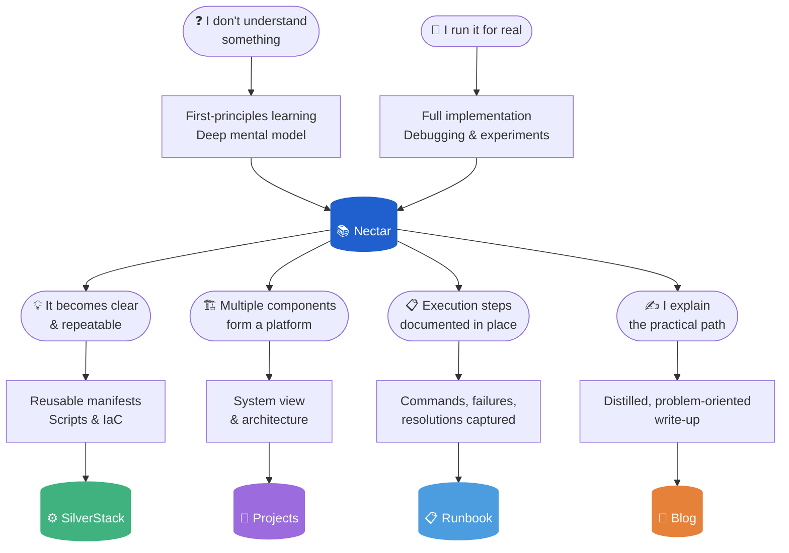

# Nectar

[](https://github.com/ibtisam-iq/nectar/actions/workflows/pages.yml)
[](https://nectar.ibtisam-iq.com)

My personal engineering knowledge base, built with MkDocs Material and deployed to [nectar.ibtisam-iq.com](https://nectar.ibtisam-iq.com). 200+ pages across Kubernetes, AWS, CI/CD, GitOps, and DevSecOps, continuously growing as I learn.

---

## How Knowledge Flows



| Surface | What it contains | Where |
|---|---|---|
| **Nectar** (this repo) | First-principles notes on every concept I had to deeply understand | [nectar.ibtisam-iq.com](https://nectar.ibtisam-iq.com) |
| **SilverStack** | Trusted implementations extracted as reusable components: scripts, manifests, and prebuilt images | [github.com/ibtisam-iq/silver-stack](https://github.com/ibtisam-iq/silver-stack) |
| **Projects** | Complete systems assembled from verified components, documented end-to-end | [projects.ibtisam-iq.com](https://projects.ibtisam-iq.com) |
| **Runbook** | Commands, failures, and resolutions captured at the point of execution | [runbook.ibtisam-iq.com](https://runbook.ibtisam-iq.com) |
| **Blog** | Engineering decisions worth explaining, written as focused, problem-oriented posts | [blog.ibtisam-iq.com](https://blog.ibtisam-iq.com) |

---

## Stack

| Layer | Choice |
|---|---|
| **Generator** | MkDocs 1.6 + Material theme 9.7.6 |
| **Fonts** | Space Grotesk (display) · IBM Plex Sans (body) · IBM Plex Mono (code) |
| **Design** | Custom CSS design system · dual dark/light mode · social cards (OG images) |
| **Plugins** | same-dir · awesome-pages · section-index · autorefs · social · minify |
| **Extensions** | PyMdown suite (superfences, mermaid, highlight, tabbed, tasklist, emoji) |
| **Hosting** | GitHub Pages |
| **DNS** | Cloudflare |
| **Analytics** | Google Analytics |

---

## CI/CD

Three jobs, each scoped to what it needs.

| Job | Trigger | What it does |
|---|---|---|
| **build** | Push to `main` + every PR | Install deps, `mkdocs build`, lychee link check, upload site artifact |
| **preview** | PR events only | Download artifact, deploy to `gh-pages/previews/pr-<N>/`, post URL to PR |
| **deploy** | Push to `main` (non-PR) | Download artifact, write CNAME, deploy to `gh-pages` |

---

## Project Structure

```text
nectar/
├── .github/workflows/pages.yml     # build, preview, deploy
├── docs/
│   ├── images/                     # favicon and logo
│   ├── javascripts/extra.js        # reading-progress bar
│   ├── overrides/                  # 404.html, main.html
│   └── stylesheets/extra.css       # custom design system
├── mkdocs.yml                      # site config, plugins, extensions
├── requirements.txt                # pinned Python dependencies
├── index.md                        # home page
├── about.md                        # about page
├── cloud-infrastructure/
├── containers-orchestration/
├── delivery/
├── observability-security/
├── operations/
├── servers/
└── technical-grounding/
```

---

## Development

```bash
python -m venv .venv && source .venv/bin/activate
pip install -r requirements.txt
mkdocs serve -a 0.0.0.0:8000
```

Build the static site:

```bash
mkdocs build
```

### Local CI with `act`

```bash
act push -W .github/workflows/pages.yml
```

Artifact uploads, PR deploys, CNAME write, and the GitHub Pages deploy are skipped locally via `env.ACT != 'true'` guards. The build and link-check steps run as normal.

---

## Background

I didn't come from a CS background. But I recognized something in myself early on: I think in systems, I need to understand the *why* before a *what* makes sense to me, and I can't let confusion sit unresolved. Those traits pulled me toward engineering, not the other way around.

That mindset shaped how I learn. I can't just follow a tutorial and move on. If I don't understand why something works, I won't know what to do when it stops working. So I document everything, in my own words, structured the way my brain actually processes it, until the confusion is gone.

That habit, sustained over time, is what this repository is.

The early entries reflect where I started. The recent ones reflect where I am now. Both belong here, because this repository is not a finished product. It grows every time I learn something new, and it will keep growing.

---

<div align="center">

**Muhammad Ibtisam**

DevOps & Cloud Engineer · CKA · CKAD

[Website](https://ibtisam-iq.com) · [LinkedIn](https://linkedin.com/in/ibtisam-iq) · [GitHub](https://github.com/ibtisam-iq)

</div>
