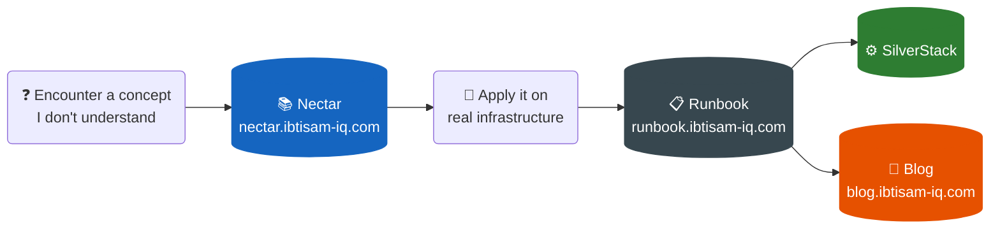

# Nectar

My personal engineering knowledge base — continuously growing as I learn.

I didn't come from a CS background. But I recognized something in myself early on: I think in systems, I need to understand the *why* before a *what* makes sense to me, and I can't let confusion sit unresolved. Those traits pulled me toward engineering — not the other way around.

That mindset shaped how I learn. I can't just follow a tutorial and move on. If I don't understand why something works, I won't know what to do when it stops working. So I document everything — in my own words, structured the way my brain actually processes it — until the confusion is gone.

That habit, sustained over time, is what this repository is.

The early entries reflect where I started. The recent ones reflect where I am now. Both belong here — because this repository is not a finished product. It grows every time I learn something new, and it will keep growing.

---

## How This Fits Into My Engineering System

| Layer | What it contains | Where |
|---|---|---|
| **Nectar** ← you are here | My personal engineering knowledge base — first-principles notes on every concept I had to deeply understand | [nectar.ibtisam-iq.com](https://nectar.ibtisam-iq.com) |
| **Runbook** | My documented steps from real infrastructure work — commands I ran, problems I hit, and how I solved them | [runbook.ibtisam-iq.com](https://runbook.ibtisam-iq.com) |
| **SilverStack** | My reusable infrastructure artifacts — Bash scripts, Kubernetes manifests, and pre-built Docker rootfs images; the Runbook links here whenever a command depends on a hosted artifact | [github.com/ibtisam-iq/silver-stack](https://github.com/ibtisam-iq/silver-stack) |
| **Blog** | My personal blog — distilled write-ups of what I built and what I learned | [blog.ibtisam-iq.com](https://blog.ibtisam-iq.com) |

---

[ibtisam-iq.com](https://ibtisam-iq.com) · [LinkedIn](https://linkedin.com/in/ibtisam-iq)
