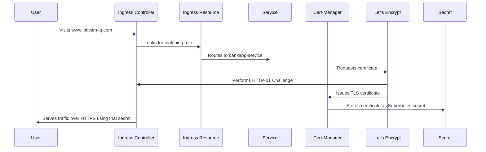

# 🌐 Understanding Ingress, Ingress Controller, TLS, Cert-Manager, Let's Encrypt, and HTTP-01 Challenge: A Basic Guide

## 🧠 1. What is an Ingress Resource?
An Ingress resource is a Kubernetes object that defines rules for routing HTTP and HTTPS traffic to your services based on the domain name or path.

Think of it as a traffic rulebook.

✨ **Example**: If someone goes to `www.ibtisam-iq.com`, Kubernetes should forward that request to `bankapp-service`.

## 🧠 2. What is an Ingress Controller?
The Ingress resource is just a set of rules — but you need something to actually enforce those rules.

**Ingress Controller** is the actual application (usually NGINX) running inside your cluster that watches for Ingress resources and handles incoming traffic accordingly.

### 📦 Popular Ingress Controllers:
- nginx (most common)
- traefik
- HAProxy
- AWS ALB Ingress Controller (in cloud setups)

📌 **Without an Ingress Controller**, your Ingress resource is just a useless config.

### 🔗 Relationship Between Ingress Resource and Ingress Controller

| **Ingress Resource** | **Ingress Controller** |
|----------------------|------------------------|
| Rulebook for routing traffic | The actual system that follows the rulebook |
| Defined in YAML by DevOps/admin | Runs as a Pod inside your cluster |
| Says "route / to bankapp-service" | Listens on port 80/443 and does the routing |
| Requires annotations for SSL, TLS, etc. | Handles SSL/TLS termination if configured |

### Ingress vs Ingress Controller:
- **Ingress Resource**: Defines how HTTP/S requests should be routed to different services based on domain, paths, etc.
- **Ingress Controller**: A Kubernetes component that enforces the rules defined by the Ingress resource by routing external traffic to the relevant services.

## 🔐 3. What is TLS/SSL Certificate?
TLS (Transport Layer Security) is the protocol that ensures traffic between your website and users is encrypted and secure.

### **TLS/SSL certificate proves:**
- You own the domain (e.g., www.ibtisam-iq.com)
- Users can trust your server
- Data is encrypted

⚠️ **Without TLS**: Browser will show ⚠️ **Not Secure**.

TLS (Transport Layer Security) is a protocol that ensures privacy and data integrity in communication between clients and servers. SSL (Secure Sockets Layer) is an older version of TLS but the term is still often used interchangeably.

A TLS/SSL certificate contains:
- A public key and private key for encrypting and decrypting messages.
- Information about the server, the issuing certificate authority (CA), and the expiration date.
- Used to encrypt communication between a client (like a browser) and a server, ensuring confidentiality and security.

In Kubernetes, SSL certificates are stored in a Secret resource, and the Ingress resource uses these certificates for securing traffic.

## 🧾 4. What is Let's Encrypt?
Let’s Encrypt is a free certificate authority. It gives you SSL/TLS certificates for free, trusted by all browsers.

But it needs to verify that:
- You own the domain.
- You have a valid setup.

That’s where **HTTP-01 Challenge** comes in.

## ✅ 5. What is HTTP-01 Challenge?
This is Let's Encrypt’s way to verify that you control your domain.

### How it works:
Let’s Encrypt says: “Hey, create a special file at `http://yourdomain/.well-known/...`”

Cert-manager creates that file inside your cluster using an Ingress rule.

Let’s Encrypt visits that file — if it’s there, ✅ domain is verified.

Let’s Encrypt issues a certificate.

🧠 **This is why your Ingress Controller must be running and reachable on port 80** — so the challenge can work.

## 6. Let's Encrypt and HTTP-01 Challenge
Let's Encrypt is a free, automated, and open Certificate Authority (CA) that provides SSL/TLS certificates. It enables websites to adopt HTTPS without manual intervention.

The HTTP-01 Challenge is a method used by Let's Encrypt to verify that you control the domain for which you are requesting a certificate. Here's how it works:

**HTTP-01 Challenge**: Cert-manager places a challenge file at a specific path (e.g., `/.well-known/acme-challenge/`) on the Ingress path.

Let's Encrypt requests this file and validates the challenge to prove that the requesting entity controls the domain.

Upon successful validation, Let's Encrypt issues the SSL certificate.

## 🔧 7. What is cert-manager?
cert-manager is a Kubernetes tool that:
- Talks to Let's Encrypt (or any CA)
- Handles domain verification
- Automatically creates and renews TLS certificates
- Stores them as Kubernetes Secrets

It watches your Ingress resources for annotations like:

```yaml
cert-manager.io/cluster-issuer: letsencrypt-prod
```
…and knows: → “Okay, I need to request a certificate from Let’s Encrypt for this domain.”

---

## 🔄 The Whole Workflow — End to End:

### 🏗️ Setup:
✅ You have:
- cert-manager installed
- Ingress Controller running (like NGINX)
- Ingress resource defined with TLS + annotations
- ClusterIssuer (Let’s Encrypt) created

### 🚀 Workflow:

## 🗂️ Recap Table

| **Component**         | **Role**                                                         |
|-----------------------|------------------------------------------------------------------|
| **Ingress Resource**   | Routing rules for your domain/path                               |
| **Ingress Controller** | The actual tool routing traffic based on the Ingress resource    |
| **TLS/SSL**            | Encrypts traffic; required for secure HTTPS                     |
| **cert-manager**       | Handles TLS certificate issuance and renewal                    |
| **Let's Encrypt**      | Free certificate authority issuing SSL certificates             |
| **HTTP-01 Challenge**  | Method Let’s Encrypt uses to verify domain ownership via Ingress |

### Workflow: Ingress with Cert-Manager and Let's Encrypt
- **Ingress Controller**: Listens for incoming traffic on HTTP/S and applies the routing rules defined in the Ingress resource.
- **Cert-Manager**: When an Ingress resource with TLS configuration is created, cert-manager is triggered to issue a certificate.
- **Let's Encrypt**: cert-manager uses the HTTP-01 challenge method to prove domain ownership and obtain a certificate from Let's Encrypt.
- **TLS Termination**: Once the certificate is issued, the Ingress controller uses it to terminate TLS connections, ensuring secure communication with clients.

## Final Notes
- **Ingress Resource**: Routes traffic to services within the cluster based on domain and path.
- **Ingress Controller**: Enforces the routing rules defined by the Ingress resource (e.g., NGINX, Traefik).
- **Cert-Manager**: Automates the process of obtaining and renewing SSL/TLS certificates.
- **Let's Encrypt**: A free, automated CA used for issuing SSL certificates.
- **TLS/SSL Certificates**: Ensure secure communication between clients and servers over HTTPS.

## 🧠 Pro Tip for CKA
✅ **You should know how to:**
- Install cert-manager
- Configure ClusterIssuer
- Write Ingress with TLS annotations
- Troubleshoot Ingress (e.g., port 80/443 not open, DNS mismatch)
- Use `kubectl describe ingress` and `kubectl get certificates`

---

## Summary

> **cert-manager** is a Kubernetes add-on that automates the process of obtaining, renewing, and managing SSL/TLS certificates for Kubernetes resources.
> 
> It integrates with multiple certificate authorities (CAs), including Let’s Encrypt.  
>
> To issue a certificate, cert-manager uses the **ClusterIssuer** (or **Issuer**) resource, which defines how cert-manager should communicate with a Certificate Authority (CA).
> 
> The **ClusterIssuer** contains the necessary configuration such as the CA's endpoint, authentication details, challenge-solving methods (like HTTP-01 or DNS-01), and secret references for storing private keys.  
>
> cert-manager continuously **watches** ClusterIssuer, Certificate, and optionally Ingress resources — and when it detects a new or updated certificate request, it interacts with the CA to request, validate, and retrieve the signed certificate, storing it securely inside a Kubernetes Secret.

