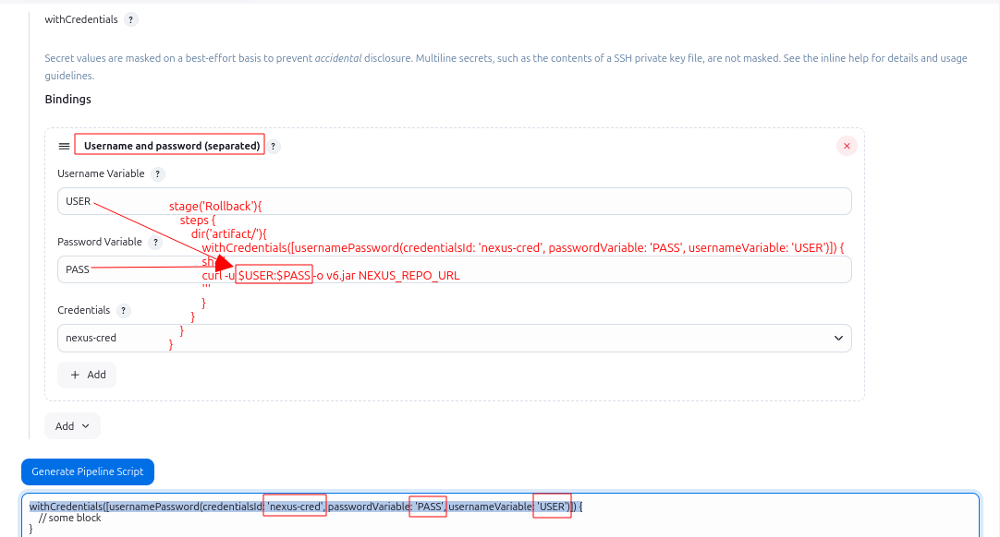

## Stage: Download JAR with Credentials

This Jenkins pipeline stage is designed to securely download a `.jar` file from a URL requiring authentication. It uses credentials stored in Jenkins' credentials store to handle the authentication.

### Pipeline Code
```groovy
stage('Download JAR with Credentials') {
  steps {
    script {
      withCredentials([usernamePassword(credentialsId: 'nexus-cred', passwordVariable: 'pass', usernameVariable: 'user')]) {
        def jarUrl = 'https://example.com/path/to/your.jar'
        sh "curl -u $user:$pass -O $jarUrl"
      }
    }
  }
}
```
### **Key Components**

1. **`withCredentials` Block**
   - Securely retrieves credentials stored in Jenkins.
   - **Parameters:**
     - `credentialsId`: The unique ID of the credentials stored in Jenkins.
     - `usernameVariable`: The environment variable (`user`) used to store the username.
     - `passwordVariable`: The environment variable (`pass`) used to store the password.

2. **`jarUrl`**
   - The URL of the `.jar` file to be downloaded.

3. **`sh` Step**
   - Executes a shell command to download the JAR file using `curl`.
   - **Options:**
     - `-u $user:$pass`: Passes the username and password for authentication.
     - `-O`: Saves the file with its original name.



---
