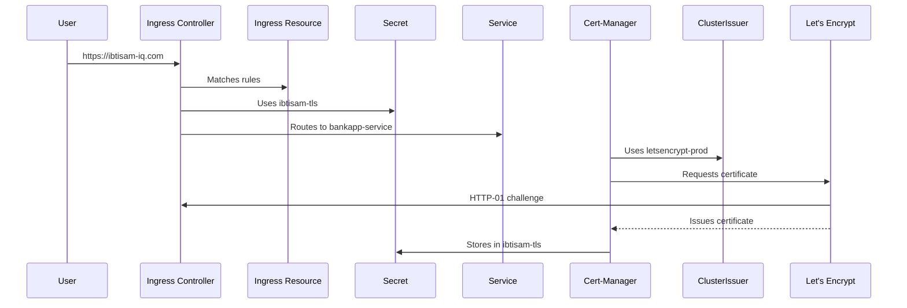

# Kubernetes Ingress FAQ Guide: Securing `https://ibtisam-iq.com`

This FAQ guide provides clear, concise answers to common questions about securing `https://ibtisam-iq.com` in Kubernetes using **Ingress**, **TLS certificates**, **Cert-Manager**, and **Let’s Encrypt**. Designed like a conversation with an expert instructor, it’s engaging, comprehensive, and organized to help you understand the entire process, whether for CKA preparation or production deployment. The **airport analogy** ties concepts together: 
- **Cert-Manager**: Security team issuing boarding passes
- **ClusterIssuer**: Security policy for issuing passes
- **Let’s Encrypt**: Passport authority verifying identities
- **Ingress Controller**: Gate officer directing passengers
- **Ingress Resource**: Flight schedule board guiding traffic
- **TLS Secret**: Locked safe storing credentials
- **HTTP-01 Challenge**: ID check to verify domain ownership

---

## ❓ FAQ: Your Questions Answered

### 1. What is a TLS/SSL Certificate, and Why is it Critical for `ibtisam-iq.com`?
A **TLS/SSL certificate** is a digital credential that enables secure HTTPS communication for `ibtisam-iq.com` by providing:
- **Encryption**: Protects data from man-in-the-middle (MITM) attacks.
- **Authentication**: Verifies `ibtisam-iq.com` is legitimate.
- **Trust**: Prevents browser “Not Secure” warnings.

**Contents**:
| Field                | Description                                      |
|----------------------|--------------------------------------------------|
| Common Name (CN)     | Domain (`ibtisam-iq.com`)                       |
| Public Key           | Encrypts client data                            |
| Issuer               | Certificate Authority (e.g., Let’s Encrypt)     |
| Validity Period      | 90 days for Let’s Encrypt                       |
| Signature            | CA’s proof of trust                             |

The certificate includes a **public key**, while the **private key** (stored in a Kubernetes Secret, Q6) decrypts data. The **Ingress Controller** (Q5) uses the certificate for **SSL termination** (Q7), enabling HTTPS. Without TLS, traffic is unencrypted, risking data exposure and user distrust. **Cert-Manager** (Q3) automates certificate issuance for seamless security.

**Analogy**: The TLS certificate is a passport proving `ibtisam-iq.com`’s identity, ensuring secure travel (communication) through the airport (Kubernetes).

---

### 2. What is a Certificate Authority (CA), and Why Use Let’s Encrypt?
A **Certificate Authority (CA)** verifies domain ownership and issues TLS certificates. **Let’s Encrypt** is a free, automated, and trusted CA, ideal for `ibtisam-iq.com` because it:
- Is cost-effective and browser-trusted.
- Integrates with **Cert-Manager** (Q3) for automation.
- Supports production use with 90-day certificates, auto-renewed (Q10).

**Domain Verification**: Let’s Encrypt uses the **HTTP-01 challenge**:
1. Requests a token at `http://ibtisam-iq.com/.well-known/acme-challenge/<token>`.
2. **Cert-Manager** creates a temporary **Ingress resource** (Q8) to serve the token via the **Ingress Controller** (Q5) on port 80.
3. On successful validation, Let’s Encrypt issues the certificate, stored in a **Secret** (Q6).

Paid CAs (e.g., DigiCert) offer extended validation but are unnecessary for most setups. Let’s Encrypt balances reliability and cost.

**Analogy**: Let’s Encrypt is the passport authority verifying `ibtisam-iq.com`’s identity before issuing a secure credential.

---

### 3. What is Cert-Manager, and How Does it Automate Certificate Management?
**Cert-Manager** is a Kubernetes controller that automates TLS certificate issuance, renewal, and management for `ibtisam-iq.com`. It eliminates manual certificate handling, reducing errors and downtime.

**Key Functions**:
- Requests certificates from Let’s Encrypt (Q2) using a **ClusterIssuer** (Q4).
- Completes **HTTP-01 challenges** (Q2) via the **Ingress Controller** (Q5).
- Stores certificates and private keys in **Kubernetes Secrets** (Q6).
- Renews certificates ~30 days before expiry (Q10).

**How It Works**:
- Watches resources like **ClusterIssuer** (Q4), **Certificate** (Q12), and **Ingress** (Q8) with annotations (e.g., `cert-manager.io/cluster-issuer`).
- Requests and stores certificates in **Secrets** for use by the **Ingress Controller**.

**Installation**:
```bash
kubectl apply -f https://github.com/cert-manager/cert-manager/releases/download/v1.12.1/cert-manager.yaml
```

**Why Essential**: Manual certificate management is complex and error-prone. Cert-Manager ensures seamless HTTPS for `ibtisam-iq.com`.

**Analogy**: Cert-Manager is the airport security team, issuing boarding passes (certificates) based on the security policy (ClusterIssuer) and verifying identities with Let’s Encrypt.

---

### 4. What is a ClusterIssuer, and How Does it Differ from an Issuer?
A **ClusterIssuer** is a cluster-wide Kubernetes resource that configures **Cert-Manager** (Q3) to request certificates from a CA like Let’s Encrypt (Q2). It defines:
| Field                     | Purpose                                                                 |
|---------------------------|-------------------------------------------------------------------------|
| `name`                    | Identifier (e.g., `letsencrypt-prod`)                                   |
| `acme.server`             | CA’s API (e.g., Let’s Encrypt’s endpoint)                              |
| `email`                   | Contact for notices (e.g., `admin@ibtisam-iq.com`)                     |
| `privateKeySecretRef`     | Secret for ACME private key (e.g., `letsencrypt-prod-private-key`)     |
| `solvers`                 | HTTP-01 challenge setup via **Ingress Controller** (Q5)                |

**Example**:
```yaml
apiVersion: cert-manager.io/v1
kind: ClusterIssuer
metadata:
  name: letsencrypt-prod
spec:
  acme:
    email: admin@ibtisam-iq.com
    server: https://acme-v02.api.letsencrypt.org/directory
    privateKeySecretRef:
      name: letsencrypt-prod-private-key
    solvers:
    - http01:
        ingress:
          class: nginx
```

**ClusterIssuer vs. Issuer**:
| Type              | Scope        | Use Case                               |
|-------------------|--------------|----------------------------------------|
| Issuer            | Namespace    | Certificates for a single namespace    |
| ClusterIssuer     | Cluster-wide | Shared TLS for `ibtisam-iq.com` across apps |

**Why ClusterIssuer**: Its cluster-wide scope simplifies management for multiple applications, making it ideal for production.

**Analogy**: The ClusterIssuer is the airport’s security policy, guiding Cert-Manager on issuing boarding passes for all flights (namespaces).

---

### 5. What is an Ingress Controller, and Why is it Needed?
An **Ingress Controller** (e.g., NGINX, Traefik) is software in your Kubernetes cluster that:
- Listens on ports 80 (HTTP) and 443 (HTTPS).
- Reads **Ingress resources** (Q8) to route traffic to services (e.g., `bankapp-service`).
- Performs **SSL termination** (Q7) using **TLS Secrets** (Q6).
- Supports **HTTP-01 challenges** (Q2) for certificate issuance.

**Installation (NGINX)**:
```bash
kubectl apply -f https://raw.githubusercontent.com/kubernetes/ingress-nginx/main/deploy/static/provider/cloud/deploy.yaml
```

**Why Separate from Kubernetes**: Kubernetes provides the **Ingress resource** as a specification, but the routing logic requires third-party software for flexibility. Without an Ingress Controller, **Ingress resources** are ineffective, and `ibtisam-iq.com` cannot serve HTTPS.

**Analogy**: The Ingress Controller is the gate officer, checking boarding passes (TLS certificates) and directing passengers (traffic) to gates (services).

---

### 6. What are Kubernetes Secrets, and How are They Used for TLS?
A **Kubernetes Secret** securely stores sensitive data, such as TLS certificates and private keys for `ibtisam-iq.com`. **Cert-Manager** (Q3) creates:
- **ACME Private Key Secret** (via `privateKeySecretRef` in ClusterIssuer, Q4): For Let’s Encrypt interactions.
- **TLS Secret** (via `Certificate.spec.secretName` or Ingress `tls.secretName`): For HTTPS.

**Example TLS Secret**:
```yaml
apiVersion: v1
kind: Secret
metadata:
  name: ibtisam-tls
type: kubernetes.io/tls
data:
  tls.crt: <base64-encoded-certificate>
  tls.key: <base64-encoded-private-key>
```

**Usage**:
- **Cert-Manager** stores the certificate and private key in `ibtisam-tls`.
- The **Ingress Controller** (Q5) uses `ibtisam-tls` for **SSL termination** (Q7).
- The **Ingress resource** (Q8) references `ibtisam-tls` in `tls.secretName`.

**Why Critical**: Secrets securely store the private key for decrypting HTTPS traffic, enabling secure connections.

**Analogy**: The Secret is a locked safe storing boarding passes (certificates and keys), accessible only to the gate officer (Ingress Controller).

---

### 7. What is SSL/TLS Termination, and Why Does it Matter?
**SSL/TLS termination** is the process where the **Ingress Controller** (Q5) decrypts HTTPS traffic using the private key from a **TLS Secret** (Q6), forwarding plain HTTP to internal services (e.g., `bankapp-service:80`).

**Benefits**:
- **Simplifies Services**: Internal services don’t handle encryption.
- **Centralized Management**: TLS is managed at the Ingress Controller.
- **Performance**: Offloads decryption from application pods.

**Example Workflow**:
1. User visits `https://ibtisam-iq.com`.
2. Ingress Controller decrypts traffic using `ibtisam-tls` (Q6).
3. Forwards HTTP to `bankapp-service`.

**Analogy**: The gate officer (Ingress Controller) checks and “terminates” the boarding pass (TLS connection), directing passengers to their gate without further checks.

---

### 8. What is an Ingress Resource, and How Does it Integrate with Cert-Manager?
An **Ingress resource** is a Kubernetes manifest defining HTTP/HTTPS routing for `ibtisam-iq.com` based on domain and paths, and configuring TLS.

**Example**:
```yaml
apiVersion: networking.k8s.io/v1
kind: Ingress
metadata:
  name: ibtisam-ingress
  annotations:
    cert-manager.io/cluster-issuer: letsencrypt-prod
    nginx.ingress.kubernetes.io/ssl-redirect: "true"
spec:
  ingressClassName: nginx
  tls:
  - hosts:
    - ibtisam-iq.com
    secretName: ibtisam-tls
  rules:
  - host: ibtisam-iq.com
    http:
      paths:
      - path: /
        pathType: Prefix
        backend:
          service:
            name: bankapp-service
            port:
              number: 80
```

**Key Fields**:
- `annotations`: Triggers **Cert-Manager** (Q3) and configures NGINX (e.g., SSL redirects).
- `tls.hosts`: Domains for HTTPS (`ibtisam-iq.com`).
- `tls.secretName`: References the **TLS Secret** (Q6, `ibtisam-tls`).
- `rules`: Routes traffic to services (e.g., `bankapp-service`).

**Cert-Manager Integration**:
- The `cert-manager.io/cluster-issuer` annotation prompts Cert-Manager to:
  1. Create a **Certificate resource** (Q12).
  2. Use the **ClusterIssuer** (Q4) to request a certificate.
  3. Store it in `ibtisam-tls`.

**Analogy**: The Ingress resource is the flight schedule board, guiding passengers (traffic) and triggering Cert-Manager to issue boarding passes.

---

### 9. What is a Certificate Resource, and When Should You Use It?
A **Certificate resource** explicitly requests a TLS certificate from **Cert-Manager** (Q3) for `ibtisam-iq.com`.

**Example**:
```yaml
apiVersion: cert-manager.io/v1
kind: Certificate
metadata:
  name: ibtisam-cert
  namespace: default
spec:
  secretName: ibtisam-tls
  issuerRef:
    name: letsencrypt-prod
    kind: ClusterIssuer
  commonName: ibtisam-iq.com
  dnsNames:
  - ibtisam-iq.com
```

**Function**:
- Specifies the **ClusterIssuer** (Q4) and **TLS Secret** (Q6).
- Cert-Manager requests the certificate and stores it in the Secret.

**Certificate vs. Ingress Annotations**:
- **Certificate Resource**: For complex setups (e.g., multiple domains, wildcard certificates).
- **Ingress Annotations**: Simpler for single-domain cases like `ibtisam-iq.com`.

**Analogy**: A Certificate resource is a formal passport application, while Ingress annotations are a quick request for a boarding pass.

---

### 10. How Does Cert-Manager Handle Certificate Renewals?
Let’s Encrypt certificates for `ibtisam-iq.com` are valid for **90 days**. **Cert-Manager** (Q3) automates renewals:
- Monitors **Secrets** (Q6) for certificate expiry.
- ~30 days before expiry:
  1. Uses the **ClusterIssuer** (Q4) to request a new certificate.
  2. Completes the **HTTP-01 challenge** (Q2) via the **Ingress Controller** (Q5).
  3. Updates the **TLS Secret** (e.g., `ibtisam-tls`).
- The **Ingress Controller** seamlessly uses the updated Secret.

**Why Automated**: Prevents downtime and reduces manual effort.

**Analogy**: Cert-Manager is the security team renewing boarding passes before they expire, ensuring uninterrupted travel (HTTPS access).

---

### 11. How Do All Components Work Together to Secure `ibtisam-iq.com`?
The end-to-end workflow for securing `https://ibtisam-iq.com` involves:
1. **Install Cert-Manager** (Q3): Watches **ClusterIssuer**, **Certificate**, and **Ingress resources**.
2. **Create ClusterIssuer** (Q4): Configures Let’s Encrypt with `privateKeySecretRef` (Q6).
3. **Install Ingress Controller** (Q5): Listens on ports 80/443.
4. **Apply Ingress Resource** (Q8): Triggers Cert-Manager via annotations to create a **Certificate resource** (Q12).
5. **Certificate Issuance**:
   - Cert-Manager uses the **ClusterIssuer** to request a certificate from Let’s Encrypt (Q2).
   - Completes the **HTTP-01 challenge** via a temporary Ingress served by the **Ingress Controller**.
   - Stores the certificate in a **TLS Secret** (Q6).
6. **Serve HTTPS**: The **Ingress Controller** uses the Secret for **SSL termination** (Q7) and routes traffic to `bankapp-service`.

**Mermaid Diagram**:


**Analogy**: The security team (Cert-Manager) follows the policy (ClusterIssuer), verifies identities with the passport authority (Let’s Encrypt), stores credentials in a safe (Secret), and hands them to the gate officer (Ingress Controller).

---

### 12. What is the Correct Order for Setting Up TLS in Kubernetes?
To secure `https://ibtisam-iq.com`, deploy resources in this order:
1. **Application Service**: Ensure `bankapp-service` is running.
   ```bash
   kubectl get svc bankapp-service
   ```
2. **Cert-Manager** (Q3):
   ```bash
   kubectl apply -f https://github.com/cert-manager/cert-manager/releases/download/v1.12.1/cert-manager.yaml
   ```
3. **ClusterIssuer** (Q4):
   ```bash
   kubectl apply -f clusterissuer.yaml
   ```
4. **Ingress Controller** (Q5):
   ```bash
   kubectl apply -f https://raw.githubusercontent.com/kubernetes/ingress-nginx/main/deploy/static/provider/cloud/deploy.yaml
   ```
5. **Ingress Resource** (Q8):
   ```bash
   kubectl apply -f ingress.yaml
   ```
6. **(Optional) Certificate Resource** (Q9): For explicit requests.
   ```bash
   kubectl apply -f certificate.yaml
   ```

**Why This Order**: Ensures dependencies (service, Cert-Manager, Ingress Controller) are in place before routing and TLS are configured.

**Analogy**: Prepare the gates (service), hire the security team (Cert-Manager), define policies (ClusterIssuer), station gate officers (Ingress Controller), and publish the flight schedule (Ingress resource).

---

### 13. How Can I Debug TLS, Cert-Manager, or Ingress Issues?
Common issues and debugging steps for `ibtisam-iq.com`:
1. **Certificate Not Issued**:
   - Check Cert-Manager logs: `kubectl logs -l app=cert-manager -n cert-manager`.
   - Verify **ClusterIssuer** (Q4) and **HTTP-01 challenge** (Q2) path accessibility.
2. **HTTP-01 Challenge Fails**:
   - Test `http://ibtisam-iq.com/.well-known/acme-challenge/test`.
   - Ensure **Ingress Controller** (Q5) is running and port 80 is open.
3. **Ingress Not Routing**:
   - Check events: `kubectl describe ingress ibtisam-ingress`.
   - Validate **Ingress resource** (Q8) rules and `bankapp-service`.
4. **Certificate Issues**:
   - Inspect status: `kubectl describe certificate ibtisam-cert`.
   - Look for DNS or CA connectivity errors.
5. **Service Unreachable**:
   - Verify service: `kubectl get svc bankapp-service`.
   - Ensure pods are running.

**Tips**:
- Use `kubectl describe` and `kubectl logs` for insights.
- Confirm DNS resolution and open ports (80/443).

**Analogy**: Debugging is the security team investigating why a boarding pass isn’t working, checking logs and policies.

---

## 📚 Summary
Securing `https://ibtisam-iq.com` involves:
- **TLS Certificates** (Q1) for encryption and trust, issued by **Let’s Encrypt** (Q2) via **HTTP-01 challenges**.
- **Cert-Manager** (Q3) automates certificate management using a **ClusterIssuer** (Q4).
- **Ingress Controller** (Q5) performs **SSL termination** (Q7) and routes traffic per **Ingress resources** (Q8).
- **Kubernetes Secrets** (Q6) store certificates and private keys.
- **Certificate resources** (Q9) offer explicit control, while **renewals** (Q10) ensure continuity.

This guide has streamlined concepts, provided YAML examples, and used an airport analogy to make the process intuitive. Deploy the setup, monitor renewals (~60 days), and explore advanced features like DNS-01 challenges.

**Resources**:
- [Cert-Manager Documentation](https://cert-manager.io/docs/)
- [Kubernetes Ingress](https://kubernetes.io/docs/concepts/services-networking/ingress/)
- [Let’s Encrypt](https://letsencrypt.org/)