# Nectar — Engineering Knowledge Base

This is where I build and verify my understanding in full detail.

It contains both:

- concepts I had to break down from first principles
- complete execution written while running real setups

Everything is documented in the form that helps me return, reconnect, and reason about a system again.

When an implementation becomes clear, trusted, and repeatable, its runnable form is promoted to **[SilverStack](https://github.com/ibtisam-iq/silver-stack)**.

When the practical path and decisions behind that implementation are distilled into a focused write-up, they appear in the **[Blog](https://blog.ibtisam-iq.com)**.

When multiple reproducible components come together as a complete running environment, the system view appears in **[Projects](https://projects.ibtisam-iq.com)**.

This space holds the depth behind both learning and execution.

---

## How Knowledge Flows

```mermaid
flowchart TD
    A(["❓ I don't understand something"])
    B["First-principles learning<br/>Deep mental model"]
    C(["🔧 I run it for real"])
    D["Full implementation<br/>Debugging & experiments"]
    E(["💡 It becomes clear & repeatable"])
    F["Reusable manifests<br/>Scripts & IaC"]
    G(["✍️ I explain the practical path"])
    H["Distilled, problem-oriented<br/>write-up"]
    I(["🏗️ Multiple components form a platform"])
    J["System view<br/>& architecture"]

    A --> B --> NECTAR[("<b>📚 Nectar</b>")]
    C --> D --> NECTAR
    NECTAR --> E --> F --> SILVER[("<b>⚙️ SilverStack</b>")]
    NECTAR --> G --> H --> BLOG[("<b>📝 Blog</b>")]
    NECTAR --> I --> J --> PROJECTS[("<b>🏛️ Projects</b>")]

    style NECTAR   fill:#1565c0,color:#ffffff,stroke:#90caf9
    style SILVER   fill:#2e7d32,color:#ffffff,stroke:#a5d6a7
    style BLOG     fill:#e65100,color:#ffffff,stroke:#ffcc80
    style PROJECTS fill:#9c27b0,color:#ffffff,stroke:#e1bee7
```

> 💡 **Nectar is the hub.** Everything I learn or run lives here first — before it becomes a reusable component, a blog post, or a project architecture.
