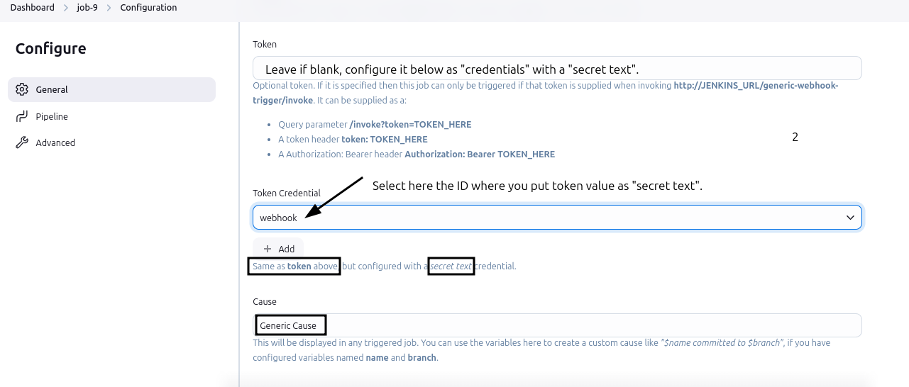

# Configuring Webhook in Jenkins

This guide explains how to configure a webhook in Jenkins with detailed explanations, the webhook mechanism, and example payloads.

---

## What is a Webhook?

A **webhook** is a mechanism that allows applications to send real-time data to other applications or services when specific events occur. For example, a webhook from GitHub can notify Jenkins whenever code is pushed to a repository. It is essentially an automated way for systems to communicate without the need for polling.

### Key Components of a Webhook
1. **Event Trigger:** Defines when the webhook should fire (e.g., a push event or a pull request in GitHub).
2. **URL Endpoint:** Specifies the URL where the event data (payload) is sent. For Jenkins, this is usually the URL of a webhook plugin like `http://JENKINS_URL/generic-webhook-trigger/invoke`.
3. **Payload:** The data sent by the webhook, typically in JSON format. It contains information about the event (e.g., branch name, commit details).

---

## Example Payload
When a webhook is triggered, it sends a **payload** to the specified URL. Here's an example payload from GitHub for a `push` event:

```json
{
  "ref": "refs/heads/main",
  "repository": {
    "name": "example-repo",
    "full_name": "user/example-repo"
  },
  "head_commit": {
    "id": "abc123",
    "message": "Updated README.md",
    "author": {
      "name": "John Doe",
      "email": "johndoe@example.com"
    }
  },
  "pusher": {
    "name": "Ibtisam",
    "email": "ibtisam@example.com"
  }
}
```

### Key Fields:
- **`ref`:** Specifies the branch (e.g., `refs/heads/main`).
- **`repository`:** Contains repository details.
- **`head_commit`:** Details of the most recent commit.
- **`pusher`:** The user who pushed the changes.

---

## Explanation of Configuration in Jenkins Job

### Post Content Parameters


#### 1. **Variable: `ref`**
- **Purpose:** This is the name of the variable where the extracted data will be stored.
- **Why:** You've chosen `ref` as the variable name, which is meaningful if you're working with Git references like branch names or tags.

#### 2. **Expression: `$.ref`**
- **What it does:** This is a JSONPath expression used to extract the `ref` field from the payload sent by the webhook (e.g., GitHub or GitLab webhook).
- **Why this value:** Webhook payloads often include a `ref` field that specifies the branch or tag associated with an event (like a push). For example:

```json
{
  "ref": "refs/heads/main",
  "repository": {
    "name": "example-repo"
  }
}
```
Here, the `ref` value is `refs/heads/main`.

### Token Configuration




#### 1. **Token**
- **What it does:** This optional security feature ensures the webhook will only trigger the Jenkins job if the correct token is included in the request.
- **How it works:**
  - Passed in the webhook URL as a query parameter: `http://JENKINS_URL/generic-webhook-trigger/invoke?token=TOKEN_HERE`


  - Alternatively, it can be passed in the HTTP headers (`token: TOKEN_HERE`) or as a bearer token.
- **Why it’s used:** To ensure that only authorized systems can trigger the job.

#### 2. **Token Credential**
- **What it does:** Allows you to use pre-configured secret credentials in Jenkins for token authentication.
- **Example:**
  - If the credential `webhook` is selected, Jenkins will validate the incoming webhook request against the stored token.

### Cause
- **What it does:** Defines a custom message that will appear in the Jenkins build cause.
- **Example:**
  - If you use `$name committed to $branch`, Jenkins will replace `$name` with the pusher's name and `$branch` with the branch name from the payload.
- **Why it’s useful:** Provides better context for the triggered build, making it clear why the job ran.

### Optional Filter


#### 1. **Expression: `refs/heads/ibtisam`**
- **What it does:** This is a regular expression to match the branch reference that triggers the job.
- **Why this value:** By specifying `refs/heads/ibtisam`, you're ensuring that the job triggers only for events on the `ibtisam` branch.

#### 2. **Text: `$ref`**
- **What it does:** Refers to the value extracted earlier in the "Post Content Parameters" section. It dynamically populates the value of the `ref` field from the webhook payload.
- **Why this value:** It links the extracted value of `ref` to the regular expression check. If `$ref` matches `refs/heads/ibtisam`, the job is triggered.

### Why These Configurations?
- **Purpose:** These settings filter webhook events so that the Jenkins job only runs for a specific branch (`ibtisam` in this case).
- **Denotation:**
  - `ref`: Captures the branch or tag name from the webhook payload.
  - Regular expression (`refs/heads/ibtisam`): Filters events for a specific branch.
  - `$ref`: Dynamically evaluates the extracted branch name.

---

### How These Settings Work Together
1. When a webhook event occurs (e.g., a push to the branch `refs/heads/ibtisam`), the webhook sends a payload to the specified Jenkins URL.
2. Jenkins:
   - Extracts the `ref` field using JSONPath (`$.ref`).
   - Matches the extracted value (`$ref`) against the regular expression (`refs/heads/ibtisam`) to determine whether the job should be triggered.
   - Validates the request using the token (if specified).
3. If all conditions are met, Jenkins triggers the job and records the cause (e.g., "Ash committed to Ibtisam").

## Steps to Configure Webbook

1. Install `Generic Webhook Trigger` Plugin in Jenkins.
2. Configure the plugin by specifying the webhook URL, token, and other settings as described above.
    - **Webhook URL:** The URL where the webhook will send its payload.
    - **Token:** The secret token used for authentication.
    - **Cause:** The message that will appear in the Jenkins build cause.
    - **Optional Filter:** The regular expression and text to filter the webhook events.
