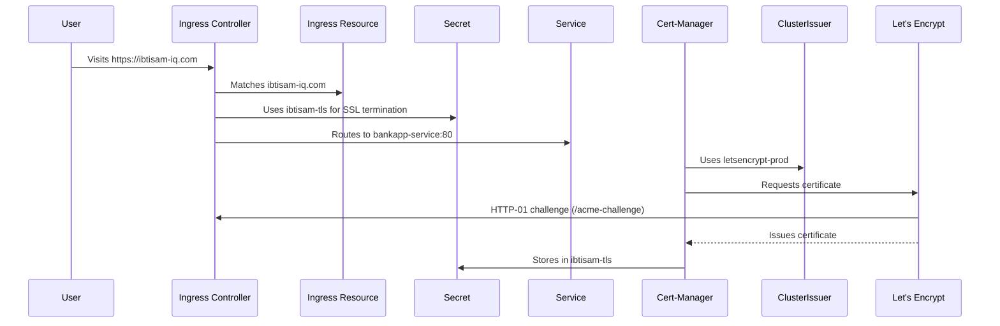

# 📖 Securing Kubernetes with Ingress, TLS, Cert-Manager, and Let’s Encrypt: A Professional FAQ Guide

This FAQ guide answers common questions about securing `https://ibtisam-iq.com` in Kubernetes using **Ingress**, **TLS certificates**, **Cert-Manager**, and **Let’s Encrypt**. Designed like a conversation with an expert instructor, it’s engaging, clear, and comprehensive, connecting concepts to help you understand the entire process. Whether you’re preparing for CKA or deploying in production, this guide makes complex topics accessible and memorable, using examples, tables, diagrams, and an airport analogy to bring the process to life.

---

## ✈️ The Airport Analogy
Think of securing your Kubernetes cluster like running an airport:
- **Cert-Manager**: Security team verifying passenger identities
- **ClusterIssuer**: Security policy for issuing boarding passes
- **Let’s Encrypt**: Passport authority issuing credentials
- **Ingress Controller**: Gate officer checking passes and directing passengers
- **Ingress Resource**: Flight schedule board guiding passengers
- **TLS Secret**: Locked safe storing boarding passes
- **HTTP-01 Challenge**: ID check to verify passengers

---

## ❓ FAQ: Your Questions Answered

### 1. What is a TLS/SSL Certificate, and Why Do We Need It?
**Question**: What is a TLS/SSL certificate, what does it contain, and why is it critical for `ibtisam-iq.com`?

**Answer**: A **TLS/SSL certificate** is a digital passport for `ibtisam-iq.com`, ensuring secure HTTPS communication between a client (e.g., browser) and your Kubernetes service. It provides:
- **Encryption**: Prevents man-in-the-middle (MITM) attacks
- **Authentication**: Proves `ibtisam-iq.com` is legitimate
- **Trust**: Avoids browser “Not Secure” warnings

**Contents**:
| Field                | Description                                      |
|----------------------|--------------------------------------------------|
| **Common Name (CN)** | Domain (`ibtisam-iq.com`)                       |
| **Public Key**       | Encrypts client data                            |
| **Private Key**      | Decrypts data (stored in a Secret)              |
| **Issuer**           | CA (e.g., Let’s Encrypt)                        |
| **Validity Period**  | 90 days for Let’s Encrypt                       |
| **Signature**        | CA’s proof of trust                             |

**How It Works**:
- The client uses the **public key** to encrypt data.
- The server uses the **private key** (stored in a **Kubernetes Secret**, see Q6) to decrypt it.
- In Kubernetes, the **Ingress Controller** (Q8) uses the certificate for **SSL termination** (Q7), enabling HTTPS for `ibtisam-iq.com`.

**Why Needed**? Without TLS, traffic is unencrypted, risking data exposure and browser warnings. For `ibtisam-iq.com`, Cert-Manager automates certificate issuance (Q5) to ensure seamless HTTPS.

**Analogy**: Like a passport proving your identity at the airport, the TLS certificate verifies `ibtisam-iq.com` and secures communication.

---

### 2. What is a Certificate Authority (CA), and Why Use Let’s Encrypt?
**Question**: What role does a CA play, why choose Let’s Encrypt for `ibtisam-iq.com`, and how does it verify domain ownership?

**Answer**: A **Certificate Authority (CA)** is a trusted entity that verifies domain ownership and issues TLS certificates. Examples:
- **Free**: Let’s Encrypt (automated, ideal for `ibtisam-iq.com`)
- **Paid**: DigiCert, GoDaddy, Sectigo (offer extended validation, warranties)

**Why Let’s Encrypt**?
- **Free and trusted**: Accepted by all browsers
- **Automated**: Integrates with Cert-Manager (Q5) for seamless certificate management
- **Production-ready**: Reliable despite 90-day validity (auto-renewed by Cert-Manager, Q10)

**Domain Verification (HTTP-01 Challenge)**:
- Let’s Encrypt uses the **HTTP-01 challenge** to confirm you control `ibtisam-iq.com`:
  1. It requests a token at `http://ibtisam-iq.com/.well-known/acme-challenge/<token>`.
  2. Cert-Manager creates a temporary **Ingress resource** (Q9) to serve the token.
  3. The **Ingress Controller** (Q8) exposes this path on port 80.
  4. If Let’s Encrypt validates the token, it issues the certificate.

**Production Note**: Paid CAs may be used for advanced validation (e.g., EV/OV certificates), but Let’s Encrypt is cost-effective and sufficient for most setups.

**Connection**: The HTTP-01 challenge relies on the Ingress Controller (Q8) and Cert-Manager (Q5) working together, with the certificate stored in a Secret (Q6).

**Analogy**: Let’s Encrypt is the passport authority verifying your identity before issuing a secure credential for `ibtisam-iq.com`.

---

### 3. What is Cert-Manager, and How Does It Automate Certificate Management?
**Question**: What is Cert-Manager, why is it essential, and how does it manage certificates for `ibtisam-iq.com`?

**Answer**: **Cert-Manager** is a Kubernetes controller that automates the issuance, renewal, and management of TLS certificates for `ibtisam-iq.com`. It eliminates manual certificate handling, which is complex and error-prone.

**Key Functions**:
- Requests certificates from Let’s Encrypt (Q2)
- Completes HTTP-01 challenges (Q2) to verify domain ownership
- Stores certificates in **Kubernetes Secrets** (Q6)
- Renews certificates ~30 days before expiry (Q10)

**How It Works**:
- Cert-Manager watches Kubernetes resources:
  - **ClusterIssuer** (Q4): Defines how to interact with Let’s Encrypt
  - **Certificate** (Q14): Requests a certificate for `ibtisam-iq.com`
  - **Ingress** (Q9): Triggers certificate issuance via annotations
- When a resource is created or updated, Cert-Manager:
  1. Uses the **ClusterIssuer** to request a certificate.
  2. Completes the HTTP-01 challenge via the **Ingress Controller** (Q8).
  3. Stores the certificate and private key in a **Secret** (e.g., `ibtisam-tls`).

**Installation**:
```bash
kubectl apply -f https://github.com/cert-manager/cert-manager/releases/download/v1.12.1/cert-manager.yaml
```

**Why Essential**? Without Cert-Manager, you’d manually generate, verify, and renew certificates, risking downtime or security issues. For `ibtisam-iq.com`, Cert-Manager ensures seamless HTTPS with minimal effort.

**Connection**: Cert-Manager relies on the **ClusterIssuer** (Q4) for configuration, stores certificates in **Secrets** (Q6), and integrates with **Ingress resources** (Q9) for automation.

**Analogy**: Cert-Manager is the airport security team, issuing boarding passes (certificates) based on the security policy (ClusterIssuer) and verifying identities with Let’s Encrypt.

---

### 4. What is a ClusterIssuer, and How Does It Differ from an Issuer?
**Question**: What is a ClusterIssuer, what does it configure, and why use it instead of an Issuer for `ibtisam-iq.com`?

**Answer**: A **ClusterIssuer** is a Kubernetes resource that defines how **Cert-Manager** (Q3) requests certificates from a CA like Let’s Encrypt (Q2). It’s cluster-wide, making it ideal for shared TLS configurations across namespaces.

**Configuration**:
| Field                     | Purpose                                                                 |
|---------------------------|-------------------------------------------------------------------------|
| `name`                    | Unique identifier (e.g., `letsencrypt-prod`)                            |
| `acme.server`             | Let’s Encrypt’s API endpoint                                           |
| `email`                   | Contact for expiry notices (e.g., `admin@ibtisam-iq.com`)              |
| `privateKeySecretRef`     | Secret for the ACME private key (e.g., `letsencrypt-prod-private-key`) |
| `solvers`                 | HTTP-01 challenge setup via the Ingress Controller (Q8)                |

**Example ClusterIssuer YAML**:
```yaml
apiVersion: cert-manager.io/v1
kind: ClusterIssuer
metadata:
  name: letsencrypt-prod
spec:
  acme:
    email: admin@ibtisam-iq.com
    server: https://acme-v02.api.letsencrypt.org/directory
    privateKeySecretRef:
      name: letsencrypt-prod-private-key
    solvers:
    - http01:
        ingress:
          class: nginx
```

**ClusterIssuer vs. Issuer**:
| Type              | Scope        | Use Case                               |
|-------------------|--------------|----------------------------------------|
| **Issuer**        | Namespace    | Certificates for a single namespace    |
| **ClusterIssuer** | Cluster-wide | Shared TLS for `ibtisam-iq.com` across apps |

**Why ClusterIssuer for `ibtisam-iq.com`**? Its cluster-wide scope simplifies management for multiple applications, making it production-friendly. An Issuer is better for isolated, namespace-specific setups.

**Connection**: The ClusterIssuer works with **Cert-Manager** (Q3) to issue certificates, storing them in **Secrets** (Q6) for use by the **Ingress Controller** (Q8).

**Analogy**: The ClusterIssuer is the airport’s security policy, guiding Cert-Manager on how to issue boarding passes for all flights (namespaces).

---

### 5. What is an Ingress Controller, and Why Is It Needed?
**Question**: What does an Ingress Controller do, how does it handle SSL termination, and why is it separate from Kubernetes core?

**Answer**: An **Ingress Controller** is software (e.g., NGINX, Traefik) running in your Kubernetes cluster that:
- Listens on **ports 80 (HTTP)** and **443 (HTTPS)**
- Reads **Ingress resources** (Q9) to route traffic
- Performs **SSL termination** (Q7) for `ibtisam-iq.com`
- Handles load balancing and path-based routing

**Key Roles**:
- **Traffic Routing**: Matches requests (e.g., `ibtisam-iq.com/`) to services (e.g., `bankapp-service`).
- **SSL Termination**: Decrypts HTTPS traffic using the TLS certificate from a **Secret** (Q6), forwarding plain HTTP to services.
- **HTTP-01 Challenge**: Exposes `/.well-known/acme-challenge/` for Let’s Encrypt (Q2).

**Installation (NGINX)**:
```bash
kubectl apply -f https://raw.githubusercontent.com/kubernetes/ingress-nginx/main/deploy/static/provider/cloud/deploy.yaml
```

**Why Separate from Kubernetes Core**? Kubernetes provides the **Ingress resource** (Q9) as a specification, but the actual routing logic depends on third-party software (NGINX, Traefik) tailored to your needs. This modularity allows flexibility in choosing controllers.

**Why Needed**? Without an Ingress Controller, **Ingress resources** are just YAML files with no effect. For `ibtisam-iq.com`, the controller ensures HTTPS traffic is securely routed to `bankapp-service`.

**Connection**: The Ingress Controller uses **Secrets** (Q6) for SSL termination, follows **Ingress resource** rules (Q9), and supports **Cert-Manager** (Q3) for HTTP-01 challenges.

**Analogy**: The Ingress Controller is the gate officer, checking boarding passes (TLS certificates) and directing passengers (traffic) to the right gates (services).

---

### 6. What Are Kubernetes Secrets, and How Are They Used for TLS?
**Question**: What is a Kubernetes Secret, how does Cert-Manager use it, and why is it critical for `ibtisam-iq.com`?

**Answer**: A **Kubernetes Secret** is a secure object for storing sensitive data, such as TLS certificates and private keys for `ibtisam-iq.com`. Cert-Manager (Q3) creates two types of Secrets:
- **ACME Private Key Secret** (via `privateKeySecretRef` in ClusterIssuer, Q4): Stores the key for Let’s Encrypt interactions
- **TLS Secret** (via `Certificate.spec.secretName` or Ingress `tls.secretName`): Stores the certificate and private key for HTTPS

**Example TLS Secret**:
```yaml
apiVersion: v1
kind: Secret
metadata:
  name: ibtisam-tls
type: kubernetes.io/tls
data:
  tls.crt: <base64-encoded-certificate>
  tls.key: <base64-encoded-private-key>
```

**How Used**:
- **Cert-Manager** stores the issued certificate and private key in `ibtisam-tls`.
- The **Ingress Controller** (Q5) uses `ibtisam-tls` for **SSL termination** (Q7).
- The **Ingress resource** (Q9) references `ibtisam-tls` in its `tls.secretName` field.

**Why Critical**? The Secret securely holds the private key needed to decrypt HTTPS traffic. Without it, `ibtisam-iq.com` cannot serve secure connections.

**Inspect**:
```bash
kubectl get secret ibtisam-tls -o yaml
```

**Connection**: Secrets are created by **Cert-Manager** (Q3), configured via **ClusterIssuer** (Q4), and used by the **Ingress Controller** (Q5) and **Ingress resource** (Q9).

**Analogy**: The Secret is a locked safe storing boarding passes (certificates and keys), accessible only to the gate officer (Ingress Controller).

---

### 7. What is SSL/TLS Termination, and Why Does It Matter?
**Question**: What is SSL/TLS termination, how does it work in Kubernetes, and why is it beneficial for `ibtisam-iq.com`?

**Answer**: **SSL/TLS termination** is the process of decrypting HTTPS traffic at the **Ingress Controller** (Q5), converting it to plain HTTP for internal services.

**How It Works**:
1. A user visits `https://ibtisam-iq.com`.
2. The **Ingress Controller** receives the request on port 443.
3. It uses the private key from the **TLS Secret** (Q6, e.g., `ibtisam-tls`) to decrypt the traffic.
4. It forwards plain HTTP to the target service (e.g., `bankapp-service:80`).

**Why Beneficial**?
- **Simplifies Services**: Internal services (e.g., `bankapp-service`) don’t need to handle encryption, reducing complexity.
- **Centralized Management**: TLS is managed at the Ingress Controller, not individual pods.
- **Performance**: Offloads decryption from application pods, improving efficiency.

**Connection**: SSL termination relies on the **Ingress Controller** (Q5) using a **TLS Secret** (Q6), configured via the **Ingress resource** (Q9).

**Analogy**: The gate officer (Ingress Controller) checks and “terminates” the passenger’s boarding pass (TLS connection), directing them to their gate (service) without further checks.

---

### 8. What is an Ingress Resource, and How Does It Work with Cert-Manager?
**Question**: What is an Ingress resource, how does it define routing and TLS, and how does it trigger Cert-Manager for `ibtisam-iq.com`?

**Answer**: An **Ingress resource** is a Kubernetes YAML manifest that defines how HTTP/HTTPS traffic is routed to services based on domain (`ibtisam-iq.com`) and paths (`/`), and configures TLS for secure connections.

**Key Components**:
| Field                            | Purpose                                                                 |
|----------------------------------|------------------------------------------------------------------------|
| `annotations`                    | Instructs Cert-Manager (e.g., `cert-manager.io/cluster-issuer`) and NGINX (e.g., `ssl-redirect`) |
| `tls.hosts`                      | Lists domains (`ibtisam-iq.com`) for HTTPS                              |
| `tls.secretName`                 | References the TLS Secret (`ibtisam-tls`, Q6)                           |
| `rules.host`                     | Matches `ibtisam-iq.com`                                               |
| `http.paths`                     | Routes paths (e.g., `/`) to services (e.g., `bankapp-service:80`)      |

**Example Ingress YAML**:
```yaml
apiVersion: networking.k8s.io/v1
kind: Ingress
metadata:
  name: ibtisam-ingress
  annotations:
    cert-manager.io/cluster-issuer: letsencrypt-prod
    nginx.ingress.kubernetes.io/ssl-redirect: "true"
    nginx.ingress.kubernetes.io/rewrite-target: /
spec:
  ingressClassName: nginx
  tls:
  - hosts:
    - ibtisam-iq.com
    secretName: ibtisam-tls
  rules:
  - host: ibtisam-iq.com
    http:
      paths:
      - path: /
        pathType: Prefix
        backend:
          service:
            name: bankapp-service
            port:
              number: 80
```

**How It Works with Cert-Manager**:
- The annotation `cert-manager.io/cluster-issuer: letsencrypt-prod` triggers **Cert-Manager** (Q3) to:
  1. Create a **Certificate resource** (Q14) behind the scenes.
  2. Use the **ClusterIssuer** (Q4) to request a certificate from Let’s Encrypt (Q2).
  3. Store the certificate in the specified **TLS Secret** (`ibtisam-tls`, Q6).
- The **Ingress Controller** (Q5) uses the Secret for **SSL termination** (Q7) and routes traffic per the rules.

**Why Important**? The Ingress resource is the “traffic rulebook” for `ibtisam-iq.com`, enabling HTTPS and integrating with Cert-Manager for automation.

**Connection**: It links **Cert-Manager** (Q3), **ClusterIssuer** (Q4), **Secrets** (Q6), and the **Ingress Controller** (Q5).

**Analogy**: The Ingress resource is the flight schedule board, telling the gate officer (Ingress Controller) where to send passengers (traffic) and triggering Cert-Manager to issue boarding passes.

---

### 9. How Does Cert-Manager Watch Resources, and Why Doesn’t It Generate Them?
**Question**: Why does Cert-Manager watch resources like ClusterIssuer, Certificate, and Ingress, and why doesn’t it generate them automatically?

**Answer**: **Cert-Manager** (Q3) operates in Kubernetes’ **declarative model**, where users declare the desired state via YAML manifests, and controllers reconcile the cluster to match that state.

**Why Watch Resources**?
- Cert-Manager is a controller, like the kubelet or deployment controller, that watches:
  - **ClusterIssuer** (Q4): Defines how to issue certificates
  - **Certificate** (Q14): Requests a certificate for `ibtisam-iq.com`
  - **Ingress** (Q8): Triggers certificate issuance via annotations
- When you create or update these resources, Cert-Manager detects changes and acts (e.g., requests a certificate from Let’s Encrypt, Q2).

**Why Not Generate Resources**?
- **Separation of Responsibility**: In Kubernetes, users or CI pipelines declare intentions (e.g., “I want a certificate for `ibtisam-iq.com`”). Controllers only act on declared resources.
- **API Server as Truth**: All desired states are stored in etcd via the Kubernetes API. Cert-Manager waits for resources to be declared rather than assuming needs.
- **Flexibility**: Users can customize **ClusterIssuer** or **Certificate** settings, which wouldn’t be possible if Cert-Manager generated them.

**Example Workflow**:
1. You create a **ClusterIssuer** (Q4) for Let’s Encrypt.
2. You apply an **Ingress resource** (Q8) with `cert-manager.io/cluster-issuer`.
3. Cert-Manager watches the Ingress, creates a **Certificate resource** (Q14), and requests a certificate, storing it in a **Secret** (Q6).

**Connection**: This declarative approach ties Cert-Manager (Q3) to **ClusterIssuer** (Q4), **Certificate** (Q14), and **Ingress resources** (Q8).

**Analogy**: Cert-Manager is the security team waiting for a passenger’s application (resources) before issuing a boarding pass, following the airport’s policy (Kubernetes’ declarative model).

---

### 10. How Does Cert-Manager Handle Certificate Renewals and Expiry?
**Question**: How does Cert-Manager manage certificate renewals for `ibtisam-iq.com`, and what happens when certificates expire?

**Answer**: Let’s Encrypt certificates for `ibtisam-iq.com` are valid for **90 days**. **Cert-Manager** (Q3) automates renewals to prevent expiry-related downtime.

**Renewal Process**:
- Cert-Manager monitors certificates stored in **Secrets** (Q6).
- ~30 days before expiry, it re-initiates the certificate issuance process:
  1. Uses the **ClusterIssuer** (Q4) to request a new certificate.
  2. Completes the **HTTP-01 challenge** (Q2) via the **Ingress Controller** (Q5).
  3. Updates the **TLS Secret** (e.g., `ibtisam-tls`) with the new certificate.
- The **Ingress Controller** (Q5) seamlessly uses the updated Secret for **SSL termination** (Q7).

**Why Automated**? Manual renewals are error-prone and time-consuming. Cert-Manager ensures `ibtisam-iq.com` remains secure without intervention.

**Connection**: Renewals depend on the **ClusterIssuer** (Q4), **Ingress Controller** (Q5), and **Secrets** (Q6), all orchestrated by **Cert-Manager** (Q3).

**Analogy**: Cert-Manager is the security team renewing passengers’ boarding passes before they expire, ensuring uninterrupted travel (HTTPS access).

---

### 11. What is the Role of privateKeySecretRef in ClusterIssuer?
**Question**: What does `privateKeySecretRef` do in a ClusterIssuer, and why is the private key important for `ibtisam-iq.com`?

**Answer**: The `privateKeySecretRef` field in a **ClusterIssuer** (Q4) specifies where **Cert-Manager** (Q3) stores the **ACME private key** used to interact with Let’s Encrypt (Q2).

**Example**:
```yaml
privateKeySecretRef:
  name: letsencrypt-prod-private-key
```

**Purpose**:
- Cert-Manager generates an ACME private key for signing requests to Let’s Encrypt.
- This key is stored in a **Kubernetes Secret** (Q6, e.g., `letsencrypt-prod-private-key`).
- It’s used during the **HTTP-01 challenge** (Q2) to prove domain ownership.

**Why Important**?
- The private key authenticates Cert-Manager’s requests to Let’s Encrypt.
- It’s distinct from the TLS private key stored in the **TLS Secret** (e.g., `ibtisam-tls`), which decrypts HTTPS traffic (Q7).
- Secure storage in a Secret ensures the key remains confidential.

**Connection**: `privateKeySecretRef` links the **ClusterIssuer** (Q4) to a **Secret** (Q6), enabling **Cert-Manager** (Q3) to complete certificate issuance.

**Analogy**: The ACME private key is a special key the security team (Cert-Manager) uses to verify its identity with the passport authority (Let’s Encrypt), stored in a safe (Secret).

---

### 12. What is a Certificate Resource, and How Does It Differ from Ingress Annotations?
**Question**: What is a Certificate resource, how does it request certificates, and how does it compare to using Ingress annotations for `ibtisam-iq.com`?

**Answer**: A **Certificate resource** is a Kubernetes manifest that explicitly requests a TLS certificate for `ibtisam-iq.com` from **Cert-Manager** (Q3).

**Example Certificate YAML**:
```yaml
apiVersion: cert-manager.io/v1
kind: Certificate
metadata:
  name: ibtisam-cert
  namespace: default
spec:
  secretName: ibtisam-tls
  issuerRef:
    name: letsencrypt-prod
    kind: ClusterIssuer
  commonName: ibtisam-iq.com
  dnsNames:
    - ibtisam-iq.com
```

**How It Works**:
- Specifies the **ClusterIssuer** (Q4, `letsencrypt-prod`) to use.
- Defines the domain (`ibtisam-iq.com`) and **TLS Secret** (`ibtisam-tls`, Q6) for storage.
- Cert-Manager watches the resource, requests a certificate from Let’s Encrypt (Q2), and stores it in the Secret.

**Certificate vs. Ingress Annotations**:
| Approach              | Description                                    | Use Case                               |
|-----------------------|------------------------------------------------|----------------------------------------|
| **Certificate Resource** | Explicitly requests a certificate             | Fine-grained control, multiple domains |
| **Ingress Annotations**  | Automatically triggers a Certificate resource | Simpler for single-domain Ingress      |

**Ingress Annotation Example**:
```yaml
annotations:
  cert-manager.io/cluster-issuer: letsencrypt-prod
tls:
  - hosts:
      - ibtisam-iq.com
    secretName: ibtisam-tls
```
- Cert-Manager detects the annotation and creates a **Certificate resource** behind the scenes.

**Why Choose**?
- Use **Certificate resources** for complex setups (e.g., multiple domains, wildcard certificates).
- Use **Ingress annotations** for simplicity in single-domain cases like `ibtisam-iq.com`.

**Connection**: Both methods rely on **Cert-Manager** (Q3), **ClusterIssuer** (Q4), and **Secrets** (Q6), with the **Ingress Controller** (Q5) using the resulting certificate.

**Analogy**: A Certificate resource is a formal passport application, while Ingress annotations are a quick request for a boarding pass, both processed by the security team (Cert-Manager).

---

### 13. How Do All Components Work Together in the Certificate Issuance Process?
**Question**: What is the end-to-end workflow for issuing a TLS certificate for `ibtisam-iq.com`, and how do components interact?

**Answer**: Securing `https://ibtisam-iq.com` involves multiple components working in harmony. Here’s the step-by-step workflow:

1. **Install Cert-Manager** (Q3):
   - Adds controllers to watch **ClusterIssuer**, **Certificate**, and **Ingress resources**.
2. **Create ClusterIssuer** (Q4):
   - Defines Let’s Encrypt’s API, email (`admin@ibtisam-iq.com`), and HTTP-01 solver.
   - Stores the ACME private key in a **Secret** (Q6, `letsencrypt-prod-private-key`).
3. **Install Ingress Controller** (Q5):
   - Listens on ports 80/443 and watches **Ingress resources**.
4. **Apply Ingress Resource** (Q8):
   - Includes `cert-manager.io/cluster-issuer` annotation and `tls.secretName: ibtisam-tls`.
   - Cert-Manager detects the annotation and creates a **Certificate resource** (Q12).
5. **Certificate Issuance**:
   - Cert-Manager uses the **ClusterIssuer** to request a certificate from Let’s Encrypt (Q2).
   - It generates a temporary Ingress for the **HTTP-01 challenge** (Q2), served by the **Ingress Controller**.
   - Let’s Encrypt validates the challenge and issues the certificate.
6. **Store Certificate**:
   - Cert-Manager saves the certificate and TLS private key in the **TLS Secret** (`ibtisam-tls`, Q6).
7. **Serve HTTPS**:
   - The **Ingress Controller** uses `ibtisam-tls` for **SSL termination** (Q7).
   - It routes traffic to `bankapp-service:80` per the **Ingress resource** rules.

**Mermaid Diagram**:


**Connection**: This workflow ties together **Cert-Manager** (Q3), **ClusterIssuer** (Q4), **Ingress Controller** (Q5), **Secrets** (Q6), **SSL termination** (Q7), and **Ingress resources** (Q8).

**Analogy**: The airport security team (Cert-Manager) follows the security policy (ClusterIssuer), verifies passengers with the passport authority (Let’s Encrypt), stores credentials in a safe (Secret), and hands them to the gate officer (Ingress Controller) to direct passengers (traffic).

---

### 14. How Can I Debug Issues with TLS, Cert-Manager, or Ingress?
**Question**: What are common issues when securing `ibtisam-iq.com`, and how do I troubleshoot them?

**Answer**: Issues with TLS, Cert-Manager, or Ingress can disrupt `https://ibtisam-iq.com`. Here’s how to debug:

**Common Issues and Fixes**:
1. **Certificate Not Issued**:
   - **Check**: Cert-Manager logs for errors.
     ```bash
     kubectl logs -l app=cert-manager -n cert-manager
     ```
   - **Fix**: Ensure the **ClusterIssuer** (Q4) is correct and the **HTTP-01 challenge** (Q2) path is accessible.
2. **HTTP-01 Challenge Fails**:
   - **Check**: Access `http://ibtisam-iq.com/.well-known/acme-challenge/test`.
   - **Fix**: Verify the **Ingress Controller** (Q5) is running and port 80 is open.
3. **Ingress Not Routing**:
   - **Check**: Ingress events.
     ```bash
     kubectl describe ingress ibtisam-ingress
     ```
   - **Fix**: Confirm the **Ingress resource** (Q8) rules and `bankapp-service` are correct.
4. **Certificate Events**:
   - **Check**: Certificate status.
     ```bash
     kubectl describe certificate ibtisam-cert
     ```
   - **Fix**: Look for errors like DNS mismatches or CA connectivity issues.
5. **Service Unreachable**:
   - **Check**: Service status.
     ```bash
     kubectl get svc bankapp-service
     ```
   - **Fix**: Ensure the service and pods are running.

**CKA Pro Tip**:
- Use `kubectl describe` and `kubectl logs` to trace issues.
- Verify DNS resolution for `ibtisam-iq.com` and open ports (80/443).
- Check `.well-known` paths for HTTP-01 challenge failures.

**Connection**: Debugging spans **Cert-Manager** (Q3), **ClusterIssuer** (Q4), **Ingress Controller** (Q5), **Secrets** (Q6), and **Ingress resources** (Q8).

**Analogy**: Debugging is like the airport’s security team investigating why a passenger’s boarding pass isn’t working, checking logs, gates, and policies.

---

### 15. What is the Correct Order for Setting Up TLS in Kubernetes?
**Question**: What is the proper sequence for deploying resources to secure `ibtisam-iq.com` with TLS?

**Answer**: To secure `https://ibtisam-iq.com`, follow this order to ensure dependencies are met:

1. **Deploy Application Service**:
   - Ensure `bankapp-service` is running and reachable.
     ```bash
     kubectl get svc bankapp-service
     ```
2. **Install Cert-Manager** (Q3):
   - Adds controllers for certificate management.
     ```bash
     kubectl apply -f https://github.com/cert-manager/cert-manager/releases/download/v1.12.1/cert-manager.yaml
     ```
3. **Create ClusterIssuer** (Q4):
   - Configures Let’s Encrypt integration.
     ```bash
     kubectl apply -f clusterissuer.yaml
     ```
4. **Install Ingress Controller** (Q5):
   - Handles traffic routing and SSL termination.
     ```bash
     kubectl apply -f https://raw.githubusercontent.com/kubernetes/ingress-nginx/main/deploy/static/provider/cloud/deploy.yaml
     ```
5. **Apply Ingress Resource** (Q8):
   - Defines routing and triggers certificate issuance.
     ```bash
     kubectl apply -f ingress.yaml
     ```
6. **(Optional) Create Certificate Resource** (Q12):
   - For explicit certificate requests.
     ```bash
     kubectl apply -f certificate.yaml
     ```

**Why This Order**? Each step builds on the previous:
- The service must exist for traffic routing.
- Cert-Manager and ClusterIssuer enable certificate issuance.
- The Ingress Controller supports routing and HTTP-01 challenges.
- The Ingress resource ties it all together.

**Connection**: This sequence integrates **Cert-Manager** (Q3), **ClusterIssuer** (Q4), **Ingress Controller** (Q5), **Secrets** (Q6), and **Ingress resources** (Q8).

**Analogy**: Setting up TLS is like preparing an airport: deploy the gates (service), hire the security team (Cert-Manager), define policies (ClusterIssuer), station gate officers (Ingress Controller), and publish the flight schedule (Ingress resource).

---

## 📚 Summary
Securing `https://ibtisam-iq.com` in Kubernetes involves a symphony of components:
- **Cert-Manager** automates certificate issuance and renewal, watching **ClusterIssuer**, **Certificate**, and **Ingress resources** in Kubernetes’ declarative model.
- **Let’s Encrypt** issues free TLS certificates, verified via the **HTTP-01 challenge**.
- **Ingress Controller** terminates SSL and routes traffic, using **TLS Secrets** created by Cert-Manager.
- **Ingress Resources** define routing rules and trigger certificate issuance via annotations.
- **ClusterIssuer** configures Cert-Manager’s interaction with Let’s Encrypt, storing keys in **Secrets**.

This FAQ guide has connected these components through clear explanations, examples, and an airport analogy, making the process intuitive and actionable. For further exploration, dive into the referenced resources or test your setup with `kubectl describe` and `kubectl logs`.

**Next Steps**:
- Deploy the setup for `ibtisam-iq.com` using the provided YAMLs.
- Monitor certificate renewals (~60 days).
- Explore advanced features like DNS-01 challenges or path-based routing.
- Review official documentation:
  - [Cert-Manager](https://cert-manager.io/docs/)
  - [Kubernetes Ingress](https://kubernetes.io/docs/concepts/services-networking/ingress/)
  - [Let’s Encrypt](https://letsencrypt.org/)

---
