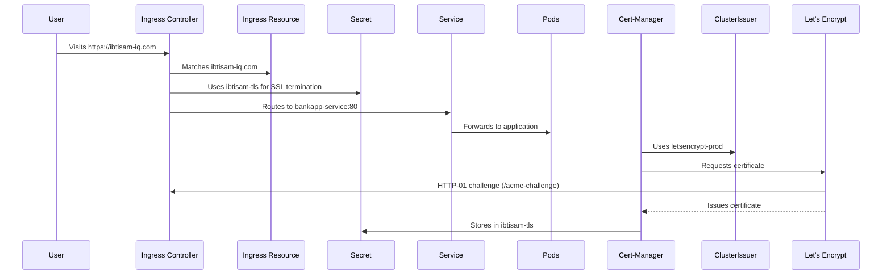

# 📖 Securing Kubernetes with Ingress, TLS, Cert-Manager, and Let’s Encrypt: A Complete Guide

This documentation guides you how to configure **secure HTTPS traffic** for `https://ibtisam-iq.com` in Kubernetes using **Ingress**, **TLS certificates**, **Cert-Manager**, and an **Ingress Controller** with **SSL termination**. Designed like a lesson plan, it walks you through concepts, setup, workflows, and debugging in a logical order, connecting all components to prepare you for real-world deployment or certifications like CKA.

---

## 🧠 Lesson 1: [Understanding TLS/SSL Certificates](ssl-tls-cert-guide.md)

### What is TLS?
**TLS (Transport Layer Security)**, often called SSL, encrypts communication between a client (e.g., browser) and a server, ensuring:
- **Confidentiality**: No eavesdropping on data
- **Integrity**: Data isn’t altered in transit
- **Authentication**: Users connect to the real `ibtisam-iq.com`

When users visit `https://ibtisam-iq.com`, TLS guarantees a secure connection.

### What is a TLS/SSL Certificate?
A **TLS/SSL certificate** is a digital passport for your website, ensuring **encrypted** and **authenticated** communication between a client (e.g., browser) and a server. When a user visits `https://ibtisam-iq.com`, the server presents a TLS certificate to:
- Prove its **identity** ("I am ibtisam-iq.com")
- Provide a **public key** for encrypting data

### Certificate Contents
| Field                | Description                                      |
|----------------------|--------------------------------------------------|
| **Common Name (CN)** | Domain name (e.g., `ibtisam-iq.com`)            |
| **Public Key**       | Encrypts session data                           |
| **CA Signature**     | Signed by a trusted Certificate Authority (CA)  |
| **Validity Period**  | Certificate’s active timeframe (90 days for Let’s Encrypt) |
| **Issuer**           | CA that issued the certificate (e.g., Let’s Encrypt) |
| **SHA-256 Fingerprint** | Unique certificate identifier                |

### Public vs. Private Key
| **Public Key**                     | **Private Key**                       |
|------------------------------------|---------------------------------------|
| Embedded in the certificate        | Kept secret in a Kubernetes Secret    |
| Shared with clients for encryption | Used by the server for decryption     |

For `ibtisam-iq.com`:
- **Issued To**: `ibtisam-iq.com`
- **Issued By**: Let’s Encrypt
- **Public Key**: Generated for your cluster
- **Fingerprint**: Unique to your certificate

### Why TLS?
- **Encryption**: Prevents man-in-the-middle (MITM) attacks
- **Authentication**: Verifies the server’s legitimacy
- **Trust**: Avoids browser "Not Secure" warnings

### What is SSL/TLS Termination?
**SSL termination** occurs at the **Ingress Controller**, which:
1. Receives encrypted HTTPS traffic
2. Decrypts it using a TLS certificate’s private key
3. Forwards plain HTTP to internal services (e.g., `ibtisam-service`)

This centralizes encryption handling, simplifying communication within the cluster.

In Kubernetes, TLS certificates enable **secure HTTPS traffic** for `https://ibtisam-iq.com` via the **Ingress Controller**.

---

## 📜 Lesson 2: Certificate Authorities and Let’s Encrypt

### What is a Certificate Authority (CA)?
A **CA** is a trusted entity that verifies domain ownership and issues TLS certificates. Examples:
- **Free CA**: **Let’s Encrypt** (automated, ideal for `ibtisam-iq.com`)
- **Paid CAs**: DigiCert, GlobalSign, Sectigo (offer warranties, advanced validation)

**Let’s Encrypt** is popular because it’s:
- Free and open
- Automated via tools like Cert-Manager
- Trusted by browsers and reliable for production

### Verifying Domain Ownership: HTTP-01 Challenge
Let’s Encrypt uses the **HTTP-01 challenge** to confirm you control `ibtisam-iq.com`:
1. It requests a file at `http://ibtisam-iq.com/.well-known/acme-challenge/<token>`.
2. If your server (via Ingress) serves the correct token, Let’s Encrypt issues the certificate.

**Note**: This requires your **Ingress Controller** to be accessible on port 80.

---

## 🎛️ Lesson 3: Cert-Manager and ClusterIssuer

### What is Cert-Manager?
**Cert-Manager** is a Kubernetes controller that **automates TLS certificate management** for `ibtisam-iq.com`, handling:
- Requesting certificates from Let’s Encrypt
- Validating domains via HTTP-01 challenges
- Storing certificates in **Kubernetes Secrets**
- Renewing certificates ~30 days before expiry (Let’s Encrypt certificates last 90 days)

### Installation
```bash
kubectl apply -f https://github.com/cert-manager/cert-manager/releases/download/v1.12.1/cert-manager.yaml
```

Cert-Manager uses **Custom Resource Definitions (CRDs)** like `Certificate` and `ClusterIssuer`.

### ClusterIssuer vs. Issuer
| Type              | Scope        | Use Case                               |
|-------------------|--------------|----------------------------------------|
| **Issuer**        | Namespace    | Certificates for apps in one namespace |
| **ClusterIssuer** | Cluster-wide | Shared TLS for `ibtisam-iq.com` across namespaces |

**ClusterIssuer** is ideal for production setups like `ibtisam-iq.com`.

### Configuring ClusterIssuer
A **ClusterIssuer** tells Cert-Manager how to request certificates for `ibtisam-iq.com`. It specifies:
- The CA’s ACME server (e.g., Let’s Encrypt)
- Email for notifications
- The **solver** for domain verification (e.g., HTTP-01)
- The **Secret** to store the private key

**ClusterIssuer YAML**:
```yaml
apiVersion: cert-manager.io/v1
kind: ClusterIssuer
metadata:
  name: letsencrypt-prod
spec:
  acme:
    email: admin@ibtisam-iq.com
    server: https://acme-v02.api.letsencrypt.org/directory
    privateKeySecretRef:
      name: letsencrypt-prod-private-key
    solvers:
    - http01:
        ingress:
          class: nginx
```

### Key Fields
| Field                     | Purpose                                                                 |
|---------------------------|-------------------------------------------------------------------------|
| `name`                    | Unique identifier (e.g., `letsencrypt-prod`)                            |
| `acme.server`             | Let’s Encrypt’s API endpoint                                           |
| `email`                   | Contact for expiry notices (e.g., `admin@ibtisam-iq.com`)              |
| `privateKeySecretRef`     | Secret to store the private key for certificate issuance               |
| `solvers`                 | Configures HTTP-01 challenge via the Ingress Controller                |

---

## 🔐 Lesson 4: Kubernetes Secrets: Storing TLS Certificates

### What is a Secret?
A **Kubernetes Secret** stores sensitive data, such as the TLS certificate and private key for `ibtisam-iq.com`. Cert-Manager stores the **public certificate** and **private key** in a **Kubernetes Secret** of type `kubernetes.io/tls`. Cert-Manager creates two types of Secrets:
- **Private key Secret** (via `privateKeySecretRef`): Used during certificate issuance
- **TLS Secret** (via `Certificate.spec.secretName` or Ingress `tls.secretName`): Stores the certificate and private key for HTTPS

**Example TLS Secret**:
```yaml
apiVersion: v1
kind: Secret
metadata:
  name: ibtisam-tls
type: kubernetes.io/tls
data:
  tls.crt: <base64-encoded-certificate>
  tls.key: <base64-encoded-private-key>
```

Inspect it:
```bash
kubectl get secret ibtisam-tls -o yaml
```

The **Ingress Controller** uses this Secret for **SSL termination**.

---

## 🎧 Lesson 5: Ingress Controller and Ingress Resource

### What is an Ingress Controller?
An **Ingress Controller** (e.g., NGINX) is software running as a pod in the cluster that:
- Listens on **ports 80 (HTTP)** and **443 (HTTPS)**
- Watches **Ingress resources** for routing rules
- Performs **SSL termination** for `https://ibtisam-iq.com`
- Routes traffic to **Services**

**Installation (NGINX)**:
```bash
kubectl apply -f https://raw.githubusercontent.com/kubernetes/ingress-nginx/main/deploy/static/provider/cloud/deploy.yaml
```

Verify:
```bash
kubectl get pods -n ingress-nginx
kubectl get svc -n ingress-nginx
```

### Why an Ingress Controller?
- **Centralized routing**: Manages all external traffic
- **TLS handling**: Enables HTTPS without app-level configuration
- **Flexibility**: Supports host/path-based routing, redirects, and rewrites

> **Note**: The Ingress Controller is separate from Kubernetes core and must be installed.

### What is an Ingress Resource?
An **Ingress resource** defines routing rules for `ibtisam-iq.com`, specifying:
- Which domain to match (e.g., `ibtisam-iq.com`)
- Which paths to route (e.g., `/`)
- Which Service to target (e.g., `bankapp-service`)
- TLS settings for HTTPS

**Ingress YAML**:
```yaml
apiVersion: networking.k8s.io/v1
kind: Ingress
metadata:
  name: ibtisam-ingress
  annotations:
    cert-manager.io/cluster-issuer: "letsencrypt-prod"
    nginx.ingress.kubernetes.io/ssl-redirect: "true"
    nginx.ingress.kubernetes.io/rewrite-target: /
spec:
  tls:
  - hosts:
    - ibtisam-iq.com
    secretName: ibtisam-tls
  rules:
  - host: ibtisam-iq.com
    http:
      paths:
      - path: /
        pathType: Prefix
        backend:
          service:
            name: bankapp-service
            port:
              number: 80
```

### Field Breakdown
| Field                            | Purpose                                                                 |
|----------------------------------|------------------------------------------------------------------------|
| `annotations`                    | Instructs Cert-Manager and NGINX (e.g., enforce SSL redirects)          |
| `spec.tls`                       | Enables HTTPS for `ibtisam-iq.com`                                     |
| `secretName`                     | References the TLS Secret (`ibtisam-tls`)                              |
| `spec.rules`                     | Defines routing rules for HTTP traffic                                 |
| `host`                           | Matches `ibtisam-iq.com`                                               |
| `http.paths.path`                | Matches the URL path (e.g., `/`)                                       |
| `backend.service.name/port`      | Targets `bankapp-service` on port 80                                   |

### SSL Termination
The Ingress Controller:
1. Receives HTTPS traffic for `ibtisam-iq.com`
2. Decrypts it using the private key from `ibtisam-tls`
3. Forwards plain HTTP to `bankapp-service`

---

## 📝 Lesson 6: Optional Certificate Resource

For explicit certificate management, you can create a **Certificate** resource instead of relying on Ingress annotations. However, Cert-Manager can automatically generate certificates when the Ingress is annotated.

**Certificate YAML**:
```yaml
apiVersion: cert-manager.io/v1
kind: Certificate
metadata:
  name: ibtisam-cert
  namespace: default
spec:
  secretName: ibtisam-tls
  issuerRef:
    name: letsencrypt-prod
    kind: ClusterIssuer
  commonName: ibtisam-iq.com
  dnsNames:
    - ibtisam-iq.com
```

---

### 🔐 `privateKeySecretRef` in `ClusterIssuer`
This specifies the **name of the Secret where the ClusterIssuer will store the private key** it uses to sign CSRs (Certificate Signing Requests) or manage challenges (like ACME for Let’s Encrypt).  

```yaml
spec:
  privateKeySecretRef:
    name: my-issuer-private-key
```

➡️ This secret is **used internally** by the `ClusterIssuer` (or `Issuer`).  
It is **not** the same as the TLS secret used by Ingress.

---

### 📄 `spec.secretName` in `Certificate` resource
This is where the **actual TLS certificate (and private key) will be stored** once the certificate is issued for your domain. The Ingress will reference this secret.

```yaml
apiVersion: cert-manager.io/v1
kind: Certificate
metadata:
  name: ibtisam-iq-tls
spec:
  secretName: ibtisam-iq-tls # <--- this will be referenced in Ingress
```

---

### 🌐 `spec.tls[].secretName` in `Ingress`
This is where your Ingress expects the TLS cert + key to exist:

```yaml
spec:
  tls:
    - hosts:
        - ibtisam-iq.com
      secretName: ibtisam-iq-tls
```

➡️ This **must match the `spec.secretName` in the Certificate** object.

---

#### ✅ Summary

| Concept                  | Purpose                                         | Should Match |
|--------------------------|-------------------------------------------------|--------------|
| `privateKeySecretRef` in ClusterIssuer | Internal secret for signing/auth     | ❌ NO        |
| `spec.secretName` in Certificate      | Where cert-manager stores TLS cert  | ✅ YES       |
| `tls[].secretName` in Ingress         | Where Ingress looks for cert+key     | ✅ YES       |

#### 🧠 Rule of Thumb
- `privateKeySecretRef` → for the **issuer**'s private key.  
- `secretName` in `Certificate` → for the **website's TLS cert**, also referenced by Ingress.

---

## Lesson 7: Two Ways to Issue TLS Certificates using `cert-manager`

cert-manager **supports two methods** for issuing TLS certificates, and each affects how Secrets and Certificates are created. Let’s break them down:

### 🅰️ **Method 1: Explicit Certificate YAML (Recommended for control)**

You manually create a `Certificate` resource like this:

```yaml
apiVersion: cert-manager.io/v1
kind: Certificate
metadata:
  name: ibtisam-iq-tls
spec:
  secretName: ibtisam-iq-tls          # 👈 Secret Ingress will use
  issuerRef:
    name: letsencrypt-prod
    kind: ClusterIssuer
  commonName: ibtisam-iq.com
  dnsNames:
    - ibtisam-iq.com
    - www.ibtisam-iq.com
```

Then in your Ingress:

```yaml
spec:
  tls:
    - hosts:
        - ibtisam-iq.com
      secretName: ibtisam-iq-tls      # 👈 Must match the above
```

🔍 **Advantage**: More control (e.g. multiple DNS names, renewals, etc.)
📁 The `Certificate` object is created by you, not inferred.

### 🅱️ **Method 2: Ingress Annotations (Auto-Certificate Issuance)**

Here, you **skip creating a `Certificate` YAML** — cert-manager automatically creates one for you behind the scenes, based on your Ingress annotations:

```yaml
apiVersion: networking.k8s.io/v1
kind: Ingress
metadata:
  annotations:
    cert-manager.io/cluster-issuer: letsencrypt-prod
spec:
  tls:
    - hosts:
        - ibtisam-iq.com
      secretName: ibtisam-iq-tls     # 👈 cert-manager will auto-create a Certificate object for this
```

📦 cert-manager **watches this Ingress**, sees that a certificate is needed, and automatically:
- Creates a `Certificate` resource behind the scenes,
- Triggers issuance using the specified ClusterIssuer,
- Stores the cert in the specified `secretName`.

🔍 **Advantage**: Faster, less YAML.
🔻 **Disadvantage**: Less transparent & customizable — good for simple use cases only.

### ✅ Summary Table

| Feature                        | Manual `Certificate` YAML | Ingress Annotations |
|-------------------------------|----------------------------|----------------------|
| YAML required?                | Yes                        | No                   |
| Custom SANs, lifetimes?       | Yes                        | Limited              |
| Auto-managed Certificate?     | No                         | Yes                  |
| Secret for Ingress required?  | Yes                        | Yes                  |
| Better for production?        | ✅ Yes                     | ❌ Only for simple use |

---

## 🔄 Lesson 8: End-to-End Workflow

### HTTPS Request Flow
1. A user visits `https://ibtisam-iq.com`.
2. The **Ingress Controller** (NGINX) receives the request on port 443.
3. It matches the request to the **Ingress resource** for `ibtisam-iq.com`.
4. Using the TLS certificate from `ibtisam-tls`, it **decrypts** the traffic.
5. It routes the plain HTTP request to `bankapp-service:80`.
6. The Service forwards the request to the application **Pods**.

### Certificate Issuance Flow
1. Cert-Manager detects the Ingress annotation (`cert-manager.io/cluster-issuer`) or a `Certificate` resource.
2. It uses the **ClusterIssuer** (`letsencrypt-prod`) to request a certificate.
3. Cert-Manager generates a **private key** and stores it in the Secret specified by `privateKeySecretRef` (`letsencrypt-prod-private-key`).
4. It creates a temporary Ingress to serve `http://ibtisam-iq.com/.well-known/acme-challenge/<token>` for the **HTTP-01 challenge**.
5. Let’s Encrypt verifies the challenge and issues the certificate.
6. Cert-Manager stores the certificate and private key in `ibtisam-tls`.
7. The **Ingress Controller** uses `ibtisam-tls` for **SSL termination**.

---

## 📊 Lesson 9: Visual Diagram

**Mermaid Diagram**:

### Traffic Flow
```plaintext
User Browser (HTTPS)
       │
       ▼
Ingress Controller (NGINX/Traefik)
  ├── Uses Secret (my-site-tls)
  ├── Performs SSL Termination
  ├── Matches Ingress Rule (host/path)
  │
  └── Forwards HTTP
       │
       ▼
    Service (my-service:80)
       │
       ▼
     Application Pods
```

### Certificate Issuance
```plaintext
Cert-Manager
  ├── Watches Ingress/Certificate
  ├── Uses ClusterIssuer
  ├── Generates Private Key → Stores in Secret (privateKeySecretRef)
  ├── Requests Cert from Let’s Encrypt
  ├── Completes HTTP-01 Challenge
  └── Stores Cert + Key in Secret (spec.secretName)
```

---

## 🛠️ Lesson 10: Setup Steps (What to Do When)

Follow these steps to secure `https://ibtisam-iq.com`:

1. **Deploy Application Service**:
   - Create `ibtisam-service` (e.g., an NGINX container).
   ```bash
   kubectl apply -f - <<EOF
   apiVersion: v1
   kind: Service
   metadata:
     name: ibtisam-service
     namespace: default
   spec:
     selector:
       app: ibtisam
     ports:
     - port: 80
       targetPort: 80
   ---
   apiVersion: apps/v1
   kind: Deployment
   metadata:
     name: ibtisam-deployment
     namespace: default
   spec:
     replicas: 1
     selector:
       matchLabels:
         app: ibtisam
     template:
       metadata:
         labels:
           app: ibtisam
       spec:
         containers:
         - name: nginx
           image: nginx:latest
           ports:
           - containerPort: 80
   EOF
   ```
   Verify:
   ```bash
   kubectl get svc ibtisam-service
   kubectl get pods -l app=ibtisam
   ```

2. **Install Cert-Manager**:
   ```bash
   kubectl apply -f https://github.com/cert-manager/cert-manager/releases/download/v1.12.1/cert-manager.yaml
   ```

3. **Create ClusterIssuer**:
   Apply the ClusterIssuer YAML (see Lesson 3).
   ```bash
   kubectl apply -f clusterissuer.yaml
   ```

4. **Install Ingress Controller (NGINX)**:
   ```bash
   kubectl apply -f https://raw.githubusercontent.com/kubernetes/ingress-nginx/main/deploy/static/provider/cloud/deploy.yaml
   ```

5. **Apply Ingress Resource**:
   Apply the Ingress YAML (see Lesson 5).
   ```bash
   kubectl apply -f ingress.yaml
   ```

6. **(Optional) Create Certificate Resource**:
   If not using Ingress annotations, apply the Certificate YAML (see Lesson 6).
   ```bash
   kubectl apply -f certificate.yaml
   ```

---

## ✅ Lesson 11: Verifying the Setup

Check the final state:
```bash
kubectl get certificate
kubectl get secret ibtisam-tls
kubectl get ingress ibtisam-ingress
kubectl get svc ibtisam-service
```

**Expected Outcome**:
- A TLS certificate is stored in `ibtisam-tls`.
- HTTPS traffic to `https://ibtisam-iq.com` is routed to `ibtisam-service`.
- Cert-Manager automatically renews the certificate ~30 days before expiry.

Test:
- Visit `https://ibtisam-iq.com` in a browser.
- Check the certificate details (should show Let’s Encrypt as the issuer).

---

## ⛑️ Lesson 12: Debugging and Troubleshooting

If `https://ibtisam-iq.com` doesn’t work, check these:

- **Cert-Manager logs**:
  ```bash
  kubectl logs -l app=cert-manager -n cert-manager
  ```
- **Ingress events**:
  ```bash
  kubectl describe ingress ibtisam-ingress
  ```
- **Certificate events**:
  ```bash
  kubectl describe certificate ibtisam-cert
  ```
- **HTTP-01 challenge**:
  Ensure `http://ibtisam-iq.com/.well-known/acme-challenge/` is accessible.
- **Service reachability**:
  Verify `bankapp-service` is running:
  ```bash
  kubectl get svc bankapp-service
  ```
- **DNS and ports**:
  Confirm `ibtisam-iq.com` resolves to the Ingress Controller and ports 80/443 are open.

**Pro Tip for CKS**:
- Use `kubectl describe` and `kubectl logs` to diagnose issues.
- Check if the Ingress Controller is routing `.well-known` paths correctly.
- Verify DNS settings for `ibtisam-iq.com`.

---

## ✅ Lesson 13: Key Components and Roles

| Component            | Role                                                                 |
|---------------------|----------------------------------------------------------------------|
| **Let’s Encrypt**   | Issues TLS certificates for `ibtisam-iq.com`                         |
| **HTTP-01 Challenge**| Proves control of `ibtisam-iq.com` via HTTP request                 |
| **Cert-Manager**    | Automates certificate issuance, renewal, and storage                 |
| **ClusterIssuer**   | Defines Let’s Encrypt settings for Cert-Manager                     |
| **Kubernetes Secret**| Stores TLS certificate and private key (`ibtisam-tls`)              |
| **Ingress Controller**| Routes traffic, terminates SSL for `ibtisam-iq.com`                |
| **Ingress Resource**| Configures routing and TLS for `ibtisam-iq.com`                    |
| **Certificate Resource**| Explicitly requests a certificate (optional)                       |

---

## 🛠️ Lesson 14: Why Separate Components?

- **Cert-Manager**: Manages certificate lifecycle
- **Ingress Controller**: Routes traffic and terminates SSL
- **ClusterIssuer**: Provides CA configuration
- **Secrets**: Securely store sensitive data

These components enable **automated, secure HTTPS** in Kubernetes.

---

## 🎯 Lesson 15: Analogy – The Airport

- **Cert-Manager**: Security team verifying passenger identities
- **ClusterIssuer**: Security policy for issuing boarding passes
- **Let’s Encrypt**: Passport authority issuing credentials
- **Ingress Controller**: Gate officer checking boarding passes and directing passengers
- **Ingress Resource**: Flight schedule board guiding passengers to gates
- **Secret**: Locked safe storing boarding passes
- **Certificate Resource**: Formal passport application

---

## Summary
**Cert-Manager** is a Kubernetes add-on that automates the issuance, renewal, and management of TLS certificates for `ibtisam-iq.com`. It integrates with Certificate Authorities (CAs) like Let’s Encrypt to simplify securing HTTPS traffic. Using the **ClusterIssuer** resource, Cert-Manager defines how to communicate with Let’s Encrypt, specifying the ACME endpoint, email (`admin@ibtisam-iq.com`), HTTP-01 challenge solver, and private key storage. Cert-Manager watches **ClusterIssuer**, **Certificate**, and annotated **Ingress** resources in Kubernetes’ declarative model, triggering certificate requests when needed. Once issued, certificates are stored in **Kubernetes Secrets** (e.g., `ibtisam-tls`) for use by the Ingress Controller. This automation ensures `ibtisam-iq.com` remains secure with minimal manual effort, paving the way for testing and advanced configurations.

For more details:
- [Ingress Basic Guide](ingress-basic.md)
- [Understading Ingress — A Simple Example with `chatgpt.com`](ingress-example.md)
- [How to Create an Ingress Resource Imperatively?](ingress-cli.md)
