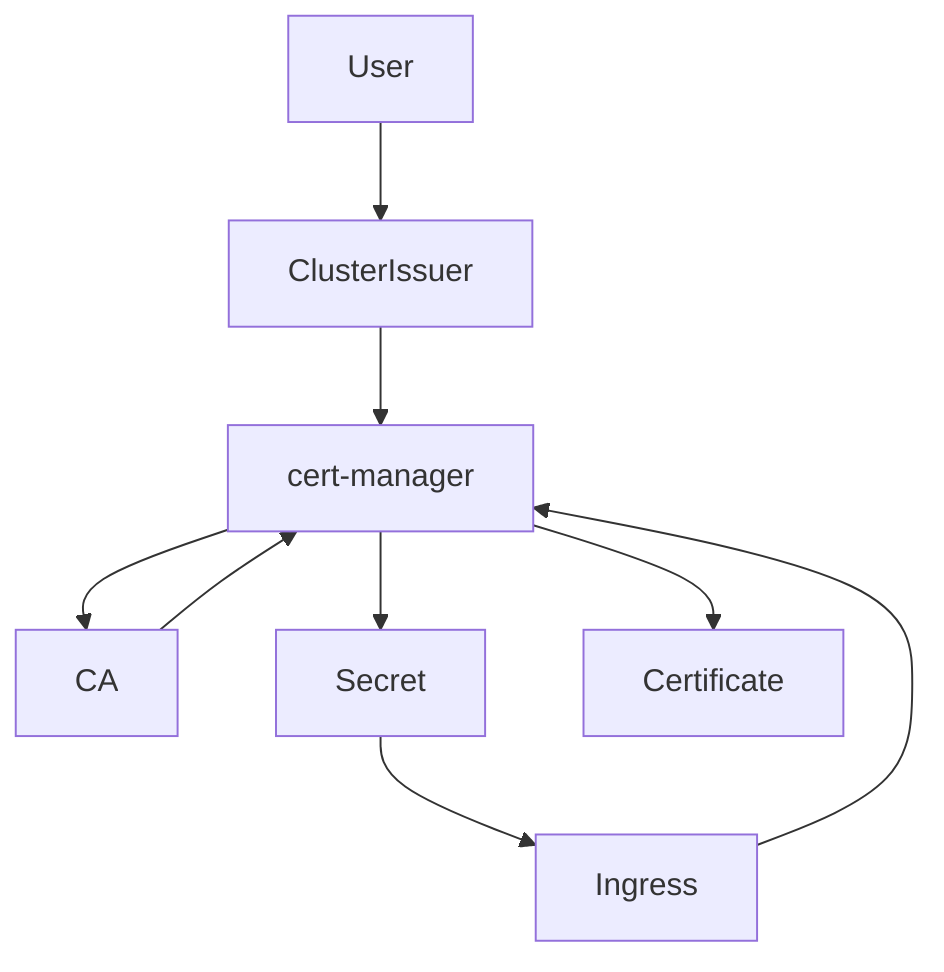

# 📑 cert-manager in Kubernetes

## 📌 What is cert-manager?
**cert-manager** is a Kubernetes add-on that automates:
- **Obtaining**
- **Renewing**
- **Managing**

SSL/TLS certificates for Kubernetes resources like Ingress and custom applications.  
It reduces the manual hassle of issuing certificates from trusted Certificate Authorities (CAs) like **Let’s Encrypt**, **ZeroSSL**, **BuyPass**, and many others.

---

## 📌 Why cert-manager?
In production systems:
- You need **valid, auto-renewable SSL/TLS certificates** for secure HTTPS traffic.
- Manually creating and updating certificates is time-consuming and error-prone.
- cert-manager integrates certificate automation directly with the **Kubernetes API** — meaning everything becomes declarative, repeatable, and automated.

---

## 📌 How cert-manager Works (Concept Chain)
To connect the dots:
1. **You define a ClusterIssuer or Issuer**
   - This declares **how cert-manager should communicate with a CA**.
   - It includes:
     - The CA’s **URL or ACME endpoint**
     - **Authentication or account details**  
     - The **challenge solver method** (like HTTP-01, DNS-01)
     - The **secret where private keys are stored**

2. **You create a Certificate resource**
   - This requests a certificate from a CA via the **configured Issuer or ClusterIssuer**
   - cert-manager reads this and **starts the issuance process**

3. **cert-manager watches:**
   - **Issuer / ClusterIssuer** — to know how to communicate with the CA.
   - **Certificate** — to see when a certificate is requested or needs renewing.
   - **Ingress (if annotated)** — to automatically manage certificates for your Ingress resources.

4. **cert-manager communicates with the CA**
   - For example, with Let’s Encrypt via **ACME protocol**
   - It proves ownership (via HTTP-01 or DNS-01 challenge)
   - Requests the certificate
   - Receives and stores it inside a **Kubernetes Secret**

---

## 📌 Key Resources cert-manager Uses

| Resource Type   | Purpose | Scope |
|:----------------|:----------------|:--------|
| **Issuer**             | Configures how cert-manager should talk to a CA | Namespace scoped |
| **ClusterIssuer** | Same as Issuer but cluster-wide | Cluster scoped |
| **Certificate**       | Requests a certificate for a specific domain using an Issuer/ClusterIssuer | Namespace scoped |
| **Secret**               | Stores the actual TLS certificate and private key | Namespace scoped |

---

## 📌 Example ACME HTTP-01 ClusterIssuer YAML

```yaml
apiVersion: cert-manager.io/v1
kind: ClusterIssuer
metadata:
  name: letsencrypt-production
spec:
  acme:
    server: https://acme-v02.api.letsencrypt.org/directory
    email: your-email@example.com
    privateKeySecretRef:
      name: letsencrypt-production-account-key
    solvers:
      - http01:
          ingress:
            class: nginx
```

---

## 📌 What is a Solver?
A **solver** is a mechanism cert-manager uses to prove to the CA that you own the domain.  
Popular solver types:
- **HTTP-01** — CA makes an HTTP request to your domain (via Ingress)
- **DNS-01** — CA checks a specific DNS TXT record in your domain’s DNS

---

## 📌 When and Why cert-manager Watches Resources  
cert-manager is a **controller** inside the cluster that watches:

| Resource | Why It Watches |
|:------------|:----------------------------|
| **ClusterIssuer / Issuer** | To detect new or updated CA communication configs |
| **Certificate** | To trigger the certificate issuance process |
| **Ingress (optional)** | If Ingress has specific annotations, cert-manager automatically creates Certificates |

**Why not generate certificates itself?**  
→ **Because cert-manager isn’t a CA** — it’s a controller that automates requesting certificates from **external CAs** using the rules you define in your Issuer/ClusterIssuer.

---

## 📌 What’s in the privateKeySecretRef?  
cert-manager requires a **private key** for:
- Signing the ACME account registration with Let’s Encrypt  
- Proving identity to the CA during the issuance process  
- It stores this private key securely in a Kubernetes Secret.

When the CA issues a certificate, cert-manager combines the **private key** with the **signed certificate** and stores both inside another Secret.

---

## ✅ Summary Diagram  


