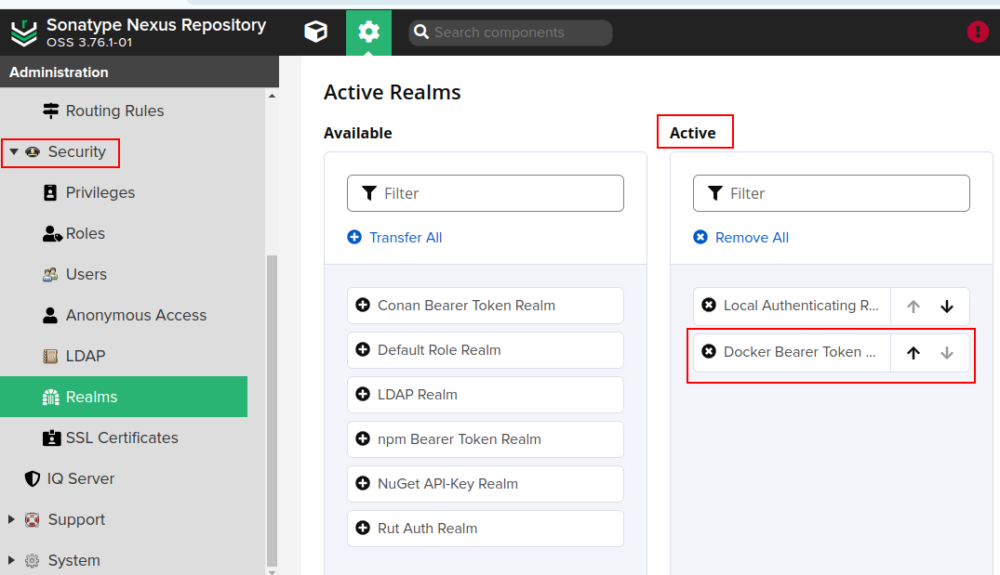

# Setting up Private Docker Registry in Nexus

1. **Set up Nexus via Docker**
- Run the following command to start Nexus in Docker: `docker run -d --name nexus -p 8081:8081 -p 5000:5000 sonatype/nexus3`
- Access Nexus at `http://localhost:8081` and set up the admin user and password.

2. **Create a new Nexus repository**: In the Nexus web interface, go to **Repositories** > **Create Repository**. Choose **Docker** as the repository type and give it a name ( e.g., "my-private-registry"). Make sure to select the correct Docker repository format e.g., "Docker (Hosted)".


3. **Configure Docker Server for Allowing HTTP Connections**
- As we set `HTTP` instead of `HTTPS` in the previous step, we need to configure Docker to allow HTTP connections. This can be done by setting the `insecure-registries` option in the Docker daemon configuration file. You can do this by adding the following line to the `/etc/docker/daemon.json` file:

```bash
vi /etc/docker/daemon.json
```

```json
{
    "insecure-registries": ["http://localhost:5000"] // adjust the IP of Nexus server and port as needed
}
```

4. **Restart Docker Service**
- After modifying the Docker daemon configuration file, restart the Docker service to apply the changes: `sudo systemctl restart docker` (on Ubuntu-based systems) or `sudo service docker restart` (on CentOS-based systems).
- Verify that the Docker service is running and listening on the correct port: `sudo systemctl status docker` (on Ubuntu-based systems) or `sudo service docker status` (on CentOS-based systems).
- You can also check the Docker logs for any errors: `sudo journalctl -u docker ` (on Ubuntu-based systems) or `sudo docker logs` (on CentOS-based systems).

5. **Realms and Authentication**
- In Nexus, go to **Security** > **Realms** and create a new realm.



6. **Restart Nexus Service**
- After configuring Docker to allow HTTP connections, restart the Nexus service to apply the changes: `docker restart nexus`.
- Verify that the Nexus service is running and listening on the correct port: `docker ps -a | grep nexus`.
- You can also check the Nexus logs for any errors: `docker logs nexus`.
- Access Nexus at `http://localhost:8081` and verify that the Docker repository is available.

6. **Login to Docker Registry**

- You can now login to the Docker registry using the following command: `docker login http://localhost:5000`
- Use the credentials you created in Nexus to login. You can verify that you are logged in by running `docker info` which should display the registry information.
- You can now push and pull images to and from your private Docker registry. For example, you can push an image using the following command: `docker tag my-image:latest http://localhost:5000/ my-image:latest` followed by `docker push http://localhost:5000/my-image:latest`.
- You can also use the `docker push` command with the `-t` option to specify the registry and tag in one step: `docker push -t http://localhost:5000/my-image:latest my-image:latest`.
- You can also use the `docker pull` command to pull an image from your private registry: `docker pull http://localhost:5000/my-image:latest`.