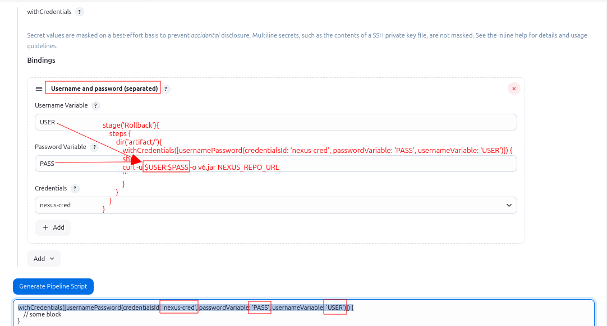

# Publishing Maven Artifacts to Nexus using Jenkins

## 1. Update pom.xml to Integrate with Nexus

### Step 1: Mention the Nexus Repository Type: Snapshots or Releases

```xml
<!-- Root element for the project metadata -->
<project>
    <!-- 
        Group ID: Specifies the unique identifier for the project's group or organization.
        Typically represents a domain or company name in reverse format.
    -->
    <groupId>com.example</groupId>
    
    <!-- 
        Artifact ID: The unique name of the project or module.
        Used to identify the artifact within the group.
    -->
    <artifactId>bankapp</artifactId>
    
    <!-- 
        Version: Specifies the version of the project.
        - Use 'SNAPSHOT' in the version (e.g., 0.0.1-SNAPSHOT) to publish to the snapshot repository.
        - Use a specific version number (e.g., 1.0.0) to publish to the release repository.
        This decision determines whether the artifact is considered a development version (SNAPSHOT) 
        or a stable release version.
    -->
    <version>0.0.1-SNAPSHOT</version>
    
    <!-- 
        Name: A human-readable name for the project.
        This is purely for informational purposes and does not affect repository selection.
    -->
    <name>bankapp</name>
    
    <!-- 
        Description: A brief description providing details about the project.
        This is useful for documentation or repository indexing.
    -->
    <description>Banking Web Application</description>
</project>
```
### Step 2: Mention the Nexus Repository URL in the pom.xml

- Unlike SonarQube, you need URL of the nexus repo, not the server URL itself.
- Unlike Sonarqube, you need to add the URL in the `source code`, not inside the Jenkins UI.
 
```xml
<project>
    <!-- Other project information -->
    <distributionManagement>
        <repository>
            <id>maven-releases</id>
            <url>NEXUS-URL/repository/maven-releases/</url>
        </repository>
        <snapshotRepository>
            <id>maven-snapshots</id>
            <url>NEXUS-URL/repository/maven-snapshots/</url>
        </snapshotRepository>
    </distributionManagement>
    <!-- Other project configuration -->
</project>
```  
Replace `NEXUS-URL` with the URL of your Nexus repository.

## 2: Add Nexus Credentials to Jenkins

- Install a plugin `Config File Provider`. It provides us the ability to provide configuration files.
- Go to Jenkins > Manage Jenkins > Configure System > `Manage Files` > `Global Maven settings.xml`.
- You can put the credentials here in two different ways.


  - Howerver, you can also put the credentials in the `settings.xml` file in the Jenkins workspace.

### Step 1: Add Maven Releases and Snapshots Repos

```xml
<server>
<id>maven-releases</id>                 <!-- put the repo name here -->
<username>your-username</username>      <!-- put the username of your nexus account here -->
<password>your-password</password>      <!-- put the password of your nexus account here -->
</server>

<server>
<id>maven-snapshots</id>                <!-- put the repo name here -->
<username>your-username</username>      <!-- put the username of your nexus account here -->
<password>your-password</password>      <!-- put the password of your nexus account here -->
</server>
```
### Step 2: Add Maven Proxy Repo

```xml
<!-- First, we need to define the proxy repo -->
<server>
<id>maven-proxy-repo</id>               <!-- put the proxy repo name here -->
<username>your-username</username>      <!-- put the username of your nexus account here -->
<password>your-password</password>      <!-- put the password of your nexus account here -->
</server>
```

```xml
<!-- Then, we need to define the proxy settings -->
<mirror>
<id>nexus</id>
<!-- mirror all repositories, including central. Put * if you want to mirror all, put the name of the repo if you want to mirror only that repo -->               
<mirrorOf>*</mirrorOf>                     
<url>http://your-proxy-repo-url.com</url>  <!-- put the proxy repo url here -->
</mirror>

```

## 3: Install Maven Plugins
- Install `Maven Integration`. It provides us the ability to run maven commands.
- Install `Pipeline Maven Integration`. It provides us the ability to run maven commands in pipeline.

---

## Stage: Download JAR with Credentials

This Jenkins pipeline stage is designed to securely download a `.jar` file from a URL requiring authentication. It uses credentials stored in Jenkins' credentials store to handle the authentication.

### Pipeline Code
```groovy
stage('Download JAR with Credentials') {
  steps {
    script {
      withCredentials([usernamePassword(credentialsId: 'nexus-cred', passwordVariable: 'pass', usernameVariable: 'user')]) {
        def jarUrl = 'https://example.com/path/to/your.jar'
        sh "curl -u $user:$pass -O $jarUrl"
      }
    }
  }
}
```
### **Key Components**

1. **`withCredentials` Block**
   - Securely retrieves credentials stored in Jenkins.
   - **Parameters:**
     - `credentialsId`: The unique ID of the credentials stored in Jenkins.
     - `usernameVariable`: The environment variable (`user`) used to store the username.
     - `passwordVariable`: The environment variable (`pass`) used to store the password.

2. **`jarUrl`**
   - The URL of the `.jar` file to be downloaded.

3. **`sh` Step**
   - Executes a shell command to download the JAR file using `curl`.
   - **Options:**
     - `-u $user:$pass`: Passes the username and password for authentication.
     - `-O`: Saves the file with its original name.



---

## Stage: Deploy Artifact to Nexus

```groovy
stage('Code-Build') {
    steps {
        sh "mvn clean package"
    }
}

stage('Deploy Artifact To Nexus') {
    steps {
        withMaven(globalMavenSettingsConfig: 'nexus-ID', jdk: 'jdk17', maven: 'maven3', mavenSettingsConfig: '', traceability: false) {
            sh "mvn deploy"
        }
    }
}
```

### `withMaven` Step in Jenkins

The `withMaven` step in Jenkins is used to integrate Maven builds with Jenkins pipelines. It provides an environment where Jenkins can manage Maven-related tasks, such as building, testing, and deploying Java applications, while automatically handling configurations like:

#### Key Parameter in `withMaven`

##### `globalMavenSettingsConfig`
- Refers to a pre-configured Maven settings file in Jenkins.
- The value (`nexus-ID`) is an identifier for a stored Maven settings configuration.
- It typically includes details like:
  - Repository URLs.
  - Authentication credentials for private repositories like Nexus or Artifactory.
  - Proxy settings or build profiles.

#### What It’s For

In this specific context:
- Ensures the `mvn deploy` command uses the correct Maven settings file.
- Helps Jenkins connect securely to the Nexus repository (or any artifact repository) by:
  - Resolving dependencies during the build.
  - Deploying the built artifacts to the repository.

---

# Publishing Node.js Artifacts to Nexus using Jenkins

## Step 1: Create a Nexus Repository


## Step 1: Create a Custom `.npmrc` File in Jenkins

- Install the required plugins `Config File Provider Plugin` and `NodeJS Plugin` in Jenkins.
- Go to `Manage Jenkins` > `Tools` > `NodeJS Installations` > and configure the tool.  

1. **Navigate to Jenkins Configuration:**
   - Go to **Manage Jenkins** > **Managed Files**.

2. **Create a New Custom File:**
   - Click on **Add a new Config**.
   - Select **Custom file** and name it `.npmrc`.

3. **Add Authentication Details:**
   - Convert your Nexus credentials to base64:
     ```bash
     echo -n 'admin:ibtisam' | base64
     ```
   - Example output:
     ```
     YWRtaW46aWJ0aXNhbQ==
     ```
   - Add the following lines to the `.npmrc` file:
      - For Snapshot Repository:
     ```
     registry=http://13.235.245.200:8081/repository/npm-snapshot
     //13.235.245.200:8081/repository/npm-snapshot/:_auth=YWRtaW46aWJ0aXNhbQ==
     ```
      - For Release Repository:
     ``` 
     registry=http://13.235.245.200:8081/repository/npm-release
     //13.235.245.200:8081/repository/npm-release/:_auth=YWRtaW46aWJ0aXNhbQ==
     ```

     - For Newly Created Hosted Repository:
     ``` 
     registry=http://13.235.245.200:8081/repository/npm-hosted-private-repo
     //13.235.245.200:8081/repository/npm-hosted-private-repo/:_auth=YWRtaW46aWJ0aXNhbQ==
     ```

---

## Step 2: Jenkins Pipeline Configuration

Create a Jenkins pipeline with the following stages:

```groovy
pipeline {
    agent any
    stages {
        stage('Git') {
            steps {
                git branch: 'main', url: 'https://github.com/ibtisamops/Node.js-Jest.git'
            }
        }
        stage('NPM Dependencies') {
            steps {
                nodejs('node23') {
                    sh "npm install"
                }
            }
        }
        stage('Publish to Nexus') {
            steps {
                configFileProvider([configFile(fileId: 'npm', targetLocation: '.')]) {
                    nodejs('node23') {
                        sh "npm publish"
                    }
                }
            }
        }
    }
}
```

- The .npmrc file created earlier is provided to the pipeline using configFileProvider.
- The artifacts are published to Nexus using the `npm publish` command.
- Replace the registry URL in the .npmrc file with the actual Nexus repository URL.

---


