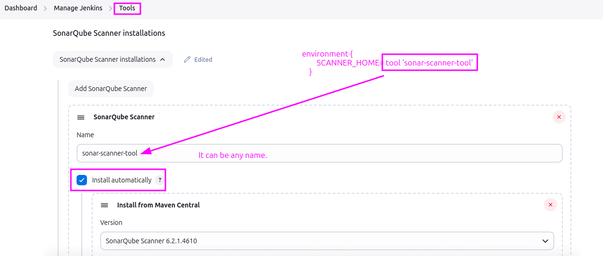
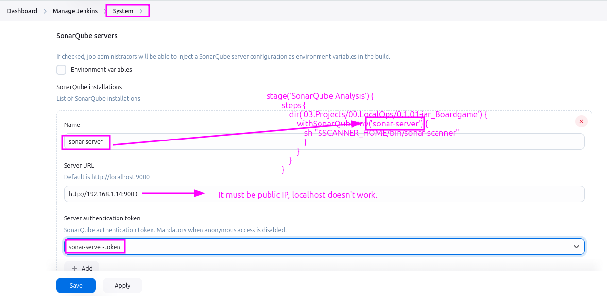
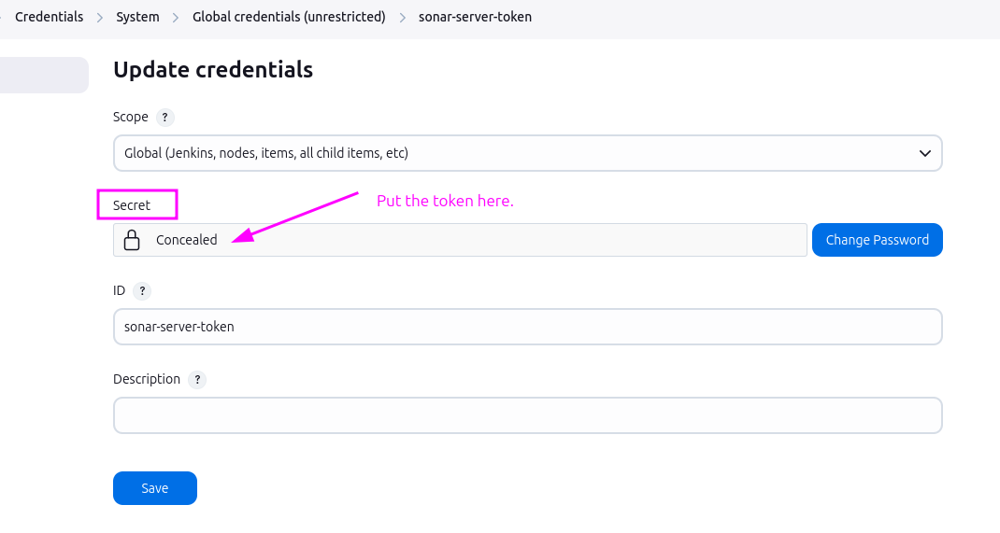
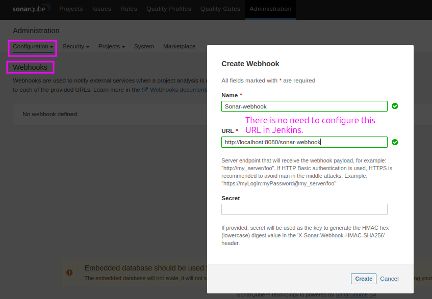

# Comprehensive Guide to SonarQube Server

## Table of Contents
1. [What is SonarQube?](#what-is-sonarqube)
2. [Key Features and Editions](#key-features-and-editions)
3. [Understanding Static Application Security Testing (SAST)](#understanding-static-application-security-testing-sast)
4. [Common Code Issues and Their Impact](#common-code-issues-and-their-impact)
   - [Comparison Table](#comparison-table)
5. [Core Concepts in SonarQube](#core-concepts-in-sonarqube)
6. [How SonarQube Works](#how-sonarqube-works)
7. [Setting Up SonarQube](#setting-up-sonarqube)
   - [Using Docker](#using-docker)
   - [Local Installation](#local-installation)
8. [Integrating SonarQube with Jenkins](#integrating-sonarqube-with-jenkins)
9. [Best Practices for SonarQube](#best-practices-for-sonarqube)
10. [Common Use Cases](#common-use-cases)
11. [FAQs](#faqs)

---

## What is SonarQube Server (formerly SonarQube)?

- Leading on-premise platform for continuous code quality and security analysis.
- Supports over 30 programming languages, frameworks, and IaC platforms.
- Utilizes **Static Application Security Testing (SAST)** to identify and address:
  - Bugs
  - Vulnerabilities
  - Code smells
  - Duplicated code
  - Technical debt
- Enables **automated code quality checks** in CI/CD pipelines.

---

## Key Features and Editions

### Editions of SonarQube
- **Community Edition**: Free, open-source, essential static code analysis.
- **Developer Edition**: Adds branch analysis, deeper language support.
- **Enterprise Edition**: Advanced reporting, portfolio management, governance.
- **Data Center Edition**: High-availability, scalability for critical environments.

### Components

1. **SonarQube Scanner**:  
   - Analyzes code and publishes reports to the server.  

2. **SonarQube Server**:  
   - Hosts the analysis reports and provides dashboards for insights.

### Key Features
- **Multi-Language Support**: Java, Python, JavaScript, .NET, etc.
- **Quality Gates**: Enforce quality checks before code merges.
- **Code Coverage Metrics**: Integrates with test frameworks to highlight untested areas.
- **AI-Powered Fixes**: Recommendations for addressing issues.
- **DevOps Integration**: Works seamlessly with Jenkins, GitHub Actions, Azure DevOps, and more.
- Known for **Code Quality Check** and **Code Coverage capabilities**. 

---

## Core Concepts in SonarQube

### **Code Quality**
- **Definition**: Measures how well-written, understandable, and maintainable the source code is. 
- **Aspects Covered**:
  - Identifies code smells (non-functional issues that indicate a need for refactoring).
  - Detects bugs and potential runtime issues.
  - Highlights violations of best practices.
- **Why It Matters**: High code quality ensures easier debugging, enhanced performance, and lower maintenance costs. Poor-quality code often leads to technical debt.

---

### **Code Coverage**
- **Definition**: Represents the percentage of the codebase that is executed when automated tests are run.
- **Importance**:
  - Ensures critical parts of the application are tested.
  - Reduces the likelihood of undetected bugs in untested code.
- **How It Works in SonarQube**:
  - Requires integration with testing tools.
  - Plugins specific to programming languages calculate and report coverage data. For example:
    - **JaCoCo** for Java projects (add to `pom.xml` for Maven builds).
    - **Coverage.py** for Python projects.
- **Example in Action**:
  - A Java project may achieve 75% coverage, highlighting areas that lack adequate test cases. This guides developers to write additional tests for untested code.

---

### **Quality Gates**
- **Definition**: Criteria or thresholds that code must meet to pass quality checks.
- **Examples of Metrics in a Quality Gate**:
  - **Code Coverage**: A minimum percentage (e.g., 80%) must be covered by tests.
  - **Bugs**: No critical or blocker bugs.
  - **Code Smells**: Limit the number of major smells.
  - **Duplications**: Keep duplicated code below a certain threshold.
- **Usage in CI/CD Pipelines**:
  - Integrated with tools like Jenkins to enforce automated quality checks.
  - Example: A webhook from SonarQube fetches quality gate metrics before proceeding with deployment.


---

### **Quality Profiles**
- **Definition**: Configurable sets of coding rules tailored for specific languages or project requirements.
- **How They Work**:
  - SonarQube provides default profiles for various programming languages.
  - Profiles can be customized to align with project-specific coding standards.
- **Use Cases**:
  - A Java project may require strict adherence to JDK conventions, while a Python project focuses on PEP-8 compliance.
  - Projects with different risk levels (e.g., financial systems vs. prototypes) can apply stricter or more lenient profiles.


---

### **Technical Debt**
- **Definition**: The implied cost of fixing code quality issues left unresolved.
- **How SonarQube Quantifies Technical Debt**:
  - Expressed as the time needed to address all detected issues.
  - Includes refactoring poorly written code, fixing bugs, and resolving smells.
- **Types of Technical Debt**:
  - **Deliberate Debt**: When shortcuts are knowingly taken for speed.
  - **Accidental Debt**: Arising from lack of knowledge or oversight.
- **Impact on Projects**:
  - High technical debt increases long-term maintenance costs.
  - Resolving debt early ensures stability and better project scalability.

---

### Expanded Examples and Real-World Applications

#### **Code Quality Example**:
- **Scenario**: A web application fails during heavy traffic due to poorly structured code.
- **How SonarQube Helps**: Identifies inefficient loops and resource-intensive methods, enabling developers to optimize the code.

#### **Code Coverage Example**:
- **Scenario**: A banking app crashes when users perform certain transactions.
- **How SonarQube Helps**: Shows untested critical code paths, guiding developers to create test cases for those scenarios.

#### **Quality Gates Example**:
- **Scenario**: Deployment is halted because quality gate conditions fail.
- **Action**: Developers review the feedback, fix issues, and resubmit the code. Only when the quality gate is passed does the pipeline resume.

#### **Technical Debt Example**:
- **Scenario**: A legacy application requires frequent patches, delaying new feature development.
- **How SonarQube Helps**: Quantifies the time needed to fix the existing debt, allowing teams to prioritize tasks effectively.

---

## How SonarQube Works

1. **Static Analysis**:  
   - Scans the source code without executing it to find potential issues.

2. **Issue Classification**:  
   - Categorizes findings into:  
     - Bugs  
     - Vulnerabilities  
     - Code smells  
   - Assigns severity levels (e.g., critical, major, minor).

3. **Reporting**:  
   - Generates dashboards and detailed reports highlighting trends and areas for improvement.

4. **Continuous Integration**:  
   - Automatically enforces quality standards during CI/CD pipeline executions.

---

## How SonarQube Detects Issues

- SonarQube relies on **Quality Profiles** configured for each programming language.  
- Example: For a Java program, the Quality Profile specifies coding rules, which SonarQube uses to identify violations.

---

## Setting Up SonarQube

### Using Docker

```bash
sudo apt install openjdk-17-jre-headless
docker run -d --name sonarqube -p 9000:9000 sonarqube:lts-community
```
- **Access the Interface**: Open `http://localhost:9000`
- Allow a few minutes for server to become online.

### Local Installation

- **Download SonarQube**: [SonarQube downloads page](https://www.sonarsource.com/)
- **Extract and Configure**: Unzip, configure `sonar.properties`.
- **Start SonarQube**: `./bin/{OS}/sonar.sh start`
- **Access the Interface**: Navigate to `http://localhost:9000`

---

## Integrating SonarQube with Jenkins

### Steps to Integrate

- **Install Plugins**: `SonarQube Scanner` plugin in Jenkins to publish the results to SonarQube Server.
- **Add SonarQube Scanner**: `Manage Jenkins > Tool`, configure scanner.



- **Configure SonarQube Server**: `Manage Jenkins > System`, add SonarQube server details.



    - Best Practice: Use an access token (generated in SonarQube) instead of a `username` and `password`. Save the token as a `Secret Text` under `Credentials`.




- **Configure Webhook**: Set up a webhook in SonarQube Server to send analysis results to Jenkins.



### Pipeline Stages

1. **Checkout Code**
   ```groovy
   stage('Checkout') {
       steps {
           checkout scm
       }
   }
   ```

2. **SonarQube Analysis**
   ```groovy
   // This stage must be after "Testing"
  
   stage('SonarQube Analysis') {
        steps {
            dir('03.Projects/00.LocalOps/0.1.01-jar_Boardgame') {
                withSonarQubeEnv('sonar-server') {
                    sh "$SCANNER_HOME/bin/sonar-scanner"
                    }
                }
            }
        }
   ```

3. **Quality Gate Check**
   ```groovy
   stage('Quality Gate') {
       steps {
            timeout(5) {
                waitForQualityGate abortPipeline: false
            }
       }
   }
   ```

---

## Best Practices for SonarQube

- **Define Quality Gates**: Align with organization’s standards.
- **Regular Scans**: Automate scans for every commit/pull request.
- **Integrate with CI/CD**: Part of continuous integration/delivery pipelines.
- **Review Reports**: Regularly review, address issues promptly.
- **Customize Quality Profiles**: Tailor to project needs.

---

## Common Use Cases

- **Code Quality Assurance**: Ensure code meets quality standards.
- **Security Analysis**: Identify, fix vulnerabilities.
- **Technical Debt Management**: Monitor, reduce technical debt.
- **Regulatory Compliance**: Ensure code complies with standards/regulations.

---

## FAQs

- **Access SonarQube**: `http://localhost:9000`
- **Supported Languages**: Over 30, including Java, Python, JavaScript, .NET.
- **Integrate with Jenkins**: Install `SonarQube Scanner` plugin, configure server details, add scanner.
- **Quality Gates**: Criteria for production-ready code.
- **Customize Quality Profiles**: Configure rule sets in Quality Profiles section.

---

This guide provides a comprehensive overview of SonarQube, its features, setup process, and best practices for integrating it into your workflow. For more detailed instructions, refer to the official SonarQube documentation.