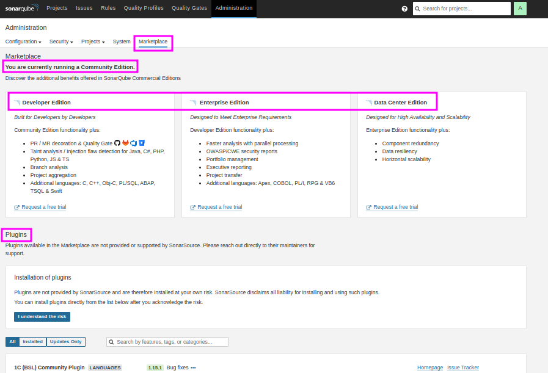

# Comprehensive Guide to SonarQube Server

## Table of Contents
1. [What is SonarQube?](#what-is-sonarqube)
2. [Key Features and Editions](#key-features-and-editions)
3. [Understanding Static Application Security Testing (SAST)](#understanding-static-application-security-testing-sast)
4. [Common Code Issues and Their Impact](#common-code-issues-and-their-impact)
   - [Comparison Table](#comparison-table)
5. [Core Concepts in SonarQube](#core-concepts-in-sonarqube)
6. [How SonarQube Works](#how-sonarqube-works)
7. [Setting Up SonarQube](#setting-up-sonarqube)
   - [Using Docker](#using-docker)
   - [Local Installation](#local-installation)
8. [Integrating SonarQube with Jenkins](#integrating-sonarqube-with-jenkins)
9. [Best Practices for SonarQube](#best-practices-for-sonarqube)
10. [Common Use Cases](#common-use-cases)

---

## What is SonarQube Server (formerly SonarQube)?

- Leading on-premise platform for continuous code quality and security analysis.
- Supports over 30 programming languages, frameworks, and IaC platforms.
- Utilizes **Static Application Security Testing (SAST)** to identify and address:
  - Bugs
  - Vulnerabilities
  - Code smells
  - Duplicated code
  - Technical debt
- Enables **automated code quality checks** in CI/CD pipelines.

---

## Key Features and Editions

### Editions of SonarQube
- **Community Edition**: Free, open-source, essential static code analysis.
- **Developer Edition**: Adds branch analysis, deeper language support.
- **Enterprise Edition**: Advanced reporting, portfolio management, governance.
- **Data Center Edition**: High-availability, scalability for critical environments.

### Components

1. **SonarQube Scanner**:  
   - Analyzes code and publishes reports to the server.  

2. **SonarQube Server**:  
   - Hosts the analysis reports and provides dashboards for insights.

### Key Features
- **Multi-Language Support**: Java, Python, JavaScript, .NET, etc.
- **Quality Gates**: Enforce quality checks before code merges.
- **Code Coverage Metrics**: Integrates with test frameworks to highlight untested areas.
- **AI-Powered Fixes**: Recommendations for addressing issues.
- **DevOps Integration**: Works seamlessly with Jenkins, GitHub Actions, Azure DevOps, and more.
- Known for **Code Quality Check** and **Code Coverage capabilities**. 

---

## Core Concepts in SonarQube

### **Code Quality**
- **Definition**: Measures how well-written, understandable, and maintainable the source code is. 
- **Aspects Covered**:
  - Identifies code smells (non-functional issues that indicate a need for refactoring).
  - Detects bugs and potential runtime issues.
  - Highlights violations of best practices.
- **Why It Matters**: High code quality ensures easier debugging, enhanced performance, and lower maintenance costs. Poor-quality code often leads to technical debt.

---

### **Code Coverage**
- **Definition**: Represents the percentage of the codebase that is executed when automated tests are run.
- **Importance**:
  - Ensures critical parts of the application are tested.
  - Reduces the likelihood of undetected bugs in untested code.
- **How It Works in SonarQube**:
  - Requires integration with testing tools.
  - Plugins specific to programming languages calculate and report coverage data. For example:
    - **JaCoCo** for Java projects (add to `pom.xml` for Maven builds).
    - **Coverage.py** for Python projects.
- **Example in Action**:
  - A Java project may achieve 75% coverage, highlighting areas that lack adequate test cases. This guides developers to write additional tests for untested code.

---

### **Quality Gates**
- **Definition**: Criteria or thresholds that code must meet to pass quality checks.
- **Examples of Metrics in a Quality Gate**:
  - **Code Coverage**: A minimum percentage (e.g., 80%) must be covered by tests.
  - **Bugs**: No critical or blocker bugs.
  - **Code Smells**: Limit the number of major smells.
  - **Duplications**: Keep duplicated code below a certain threshold.
- **Usage in CI/CD Pipelines**:
  - Integrated with tools like Jenkins to enforce automated quality checks.
  - Example: A webhook from SonarQube fetches quality gate metrics before proceeding with deployment.


---

### **Quality Profiles**
- **Definition**: Configurable sets of coding rules tailored for specific languages or project requirements.
- **How They Work**:
  - SonarQube provides default profiles for various programming languages.
  - Profiles can be customized to align with project-specific coding standards.
- **Use Cases**:
  - A Java project may require strict adherence to JDK conventions, while a Python project focuses on PEP-8 compliance.
  - Projects with different risk levels (e.g., financial systems vs. prototypes) can apply stricter or more lenient profiles.


---

### **Technical Debt**
- **Definition**: The implied cost of fixing code quality issues left unresolved.
- **How SonarQube Quantifies Technical Debt**:
  - Expressed as the time needed to address all detected issues.
  - Includes refactoring poorly written code, fixing bugs, and resolving smells.
- **Types of Technical Debt**:
  - **Deliberate Debt**: When shortcuts are knowingly taken for speed.
  - **Accidental Debt**: Arising from lack of knowledge or oversight.
- **Impact on Projects**:
  - High technical debt increases long-term maintenance costs.
  - Resolving debt early ensures stability and better project scalability.

---

### Expanded Examples and Real-World Applications

#### **Code Quality Example**:
- **Scenario**: A web application fails during heavy traffic due to poorly structured code.
- **How SonarQube Helps**: Identifies inefficient loops and resource-intensive methods, enabling developers to optimize the code.

#### **Code Coverage Example**:
- **Scenario**: A banking app crashes when users perform certain transactions.
- **How SonarQube Helps**: Shows untested critical code paths, guiding developers to create test cases for those scenarios.

#### **Quality Gates Example**:
- **Scenario**: Deployment is halted because quality gate conditions fail.
- **Action**: Developers review the feedback, fix issues, and resubmit the code. Only when the quality gate is passed does the pipeline resume.

#### **Technical Debt Example**:
- **Scenario**: A legacy application requires frequent patches, delaying new feature development.
- **How SonarQube Helps**: Quantifies the time needed to fix the existing debt, allowing teams to prioritize tasks effectively.

---

### **What Happens When Running SonarQube Analysis on a Python Project Without Tests?**

If you run a SonarQube analysis on a Python project without any written tests, here’s what happens regarding **Code Quality Check**, **Code Coverage**, and **Quality Gates**:

---

### **Code Quality Check**
- **What Happens**:
  - SonarQube performs static analysis of the code, identifying:
    - **Bugs**: Potential runtime errors.
    - **Vulnerabilities**: Insecure coding patterns.
    - **Code Smells**: Redundant or overly complex code.
    - **Duplications**: Duplicate code fragments.
  - These checks are independent of the presence of tests as they rely solely on static code analysis.
- **Prerequisites**:
  - Source code files must exist in a supported format (e.g., `.py` for Python).
  - A **Quality Profile** must be set up for Python to define the rules SonarQube uses for analysis.

---

### **Code Coverage**
- **What Happens**:
  - Code coverage analysis will not produce results since no tests are present to generate coverage data.
  - Code coverage relies on external test frameworks to run the code and report coverage.
- **Prerequisites**:
  - Automated tests must exist in the project.
  - A compatible test coverage tool (e.g., `Coverage.py`) should be configured to collect and export coverage data in a supported format (e.g., `.xml`).
  - The SonarQube scanner needs the coverage report file path specified during the analysis.

---

### **Quality Gates**
- **What Happens**:
  - If a **Quality Gate** includes conditions related to code coverage (e.g., "minimum coverage = 80%"), the quality gate will **fail** because coverage data is either absent or reported as 0%.
  - Other conditions in the Quality Gate (e.g., "no blocker bugs" or "less than 5% code duplication") will still be evaluated based on the static analysis results.
- **Prerequisites**:
  - The code must pass static analysis rules defined in the **Quality Gate**.
  - If the Quality Gate includes coverage metrics, tests and coverage data must be available for those metrics to be evaluated.

---

### **Summary of Prerequisites for Analysis**

| **Analysis Type**      | **Prerequisites**                                                                 |
|-------------------------|----------------------------------------------------------------------------------|
| **Code Quality Check**  | - Source code is available. <br> - Quality Profile is configured.                |
| **Code Coverage**       | - Automated tests are written. <br> - Test coverage tool is configured (e.g., `Coverage.py`). <br> - Coverage report is generated in a supported format. |
| **Quality Gates**       | - Static analysis rules must be satisfied. <br> - If coverage conditions are included, tests and coverage data must be available. |


### **Conclusion**
In the absence of tests:
1. **Static code quality checks** will still be performed and reported.
2. **Code coverage** will remain at 0%, and any Quality Gate conditions based on coverage will fail.
3. To fully leverage SonarQube, ensure the project has:
   - Adequate test coverage.
   - Proper configuration of test tools and reporting paths.
   - A well-defined Quality Profile tailored to the project’s language and standards.

---

### **Evaluating Code Coverage for Different Languages in SonarQube**

To calculate code coverage in SonarQube, specific plugins and tools are required for each programming language. Here's a brief overview:

---

#### **1. Python**
- **Tool**: `Coverage.py`
- **Integration**: 
  - Use `pytest-cov` or directly run `pip3 install coverage; coverage run -m unittest discover; coverage report` to execute tests.
  - Generate a coverage report in `.xml` format (e.g., `coverage xml`) by running `coverage xml`.
  - Configure the SonarQube scanner to use the generated report.
  - For details, please click [here](coverage.md). 

---

#### **2. Java**
- **Tool**: `JaCoCo` (Java Code Coverage)
- **Integration**: 
  - Add the JaCoCo plugin to your build tool configuration (`pom.xml` for Maven or `build.gradle` for Gradle).
  - Run tests using the build tool, which generates the coverage report in `.exec` or `.xml` format.
  - Specify the coverage report path in the SonarQube scanner configuration.

---

#### **3. .NET**
- **Tool**: `coverlet` or Visual Studio Code Coverage.
- **Integration**: 
  - Use `coverlet` with test runners like `dotnet test` to generate coverage in formats like `opencover` or `.cobertura`.
  - Alternatively, Visual Studio Enterprise can generate code coverage reports.
  - Provide the report file path to SonarQube for analysis.

---

#### **4. JavaScript/TypeScript**
- **Tool**: `Istanbul` (via `nyc`) or Jest's built-in coverage tool.
- **Integration**: 
  - Run tests using `nyc` or configure Jest to collect coverage data.
  - Generate reports in supported formats such as `lcov.info` or `.json`.
  - Specify the coverage file in the SonarQube scanner settings.

---

### **Summary**

| **Language**    | **Tool**         | **Report Format**       | **Steps to Integrate**                             |
|------------------|------------------|-------------------------|---------------------------------------------------|
| **Python**       | `Coverage.py`    | `.xml`                  | Generate XML report with `coverage.py`.           |
| **Java**         | `JaCoCo`         | `.exec` or `.xml`       | Add JaCoCo plugin, configure the build tool.      |
| **.NET**         | `coverlet`       | `opencover` or `.cobertura` | Use `coverlet` with test runners or Visual Studio. |
| **JavaScript**   | `Istanbul`/`nyc` | `lcov.info` or `.json`       | Run tests with `nyc` or Jest to collect coverage. |


### **Conclusion**
SonarQube relies on language-specific tools to gather and analyze code coverage data. Always ensure:
1. Tests are written and executed.
2. Coverage reports are generated in formats supported by SonarQube.
3. SonarQube scanner configuration includes the correct report file paths for analysis.

---

### Key Features of SonarQube

SonarQube provides two main features to ensure code quality and maintainability:

1. **Code Quality Check**

- **Definition**: This is the static code analysis performed by SonarQube to identify issues such as:
    - Bugs
    - Vulnerabilities
    - Code smells
    - Duplications
- **Includes**:
    - **Code Coverage** is a subset of code quality metrics because it provides insight into how thoroughly the code is tested. However, Code Coverage itself relies on external tools to generate coverage reports and is not directly calculated by SonarQube.

2. **Quality Gates**

- **Definition**: Quality Gates are a set of conditions that must be met to consider the code ready for production. They evaluate specific metrics, including:
    - **Code Quality Issues** (e.g., blocker bugs, high-severity vulnerabilities).
    - **Code Coverage** (e.g., minimum 80% coverage required).
    - **Other Metrics** (e.g., duplications or maintainability thresholds).
- **Purpose**: Acts as a checkpoint to enforce coding standards and ensure the overall health of the codebase before deploying or merging changes.

### Relationship Between Features

- **Code Coverage**: While it’s part of the broader **Code Quality Check**, it plays a critical role in **Quality Gate Analysis** if included as a condition.
- For example:
    - Code Quality Check identifies issues like code smells and bugs.
    - Quality Gates use these metrics (including coverage) to decide if the code passes or fails the defined standards.

#### **Example Workflow**
1. **Code Quality Check** detects:
   - Bugs, code smells, and vulnerabilities.
   - Coverage data if provided by external tools (e.g., `Coverage.py` or `JaCoCo`).
2. **Quality Gates** evaluate the results of the analysis:
   - Fails if conditions (e.g., "minimum 80% coverage" or "no blocker bugs") are not met.

#### Conclusion

1. **Code Quality Check**: Focuses on detecting issues in the code, including bugs, vulnerabilities, and code coverage.
2. **Quality Gates**: Ensures that the project meets predefined criteria for deployment, leveraging metrics from the code quality check, including coverage if configured.
Thus, **Code Coverage** is an integral part of the analysis but is distinct from the overall **Code Quality Check** as it requires external test coverage data.

---
## How SonarQube Works

1. **Static Analysis**:  
   - Scans the source code without executing it to find potential issues.

2. **Issue Classification**:  
   - Categorizes findings into:  
     - Bugs  
     - Vulnerabilities  
     - Code smells  
   - Assigns severity levels (e.g., critical, major, minor).

3. **Reporting**:  
   - Generates dashboards and detailed reports highlighting trends and areas for improvement.

4. **Continuous Integration**:  
   - Automatically enforces quality standards during CI/CD pipeline executions.

---

## How SonarQube Detects Issues

- SonarQube relies on **Quality Profiles** configured for each programming language.  
- Example: For a Java program, the Quality Profile specifies coding rules, which SonarQube uses to identify violations.

---

## Setting Up SonarQube

### Using Docker

```bash
sudo apt install openjdk-17-jre-headless
docker run -d --name sonarqube -p 9000:9000 sonarqube:lts-community
```
- **Access the Interface**: Open `http://localhost:9000`
- Allow a few minutes for server to become online.

### Local Installation

- **Download SonarQube**: [SonarQube downloads page](https://www.sonarsource.com/)
- **Extract and Configure**: Unzip, configure `sonar.properties`.
- **Access the Interface**: Navigate to `http://localhost:9000`
- For details, please click [here](./local_setup.md).

---

## Integrating SonarQube with Jenkins

- **Install Plugins**: `SonarQube Scanner` plugin in Jenkins to publish the results to SonarQube Server.
- **Add SonarQube Scanner**: `Manage Jenkins > Tool`, configure scanner.
- **Configure SonarQube Server**: `Manage Jenkins > System`, add SonarQube server details.
  - Best Practice: Use an access token (generated in SonarQube) instead of a `username` and `password`. Save the token as a `Secret Text` under `Credentials`.
- **Configure Webhook**: Set up a webhook in SonarQube Server to send analysis results to Jenkins.
- For details, please click [here](jenkins_setup.md).
---
## Sonarqube Community Branch Plugin

Please click here for more information about installing [Community Branch Plugin](https://github.com/mc1arke/sonarqube-community-branch-plugin).



## Best Practices for SonarQube

- **Define Quality Gates**: Align with organization’s standards.
- **Regular Scans**: Automate scans for every commit/pull request.
- **Integrate with CI/CD**: Part of continuous integration/delivery pipelines.
- **Review Reports**: Regularly review, address issues promptly.
- **Customize Quality Profiles**: Tailor to project needs.

---

## Common Use Cases

- **Code Quality Assurance**: Ensure code meets quality standards.
- **Security Analysis**: Identify, fix vulnerabilities.
- **Technical Debt Management**: Monitor, reduce technical debt.
- **Regulatory Compliance**: Ensure code complies with standards/regulations.

---

This guide provides a comprehensive overview of SonarQube, its features, setup process, and best practices for integrating it into your workflow. For more detailed instructions, refer to the official SonarQube documentation.

