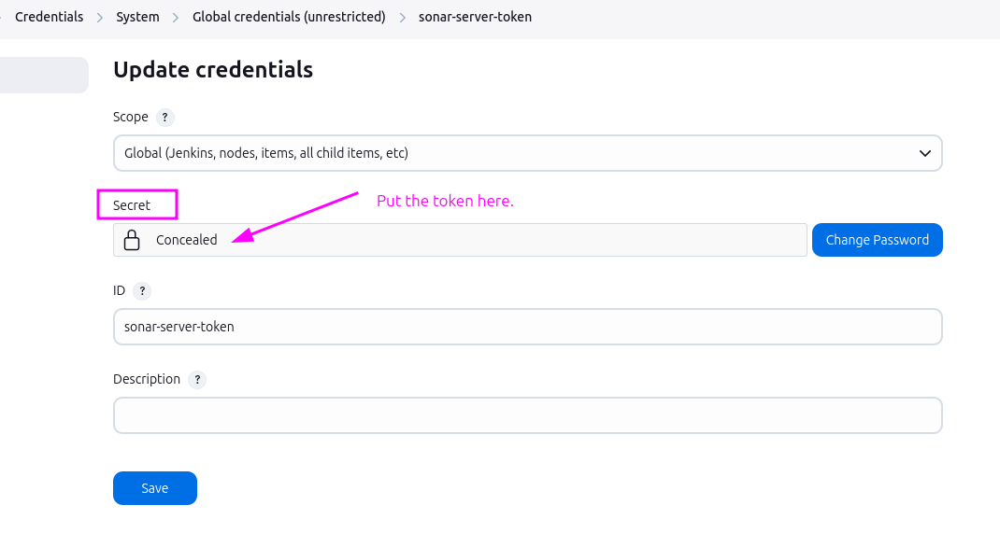
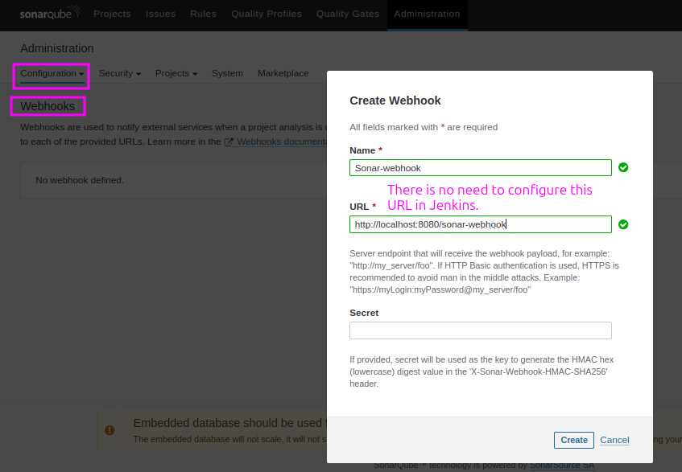

# Integrating SonarQube with Jenkins

## Steps to Integrate

- **Install Plugins**: `SonarQube Scanner` plugin in Jenkins to publish the results to SonarQube Server.

- **Add SonarQube Scanner**: `Manage Jenkins > Tool`, configure scanner.


- **Configure SonarQube Server**: `Manage Jenkins > System`, add SonarQube server details.


  - Best Practice: Use an access token (generated in SonarQube) instead of a `username` and `password`. Save the token as a `Secret Text` under `Credentials`.




- **Configure Webhook**: Set up a webhook in SonarQube Server to send analysis results to Jenkins.
    - Read the official documentation [here](https://docs.sonarsource.com/sonarqube-server/9.9/project-administration/webhooks/)



## Pipeline Stages

1. **Checkout Code**
   ```groovy
   stage('Checkout') {
       steps {
           checkout scm
       }
   }
   ```

2. **SonarQube Analysis**
   ```groovy
   // This stage must be after "Testing"
  
   stage('SonarQube Analysis') {
        steps {
            dir('03.Projects/00.LocalOps/0.1.01-jar_Boardgame') {
                withSonarQubeEnv('sonar-server') {
                    sh "$SCANNER_HOME/bin/sonar-scanner"
                    }
                }
            }
        }
   ```

3. **Quality Gate Check**
   ```groovy
   stage('Quality Gate') {
       steps {
            timeout(5) {
                waitForQualityGate abortPipeline: false
            }
       }
   }
   ```

---
