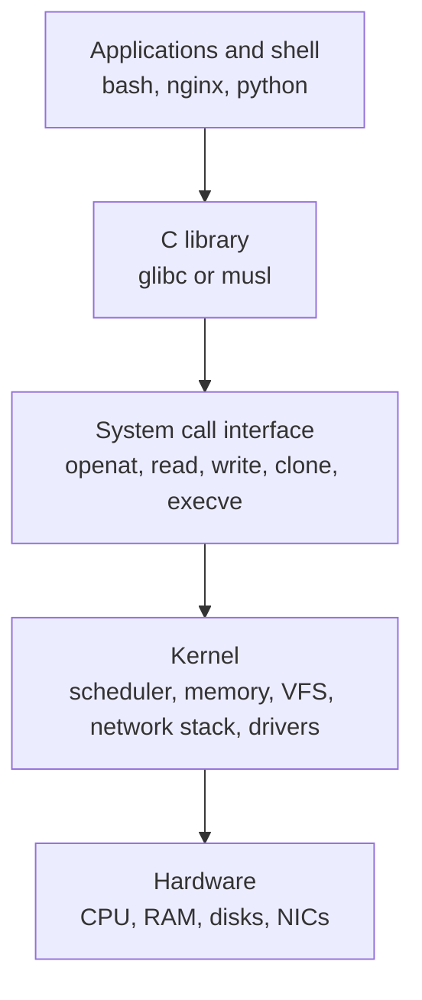

# Architecture

A Linux system is layered: hardware, the kernel, the system call interface, the C library, and user programs such as the shell. Most troubleshooting reduces to finding the layer where a request failed, so the layer boundaries are worth knowing precisely.

**Track:** Core · **Interview weight:** High

---

## Must-Know Facts

<!-- --8<-- [start:facts] -->
| Fact | Value | Verify with |
|---|---|---|
| Layers | Hardware, kernel, system calls, C library, shell and applications | `ldd /usr/bin/ls` |
| Kernel space | Runs in CPU privileged mode (ring 0 on x86) with full hardware access | `grep -c . /proc/kallsyms` |
| User space | Runs in ring 3; reaches hardware only through system calls | `strace -c ls` |
| System call | The only entry point from a program into the kernel | `strace -e trace=openat cat /etc/hostname` |
| C library | glibc on RHEL and Ubuntu, musl on Alpine; wraps system calls | `ldd /usr/bin/ls` |
| Dynamic loader | `/lib64/ld-linux-x86-64.so.2` loads shared libraries at exec | `file /usr/bin/ls` |
| vDSO | Kernel page mapped into every process for fast calls such as `clock_gettime` | `grep vdso /proc/self/maps` |
| Kernel design | Monolithic, with loadable modules | `lsmod` |
| PID 1 | `systemd`, the first user-space process | `ps -o pid,comm -p 1` |
| PID 2 | `kthreadd`, parent of all kernel threads | `ps --ppid 2` |
| Error reporting | System calls return `-1` and set `errno` (`ENOENT`, `EACCES`) | `strace ls /nonexistent` |
<!-- --8<-- [end:facts] -->

---

## The Layers



| Layer | Runs in | Examples | Fails with |
|---|---|---|---|
| Applications | User space | `bash`, `nginx`, `kubelet` | Exit codes, application logs |
| Libraries | User space | `libc.so.6`, `libssl.so` | `error while loading shared libraries` |
| System calls | Boundary | `openat`, `execve`, `mmap` | `errno` values such as `ENOENT` |
| Kernel | Kernel space | Scheduler, VFS, TCP/IP, drivers | `dmesg` messages, oops, panic |
| Hardware | Firmware and devices | Disks, NICs, memory | I/O errors, machine-check events |

---

## Kernel Space and User Space

The CPU enforces two privilege levels. Kernel code runs in privileged mode and can touch any memory or device; user programs run unprivileged, in their own virtual address space, and a stray pointer kills only that process.

The kernel symbol table lists functions that run in that privileged layer, and it hides their addresses from unprivileged users (`kernel.kptr_restrict = 1`):

```bash
grep -m2 -E ' (T|t) (__x64_sys_openat|do_sys_openat2)$' /proc/kallsyms
sudo grep -m2 -E ' (T|t) (__x64_sys_openat|do_sys_openat2)$' /proc/kallsyms
cat /proc/sys/kernel/kptr_restrict
```

Output:

```text
0000000000000000 t do_sys_openat2
0000000000000000 T __x64_sys_openat
ffffffff8132e0f0 t do_sys_openat2
ffffffff8132e530 T __x64_sys_openat
1
```

| Kernel subsystem | Responsibility | Where to look |
|---|---|---|
| Process scheduler | Which task runs on which CPU | `/proc/<pid>/sched`, `top` |
| Memory management | Virtual memory, page cache, OOM killer | `/proc/meminfo`, `free` |
| VFS and filesystems | One file API over ext4, xfs, nfs, tmpfs | `/proc/filesystems`, `mount` |
| Network stack | Sockets, TCP/IP, netfilter | `ss`, `ip`, `nft` |
| Device drivers | Disks, NICs, virtio | `lsmod`, `dmesg` |
| IPC and security | Pipes, signals, namespaces, LSMs | `/proc/<pid>/ns`, `getenforce` |

---

## System Calls

A system call switches the CPU into kernel mode, runs one kernel function, and returns a result. `strace` prints each call with its arguments and return value:

```bash
strace -o /tmp/t.txt -e trace=openat,read,write,close cat /etc/hostname >/dev/null
grep -A6 'etc/hostname' /tmp/t.txt
```

Output:

```text
openat(AT_FDCWD, "/etc/hostname", O_RDONLY) = 3
read(3, "ubuntu-01", 131072)            = 9
write(1, "ubuntu-01", 9)                = 9
read(3, "", 131072)                     = 0
close(3)                                = 0
close(1)                                = 0
close(2)                                = 0
```

`openat` returns file descriptor 3, `read` returns bytes read (0 means end of file), and `write` sends the data to descriptor 1 (standard output). `cat` never touches the disk directly.

A failed call returns `-1` and an `errno` name, which is the text that ends up in error messages:

```bash
strace -e trace=statx ls /nonexistent
```

Output:

```text
statx(AT_FDCWD, "/nonexistent", AT_STATX_SYNC_AS_STAT|AT_NO_AUTOMOUNT, STATX_MODE, 0x7ffd58dceb60) = -1 ENOENT (No such file or directory)
statx(AT_FDCWD, "/nonexistent", AT_STATX_SYNC_AS_STAT|AT_SYMLINK_NOFOLLOW|AT_NO_AUTOMOUNT, STATX_MODE, 0x7ffd58dceb60) = -1 ENOENT (No such file or directory)
ls: cannot access '/nonexistent': No such file or directory
+++ exited with 2 +++
```

`strace -c` summarizes which calls a program makes and how often:

```bash
strace -c -w ls / >/dev/null
```

Output:

```text
% time     seconds  usecs/call     calls    errors syscall
------ ----------- ----------- --------- --------- ----------------
 23.10    0.000479          14        33        13 openat
 21.70    0.000450          14        30           mmap
 12.99    0.000269          12        22           close
 12.86    0.000266          12        21           fstat
  7.97    0.000165         165         1           execve
# ... (trimmed)
------ ----------- ----------- --------- --------- ----------------
100.00    0.002072          14       140        17 total
```

Listing one directory costs 140 system calls; most of them load shared libraries and locale files before `getdents64` reads the directory.

!!! note "strace slows the traced process"
    Every traced call stops the process twice. On a busy production service, `strace -c -p <pid>` for a few seconds is acceptable; a long trace is not. `perf` and eBPF tools trace with far less overhead.

---

## The C Library and the Loader

Programs rarely issue system calls directly. They call C library functions (`fopen`, `printf`, `getaddrinfo`), and the library issues the system calls. The dynamic loader named in the ELF header maps the libraries into memory before `main` runs.

```bash
file /usr/bin/ls
ldd /usr/bin/ls
grep -E 'vdso|libc' /proc/self/maps
```

Output:

```text
/usr/bin/ls: ELF 64-bit LSB pie executable, x86-64, version 1 (SYSV), dynamically linked, interpreter /lib64/ld-linux-x86-64.so.2, BuildID[sha1]=daa5130f2a41f7fbc8662048f3294f3d439ca7ff, for GNU/Linux 3.2.0, stripped
	linux-vdso.so.1 (0x00007fffc1566000)
	libselinux.so.1 => /lib/x86_64-linux-gnu/libselinux.so.1 (0x00007f7a4af02000)
	libc.so.6 => /lib/x86_64-linux-gnu/libc.so.6 (0x00007f7a4ac00000)
	libpcre2-8.so.0 => /lib/x86_64-linux-gnu/libpcre2-8.so.0 (0x00007f7a4ae68000)
	/lib64/ld-linux-x86-64.so.2 (0x00007f7a4af5a000)
7ff11d600000-7ff11d628000 r--p 00000000 fd:00 3483                       /usr/lib/x86_64-linux-gnu/libc.so.6
7ff11d628000-7ff11d7b1000 r-xp 00028000 fd:00 3483                       /usr/lib/x86_64-linux-gnu/libc.so.6
7ff11d7b1000-7ff11d800000 r--p 001b1000 fd:00 3483                       /usr/lib/x86_64-linux-gnu/libc.so.6
7ff11d800000-7ff11d804000 r--p 001ff000 fd:00 3483                       /usr/lib/x86_64-linux-gnu/libc.so.6
7ff11d804000-7ff11d806000 rw-p 00203000 fd:00 3483                       /usr/lib/x86_64-linux-gnu/libc.so.6
7ffeeeff5000-7ffeeeff7000 r-xp 00000000 00:00 0                          [vdso]
```

`linux-vdso.so.1` has no file path: the kernel maps it into every process so calls such as `gettimeofday` run without a mode switch.

!!! warning "Some images ship a multi-call coreutils"
    On the Rocky playground, `/usr/bin/ls` is a script that runs `/usr/bin/coreutils --coreutils-prog-shebang=ls` (the `coreutils-single` package), so `ldd /usr/bin/ls` prints `not a dynamic executable`. BusyBox on Alpine works the same way. Run `file` before `ldd` when the output looks wrong.

---

## Kernel Threads and PID 1

The kernel starts two tasks itself. PID 1 (`systemd`) is the first user-space program and the ancestor of every service; PID 2 (`kthreadd`) spawns kernel threads, which have no user-space memory.

```bash
ps -o pid,ppid,stat,comm -p 1,2,3
grep -E '^(Name|PPid|VmRSS)' /proc/1/status /proc/2/status
ps --ppid 2 --no-headers | wc -l
sudo ls -l /proc/1/exe
```

Output:

```text
    PID    PPID STAT COMMAND
      1       0 Ss   systemd
      2       0 S    kthreadd
      3       2 I<   rcu_gp
/proc/1/status:Name:	systemd
/proc/1/status:PPid:	0
/proc/1/status:VmRSS:	   12484 kB
/proc/2/status:Name:	kthreadd
/proc/2/status:PPid:	0
86
lrwxrwxrwx 1 root root 0 Sep 16 13:23 /proc/1/exe -> /usr/lib/systemd/systemd
```

`kthreadd` has no `VmRSS` line because it owns no user memory. In `ps aux` output, kernel threads appear in square brackets (`[kworker/0:0]`) because they have no command line.

---

## Monolithic Kernel with Modules

Linux is monolithic: drivers, filesystems and the network stack run in the same address space as the core kernel, which is fast but means a driver bug can crash the whole system. Loadable modules add code at runtime without a reboot.

```bash
lsmod | head -3
grep -E '^CONFIG_(MODULES|PREEMPT_DYNAMIC)=' /boot/config-$(uname -r)
```

Output:

```text
Module                  Size  Used by
crc32_pclmul           16384  0
crc32c_intel           24576  0
CONFIG_PREEMPT_DYNAMIC=y
CONFIG_MODULES=y
```

| Design | Drivers run in | Example | Trade-off |
|---|---|---|---|
| Monolithic | Kernel space | Linux, FreeBSD | Fast; a driver fault can panic the kernel |
| Microkernel | User-space servers | MINIX 3, QNX, seL4 | Isolated faults; more context switches |
| Hybrid | Mostly kernel space | Windows NT, XNU (macOS) | Microkernel structure, monolithic performance choices |

---

## Common Errors

### `ls: cannot access '/nonexistent': No such file or directory`

**Cause:** the `statx` system call returned `ENOENT`; the message is the C library's text for that `errno`.

**Fix:** check the path. `strace -e trace=file <command>` shows exactly which path the program tried.

### `not a dynamic executable`

**Cause:** the file is statically linked, a script, or built for another architecture.

**Fix:** `file <path>` shows the real type.

---

## Interview Checkpoints

<!-- --8<-- [start:l1] -->
??? question "L1: What is the difference between kernel space and user space?"
    **Say first:** kernel space runs with full hardware privilege in one shared address space; user space runs unprivileged in isolated address spaces and asks the kernel for everything through system calls.

    **Proof:** `strace cat /etc/hostname` shows every request crossing the boundary.

    **Follow-up:** What happens to the system when a user program dereferences a bad pointer, compared with a driver doing the same?

??? question "L1: What is a system call, and why can't a program read a disk directly?"
    **Say first:** a system call is the controlled entry into the kernel; the CPU blocks direct device access from unprivileged mode, so the kernel can enforce permissions and share hardware.

    **Proof:** `strace -e trace=openat,read cat /etc/hostname`

    **Follow-up:** How does the kernel report a failed system call?

??? question "L1: Is Linux a monolithic kernel or a microkernel?"
    **Say first:** monolithic with loadable modules: drivers run in kernel space but can be loaded and unloaded at runtime.

    **Proof:** `lsmod`; `CONFIG_MODULES=y` in `/boot/config-$(uname -r)`.

    **Follow-up:** What is the risk of that design, and what does the kernel do when a module faults?
<!-- --8<-- [end:l1] -->

??? question "L2: Show which files a program opens when it starts."
    **Say first:** trace the file-related system calls.

    **Proof:**

    ```bash
    strace -f -e trace=openat -o /tmp/open.txt <command>
    grep -v ENOENT /tmp/open.txt
    ```

    **Follow-up:** How do you attach the same trace to a process that is already running? (`strace -p <pid>`.)

??? question "L2: Which C library and shared libraries does a binary need?"
    **Say first:** read the ELF header and the dynamic dependencies.

    **Proof:** `file /usr/bin/ls` then `ldd /usr/bin/ls`.

    **Follow-up:** Why does a binary built on Ubuntu fail on Alpine?

??? question "L3: A command fails with a vague error and no log. How do you find what it tried?"
    **Say first:** trace its system calls and look for the first unexpected error return.

    **Proof:** `strace -f -o /tmp/t.txt <command>`, then `grep -E '= -1 E(ACCES|NOENT|PERM)' /tmp/t.txt` shows the path or operation that failed.

    **Follow-up:** When would you choose `ltrace` or `perf` instead?

??? question "L3: A process shows in ps with its name in square brackets and cannot be killed."
    **Say first:** bracketed names are kernel threads, children of PID 2; they are not user processes and do not take signals from users.

    **Proof:** `ps -o pid,ppid,comm -p <pid>` shows PPID 2; `/proc/<pid>/status` has no `VmRSS`.

    **Follow-up:** If a `kworker` thread uses a lot of CPU, where do you look next?

??? question "L4: What happens between typing ls and seeing the output?"
    **Say first:** the shell forks, the child calls `execve`, the loader maps libc, `ls` calls `openat` and `getdents64` on the directory, formats names, and calls `write` on descriptor 1, which the terminal driver displays.

    **Proof:** `strace -f bash -c ls` shows `clone`, `execve`, `openat`, `getdents64` and `write` in order.

    **Don't say:** "The shell reads the directory and prints it."

---

## Related

- [Kernel vs OS vs Distro](kernel-vs-os-vs-distro.md): what belongs to the kernel and what belongs to the userland
- [System Information](system-information.md): reading `/proc` and `/sys`
- [Streams and Redirection](../01-shell-and-cli/streams-and-redirection.md): file descriptors 0, 1 and 2
- [File Descriptors](../02-files-and-filesystem/file-descriptors.md): what `openat` returns

Captured on Rocky Linux 10.2 and Ubuntu 24.04.4 LTS (iximiuz Labs microVMs, kernel 6.1.167), 2026-09.
