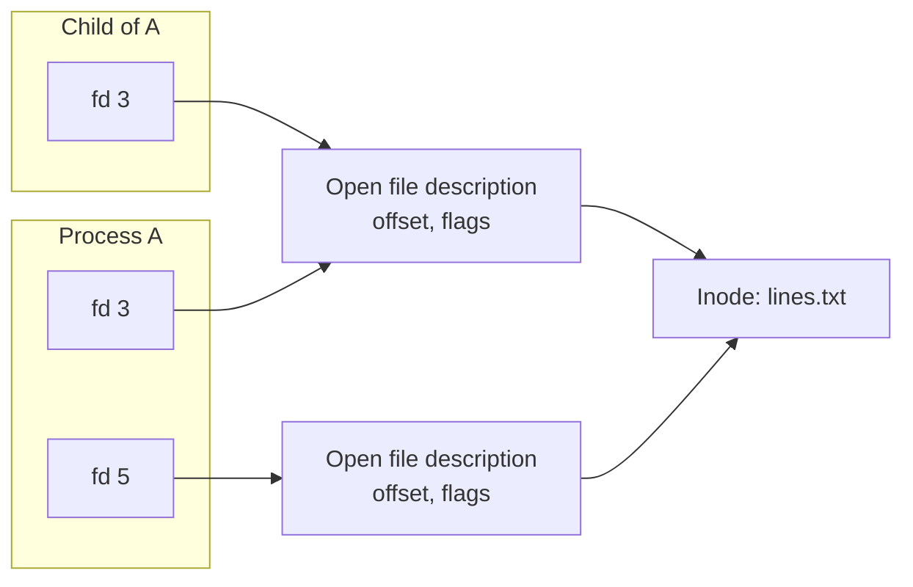

# File Descriptors

A file descriptor is a small integer that a process uses to refer to an open file, pipe, socket or device. Descriptor limits, leaked descriptors, shared file offsets and deleted-but-open files all come from the three kernel structures behind that integer.

**Track:** Advanced · **Interview weight:** High

---

## Must-Know Facts

<!-- --8<-- [start:facts] -->
| Fact | Value | Verify with |
|---|---|---|
| Descriptor | Index into the process's descriptor table | `ls -l /proc/<pid>/fd` |
| Allocation | Lowest free number; 0, 1, 2 are normally taken | `strace -e trace=openat` |
| Three layers | Descriptor table (per process), open file description (offset, flags), inode (the file) | `cat /proc/<pid>/fdinfo/<n>` |
| After `fork()` | Child gets copies of the descriptors pointing to the same open file descriptions, so offsets are shared | `read` in a subshell |
| Separate `open()` | New open file description with its own offset | `/proc/<pid>/fdinfo` |
| `dup2(old, new)` | Makes `new` refer to the same description; this is `2>&1` | `strace -e trace=dup2` |
| `O_APPEND` | Every write goes to the end, atomically | `flags` in `fdinfo` |
| `O_CLOEXEC` | Descriptor closes on `execve`; flag `02000000` | `flags` in `fdinfo` |
| Per-process limit | `ulimit -n` / `RLIMIT_NOFILE`, often soft 1024 | `grep 'open files' /proc/<pid>/limits` |
| System-wide counters | `/proc/sys/fs/file-nr`, `file-max`, `nr_open` | `cat /proc/sys/fs/file-nr` |
| Limit reached | `EMFILE`: "Too many open files" | `ls /proc/<pid>/fd` |
| Sockets and pipes | Also descriptors; count against the same limit | `lsof -p <pid>` |
<!-- --8<-- [end:facts] -->

---

## The Descriptor Table

The script below ran non-interactively, so descriptors 0 to 2 are pipes from the calling program. `255` is bash's own handle on the script file.

```bash
printf 'line1\nline2\nline3\nline4\n' > lines.txt
exec 3< lines.txt
exec 4>> app.log
ls -l /proc/$$/fd | tail -n +2
cat /proc/$$/fdinfo/3
cat /proc/$$/fdinfo/4
```

Output:

```text
lr-x------ 1 laborant laborant 64 Sep 16 13:58 0 -> pipe:[36175]
l-wx------ 1 laborant laborant 64 Sep 16 13:58 1 -> pipe:[36176]
l-wx------ 1 laborant laborant 64 Sep 16 13:58 2 -> pipe:[36176]
lr-x------ 1 laborant laborant 64 Sep 16 13:58 255 -> /tmp/fd.sh
lr-x------ 1 laborant laborant 64 Sep 16 13:58 3 -> /tmp/lines.txt
l-wx------ 1 laborant laborant 64 Sep 16 13:58 4 -> /tmp/app.log
pos:	0
flags:	0100000
mnt_id:	21
ino:	20701
pos:	0
flags:	0102001
mnt_id:	21
ino:	20702
```

`fdinfo` exposes the open file description: `pos` is the offset and `flags` are the `open()` flags in octal. `0102001` decodes to `O_LARGEFILE` (0100000), `O_APPEND` (02000) and `O_WRONLY` (1).



---

## Shared and Separate Offsets

A child created by `fork()` shares the parent's open file descriptions. A second `open()` of the same file creates an independent one.

```bash
read -r first <&3
echo "parent read: $first"
( read -r second <&3; echo "child read:  $second" )
read -r third <&3
echo "parent read: $third"
exec 5< lines.txt
read -r other <&5
echo "fd 5 (separate open) read: $other"
grep pos /proc/$$/fdinfo/3 /proc/$$/fdinfo/5
```

Output:

```text
parent read: line1
child read:  line2
parent read: line3
fd 5 (separate open) read: line1
/proc/4148/fdinfo/3:pos:	18
/proc/4148/fdinfo/5:pos:	6
```

The subshell's read moved the offset for the parent too, so the parent skipped `line2`. This is why several processes appending to one inherited log descriptor do not overwrite each other, and why two processes that each open a file with `>` do.

!!! warning "Open log files in append mode when several writers share them"
    Without `O_APPEND`, each writer keeps its own offset and overwrites the others' lines. `>>` in the shell, `a` in Python and `O_APPEND` in C make every write land at the current end of the file.

---

## Redirection Is dup2

```bash
strace -f -e trace=openat,dup2,close -o /tmp/redir.txt bash -c 'echo hi > /tmp/out.txt 2>&1'
grep -E 'out.txt|dup2' /tmp/redir.txt
```

Output:

```text
4175  openat(AT_FDCWD, "/tmp/out.txt", O_WRONLY|O_CREAT|O_TRUNC, 0666) = 3
4175  dup2(3, 1)                        = 1
4175  dup2(1, 2)                        = 2
4175  dup2(11, 2)                       = 2
4175  dup2(10, 1)                       = 1
```

`> /tmp/out.txt` opened descriptor 3 and copied it onto 1; `2>&1` copied 1 onto 2. `echo` is a builtin, so bash saved the old descriptors as 10 and 11 and restored them afterwards; for an external command the redirections happen in the child before `execve`.

---

## Close-on-Exec

Descriptors survive `execve` unless they carry `O_CLOEXEC`. A leaked descriptor keeps files, sockets or pipes open in every program a service starts.

```bash
python3 -c '
import os
fd = os.open("/etc/hostname", os.O_RDONLY)
print("fd", fd, "cloexec:", not os.get_inheritable(fd))
'
grep flags /proc/$$/fdinfo/255
```

Output:

```text
fd 3 cloexec: True
flags:	02100000
```

Python opens files with `O_CLOEXEC` by default (PEP 446), and bash marks its script handle the same way (`02000000` in the flags).

---

## Limits

```bash
ulimit -Sn; ulimit -Hn
grep 'open files' /proc/$$/limits
cat /proc/sys/fs/file-nr
cat /proc/sys/fs/nr_open
( ulimit -n 20; python3 -c '
files = []
try:
    while True:
        files.append(open("/etc/hostname"))
except OSError as e:
    print(f"opened {len(files)} files, then: {e}")
' )
```

Output:

```text
1024
1048576
Max open files            1024                 1048576              files     
608	0	9223372036854775807
1048576
opened 16 files, then: [Errno 24] Too many open files: '/etc/hostname'
```

| Limit | Scope | Set with |
|---|---|---|
| Soft `nofile` | One process; raise up to the hard limit | `ulimit -n`, `setrlimit()` |
| Hard `nofile` | One process; ceiling for the soft limit | `/etc/security/limits.conf` (PAM logins) |
| Service limit | One systemd unit | `LimitNOFILE=` in the unit |
| `fs.nr_open` | Maximum any process can be given | `sysctl fs.nr_open` |
| `fs.file-max` | All open files on the system | `sysctl fs.file-max` |

`file-nr` shows allocated handles, unused handles and the maximum. The process-level soft limit is almost always the one that is hit.

!!! warning "limits.conf does not apply to systemd services"
    `/etc/security/limits.conf` is read by `pam_limits` at login. A service started by systemd gets `LimitNOFILE=` from its unit (or `DefaultLimitNOFILE` in `system.conf`), and `/proc/<pid>/limits` shows what it really has.

---

## Inspecting a Running Process

```bash
pid=$(pgrep -o systemd-journal)
sudo ls /proc/$pid/fd | wc -l
sudo lsof -p "$pid" -a -d 0-10 | head -8
```

Output:

```text
26
COMMAND   PID USER   FD      TYPE             DEVICE SIZE/OFF  NODE NAME
systemd-j 336 root    0r      CHR                1,3      0t0     4 /dev/null
systemd-j 336 root    1w      CHR                1,3      0t0     4 /dev/null
systemd-j 336 root    2w      CHR                1,3      0t0     4 /dev/null
systemd-j 336 root    3u     unix 0xffff888102262400      0t0 15586 /run/systemd/journal/socket type=DGRAM (CONNECTED)
systemd-j 336 root    4u     unix 0xffff888102261c00      0t0 15588 /run/systemd/journal/stdout type=STREAM (LISTEN)
systemd-j 336 root    5u     unix 0xffff888102260c00      0t0 15584 /run/systemd/journal/dev-log type=DGRAM (CONNECTED)
```

In the `FD` column, the letter is the access mode: `r` read, `w` write, `u` both. Services have their standard streams on `/dev/null` or the journal, not a terminal.

Event-driven servers (nginx, Node.js, Redis) watch thousands of socket descriptors with one `epoll` descriptor, which is why their `nofile` limits are raised far above 1024.

---

## Common Errors

### `[Errno 24] Too many open files`

**Cause:** the process reached its soft `RLIMIT_NOFILE` (`EMFILE`), because of load or a descriptor leak.

**Fix:** count with `ls /proc/<pid>/fd | wc -l` over time; a steady rise means a leak. Raise `LimitNOFILE=` for the service if the load is real.

### `bash: line 1: 3: Bad file descriptor`

**Cause:** a redirection used a descriptor number that is not open in the shell (`cmd >&3` before `exec 3>`).

**Fix:** open it first with `exec 3> file`, and close it with `exec 3>&-`.

---

## Interview Checkpoints

<!-- --8<-- [start:l1] -->
??? question "L1: What is a file descriptor?"
    **Say first:** an integer index into a process's table of open files, pipes, sockets and devices; 0, 1 and 2 are standard input, output and error.

    **Proof:** `ls -l /proc/$$/fd`

    **Follow-up:** Which number does the next `open()` return?

??? question "L1: What does Too many open files mean?"
    **Say first:** the process hit its per-process descriptor limit (`EMFILE`), usually the soft `nofile` limit of 1024.

    **Proof:** `grep 'open files' /proc/<pid>/limits`; `ls /proc/<pid>/fd | wc -l`.

    **Follow-up:** How do you raise it for a systemd service?
<!-- --8<-- [end:l1] -->

??? question "L2: Count and list the open files of a running service."
    **Say first:** read `/proc/<pid>/fd` or use `lsof`.

    **Proof:**

    ```bash
    pid=$(systemctl show -p MainPID --value nginx)
    sudo ls -l /proc/$pid/fd | wc -l
    sudo lsof -p "$pid"
    ```

    **Follow-up:** How do you tell sockets from files in that list?

??? question "L2: Raise the open-file limit for a service and prove it applied."
    **Say first:** set `LimitNOFILE` in a drop-in, restart, and read the live limits.

    **Proof:**

    ```bash
    sudo systemctl edit nginx    # [Service] LimitNOFILE=65535
    sudo systemctl restart nginx
    grep 'open files' /proc/$(systemctl show -p MainPID --value nginx)/limits
    ```

    **Follow-up:** Why would editing `/etc/security/limits.conf` not change it?

??? question "L3: A Java service fails with Too many open files after a few days of uptime."
    **Say first:** find out whether descriptors grow steadily (a leak) or spike with load.

    **Proof:** sample `ls /proc/<pid>/fd | wc -l` every few minutes; `lsof -p <pid>` grouped by `TYPE` and `NAME` shows what accumulates, often `CLOSE_WAIT` sockets or unclosed files.

    **Follow-up:** What is the short-term mitigation, and why is it not the fix?

??? question "L3: Two cron jobs write to the same log and lines are garbled or missing."
    **Say first:** check whether they open the log in append mode.

    **Proof:** `grep flags /proc/<pid>/fdinfo/<n>` lacks `02000` (`O_APPEND`); the jobs use `>` instead of `>>`.

    **Follow-up:** Why does `O_APPEND` fix it?

??? question "L4: What happens to open files across fork() and exec()?"
    **Say first:** `fork()` copies the descriptor table, and both processes point to the same open file descriptions (shared offsets); `execve()` keeps every descriptor except those with `O_CLOEXEC`.

    **Proof:** the subshell `read` above advanced the parent's offset; `fdinfo` flags show `02000000` on close-on-exec descriptors.

    **Don't say:** "The child gets its own copy of each open file."

??? question "L4: What are the kernel structures behind a descriptor?"
    **Say first:** the per-process descriptor table points to open file descriptions (`struct file`: offset, flags, reference count), which point to the inode through the dentry.

    **Proof:** two opens of one file show different `pos` values but the same `ino` in `fdinfo`.

    **Don't say:** "The descriptor is the inode number."

---

## Related

- [Streams and Redirection](../01-shell-and-cli/streams-and-redirection.md): descriptors 0, 1 and 2 in the shell
- [Inodes and Links](inodes-and-links.md): deleted files held open by a descriptor
- [File Types](file-types.md): pipes, sockets and devices are opened the same way
- [Round 4: Internals](../interview/round-4-internals.md): more "what happens when" questions

Captured on Rocky Linux 10.2 and Ubuntu 24.04.4 LTS (iximiuz Labs microVMs, kernel 6.1.167), 2026-09.
