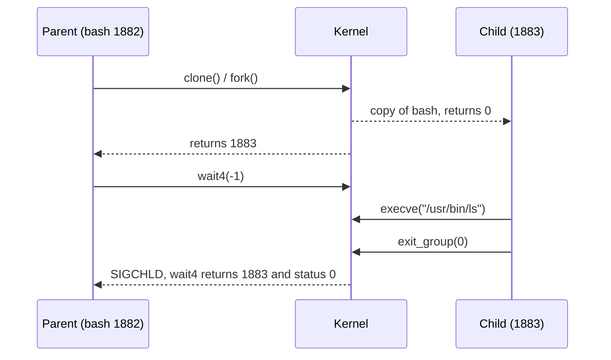

# Process Lifecycle

Every process except PID 1 is created by `fork()` (or `clone()`), usually replaced with a new program by `execve()`, and ends with `exit()`; its parent then collects the exit status with `wait()`. Zombies, orphans, daemons and exit codes all follow from these four calls, which is why interviewers use them to test depth.

**Track:** Advanced · **Interview weight:** High

---

## Must-Know Facts

<!-- --8<-- [start:facts] -->
| Fact | Value | Verify with |
|---|---|---|
| `fork()` | Creates a copy of the calling process; returns the child PID to the parent and 0 to the child | `strace -f -e trace=clone bash -c 'ls; true'` |
| `execve()` | Replaces the program in the current process; the PID stays the same | `bash -c 'echo $$; exec bash -c "echo \$\$"'` |
| Copy-on-write | Parent and child share memory pages until one writes; `fork()` copies page tables only | `/proc/<pid>/smaps_rollup` |
| `exit()` | Frees memory and files; the process becomes a zombie holding its exit status | `ps -o stat` shows `Z` |
| `wait()` | Parent reads the exit status and the kernel removes the zombie (reaping) | `strace -e trace=wait4` |
| `SIGCHLD` | Sent to the parent when a child exits or stops | `strace` shows `--- SIGCHLD` |
| Zombie | Exited, not yet reaped; uses no memory, only a process table entry | `ps -o pid,ppid,stat` |
| Orphan | Parent exited first; adopted by PID 1 or the nearest subreaper | `ps -o ppid` shows `1` |
| Exit status | 0 to 255; 128+N means killed by signal N | `echo $?` |
| Process group | Jobs of one pipeline; signals from the terminal go to the foreground group | `ps -o pgid` |
| Session | Process groups under one login; the leader owns the controlling terminal | `ps -o sid,tty` |
| Daemon | Background process with no controlling terminal (`TTY ?`), usually managed by systemd | `ps -o tty -p <pid>` |
| `setsid` | Starts a program in a new session with no terminal | `setsid sleep 60` |
<!-- --8<-- [end:facts] -->

---

## Fork, Exec, Wait, Exit

Running `ls` from a shell takes four steps: the shell forks, the child execs `ls`, the child exits, and the shell waits for it. `strace -f` shows all four.

```bash
strace -f -o st.txt -e trace=clone,clone3,execve,wait4,exit_group bash -c 'ls -d /etc >/dev/null; echo done'
cat st.txt
```

Output:

```text
done
1882  execve("/usr/bin/bash", ["bash", "-c", "ls -d /etc >/dev/null; echo done"], 0x7ffe3f0e5368 /* 34 vars */) = 0
1882  clone(child_stack=NULL, flags=CLONE_CHILD_CLEARTID|CLONE_CHILD_SETTID|SIGCHLD, child_tidptr=0x7f9d7916aa10) = 1883
1882  wait4(-1,  <unfinished ...>
1883  execve("/usr/bin/ls", ["ls", "-d", "/etc"], 0x55574f2e55e0 /* 34 vars */) = 0
1883  exit_group(0)                     = ?
1883  +++ exited with 0 +++
1882  <... wait4 resumed>[{WIFEXITED(s) && WEXITSTATUS(s) == 0}], 0, NULL) = 1883
1882  --- SIGCHLD {si_signo=SIGCHLD, si_code=CLD_EXITED, si_pid=1883, si_uid=1001, si_status=0, si_utime=0, si_stime=0} ---
1882  wait4(-1, 0x7fff84b88890, WNOHANG, NULL) = -1 ECHILD (No child processes)
1882  exit_group(0)                     = ?
1882  +++ exited with 0 +++
```

glibc implements `fork()` with `clone()` and only `SIGCHLD` as the exit signal, so nothing is shared with the parent. `echo` produced no child: it is a builtin, so `bash` ran it itself.



---

## Exec Keeps the PID

`exec` replaces the program image in place: memory is rebuilt from the new binary, while the PID, open file descriptors (except close-on-exec ones), working directory and credentials stay. Wrapper scripts end with `exec app` so the application receives signals directly and no idle shell stays behind.

```bash
bash -c 'echo "before exec: $$"; exec bash -c "echo after exec: \$\$"'
```

Output:

```text
before exec: 1885
after exec: 1885
```

---

## Copy-on-Write

After `fork()` the child gets a copy of the parent's page tables, and both point to the same physical pages marked read-only. The first write to a page triggers a page fault, and only then does the kernel copy that page. This makes `fork()` followed by `exec()` cheap even for a large parent.

!!! note "Copy-on-write explains memory spikes in forking servers"
    A Redis or PostgreSQL process that forks for a snapshot starts with almost no extra memory; each page the parent modifies during the snapshot is duplicated, so a write-heavy parent can nearly double its resident memory before the child finishes.

---

## Zombies

A child that has exited but has not been waited for stays in the process table as a zombie (`Z`, `<defunct>`). It holds only its PID and exit status; its memory is already freed.

```bash
cat > zombie.py <<'PYEND'
import os, time
pid = os.fork()
if pid == 0:
    os._exit(3)
print("parent", os.getpid(), "child", pid, flush=True)
time.sleep(60)
PYEND
python3 zombie.py > z.out 2>&1 &
cat z.out
ps -o pid,ppid,stat,comm --ppid 1887 -p 1887
```

Output:

```text
parent 1887 child 1889
    PID    PPID STAT COMMAND
   1887    1878 S    python3
   1889    1887 Z    python3
```

A signal cannot remove a zombie, because the process has already exited. The zombie disappears when the parent calls `wait()`, or when the parent dies and PID 1 adopts and reaps it.

```bash
kill -9 1889
ps -o pid,ppid,stat,comm --ppid 1887
kill 1887; sleep 0.5; ps -o pid,stat,comm --ppid 1887 || echo 'no children left'
```

Output:

```text
    PID    PPID STAT COMMAND
   1889    1887 Z    python3
    PID STAT COMMAND
no children left
```

!!! warning "A few zombies are harmless; a growing number is a parent bug"
    Each zombie holds a PID. A parent that never reaps its children eventually exhausts `pid_max` or the user's process limit, and new `fork()` calls fail. Fix or restart the parent.

---

## Orphans and Subreapers

If a parent exits before its child, the kernel re-parents the child to the nearest ancestor marked as a subreaper (`prctl(PR_SET_CHILD_SUBREAPER)`), or to PID 1. `systemd --user`, container runtimes and `tini` set this flag, so orphans in a session or container may stop at them instead of PID 1.

```bash
bash -c 'sleep 30 & echo "child $!"'
ps -o pid,ppid,comm -C sleep
```

Output:

```text
child 1899
    PID    PPID COMMAND
   1899       1 sleep
```

---

## Sessions, Process Groups and the Terminal

A login shell starts a session and becomes its leader; each pipeline the shell runs becomes a process group. The terminal delivers `Ctrl-C` and `Ctrl-Z` to the foreground process group, and a hangup to the session leader.

```bash
ps -o pid,ppid,pgid,sid,tty,stat,comm -u laborant
```

Output:

```text
    PID    PPID    PGID     SID TT       STAT COMMAND
   1754       1    1754    1754 ?        Ss   systemd
   1756    1754    1754    1754 ?        S    (sd-pam)
   1838    1837    1838    1838 ?        Ss   bash
   1878    1838    1838    1838 ?        S    bash
   1899       1    1838    1838 ?        S    sleep
   1904    1878    1838    1838 ?        R    ps
```

The orphaned `sleep 1899` moved to PPID 1 but kept its session and process group. `s` in `STAT` marks a session leader.

`setsid` starts a program in a new session, detached from any terminal, which is the core of daemonizing:

```bash
setsid sleep 40 >/dev/null 2>&1 < /dev/null &
ps -o pid,ppid,pgid,sid,tty,comm -C sleep
```

Output:

```text
    PID    PPID    PGID     SID TT       COMMAND
   1905    1878    1905    1905 ?        sleep
```

---

## Daemons

A classic SysV daemon double-forks: fork and exit the parent, `setsid()`, fork again so it can never reacquire a terminal, then `chdir("/")`, reset the umask and close inherited file descriptors. Under systemd a service should stay in the foreground (`Type=simple` or `Type=exec`), and systemd provides the detachment, logging and restart.

```bash
ps -o pid,ppid,pgid,sid,tty,comm -p $(pgrep -o crond)
```

Output:

```text
    PID    PPID    PGID     SID TT       COMMAND
    933       1     933     933 ?        crond
```

| Property | Meaning |
|---|---|
| `PPID 1` | Started by systemd, or orphaned |
| `SID = PID` | Leader of its own session |
| `TTY ?` | No controlling terminal |

---

## Exit Status

The parent receives a 16-bit status from `wait()`; shells reduce it to one number in `$?`.

| `$?` | Meaning |
|---|---|
| `0` | Success |
| `1` to `125` | Program-defined failure |
| `126` | Found but not executable |
| `127` | Command not found |
| `128 + N` | Killed by signal N: `130` (INT), `137` (KILL), `143` (TERM) |

---

## Common Errors

### `bash: fork: retry: Resource temporarily unavailable`

**Cause:** `fork()` returned `EAGAIN`: the user hit `ulimit -u` (`RLIMIT_NPROC`), the unit hit `TasksMax=`, or the system hit `kernel.pid_max` or `kernel.threads-max`. Unreaped zombies count toward all of these.

**Fix:** find the owner of the tasks with `ps -eLo user= | sort | uniq -c`, fix or restart the parent that leaks children, then adjust the limit if the workload needs it.

---

## Interview Checkpoints

<!-- --8<-- [start:l1] -->
??? question "L1: What is a zombie process, and how do you remove one?"
    **Say first:** a child that has exited but whose parent has not called `wait()`; it is removed when the parent reaps it or when the parent dies and PID 1 reaps it.

    **Proof:** `ps -o pid,ppid,stat,comm` shows `Z`; `kill -9` on the zombie changes nothing; killing the parent clears it.

    **Follow-up:** Why can't `kill -9` remove it?

??? question "L1: What is the difference between an orphan and a zombie?"
    **Say first:** an orphan is still running but lost its parent and was adopted by PID 1 or a subreaper; a zombie has finished but was not reaped.

    **Proof:** an orphan shows `PPID 1` and state `S` or `R`; a zombie shows state `Z`.

    **Follow-up:** Why do containers need an init process such as `tini`?

??? question "L1: What does fork() return?"
    **Say first:** the child's PID in the parent, 0 in the child, and -1 on failure.

    **Proof:** `strace -f` shows `clone(...) = 1883` in the parent while the child continues as PID 1883.

    **Follow-up:** How does a program run a different binary after `fork()`?
<!-- --8<-- [end:l1] -->

??? question "L2: Find zombie processes and the parents responsible for them."
    **Say first:** filter by state `Z` and print the PPID.

    **Proof:** `ps -eo pid,ppid,stat,comm | awk '$3 ~ /^Z/'`, then `ps -o pid,cmd -p <ppid>`

    **Follow-up:** When is sending `SIGCHLD` to the parent worth trying?

??? question "L2: Start a long job that survives logout without nohup."
    **Say first:** start it in a new session with no terminal, or as a transient systemd unit.

    **Proof:** `setsid ./job.sh >job.log 2>&1 < /dev/null &` or `systemd-run --user --unit=job ./job.sh` with lingering enabled.

    **Follow-up:** Why is the systemd option easier to operate?

??? question "L3: A server has thousands of defunct processes and new SSH logins fail."
    **Say first:** the zombies exhaust the user's or the system's process slots; find the parent that does not reap.

    **Proof:** `ps -eo ppid=,stat= | awk '$2 ~ /^Z/ {print $1}' | sort | uniq -c`, then `systemctl status <unit>` for that PPID and restart it; the zombies go to PID 1, which reaps them.

    **Follow-up:** What code change prevents it? (`waitpid()` in a `SIGCHLD` handler, or `SIGCHLD` set to `SIG_IGN`.)

??? question "L4: What happens between typing ls and the prompt returning?"
    **Say first:** the shell resolves `ls` in `PATH`, calls `fork()`, the child calls `execve()`, the kernel loads the ELF and its loader, `ls` runs and calls `exit_group()`, and the shell's `wait4()` returns the status.

    **Proof:** `strace -f -e trace=clone,execve,wait4,exit_group bash -c 'ls; true'` (with a single command, `bash -c` skips the fork and execs `ls` directly)

    **Follow-up:** Where does copy-on-write save work in this sequence?

??? question "L4: Why does fork() not double memory usage?"
    **Say first:** the kernel copies page tables and marks the pages read-only in both processes; a page is copied only when one side writes to it.

    **Proof:** a large process can fork and `exec` a small command without increasing `free` output; a write-heavy parent grows during a Redis `BGSAVE`.

    **Don't say:** "`fork()` copies the whole address space."

---

## Related

- [Process Fundamentals](process-fundamentals.md): PIDs, threads and `/proc`
- [Signals](signals.md): `SIGCHLD`, `SIGHUP` and exit codes 128+N
- [Job Control](job-control.md): process groups at the terminal
- [Exit Codes and Chaining](../01-shell-and-cli/exit-codes-and-chaining.md): `$?` in scripts
- [Process Won't Die](../interview/scenarios/process-wont-die.md): zombies as a troubleshooting case

Captured on Rocky Linux 10.2 (iximiuz Labs microVM, kernel 6.1.167), 2026-09.
