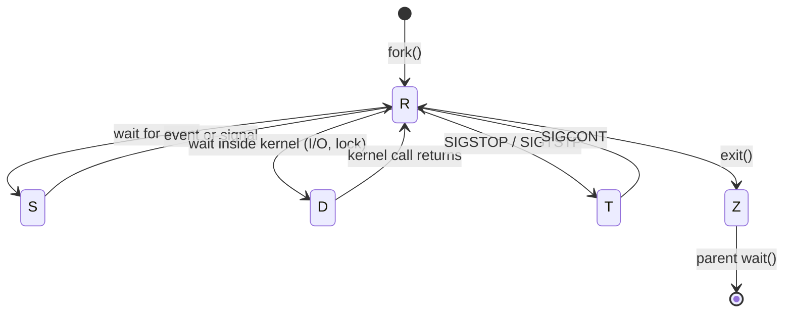

# Process States

The `STAT` column shows what a process is doing right now: running, sleeping, blocked in the kernel, stopped or exited. The states matter in troubleshooting because two of them, `D` and `Z`, ignore `kill -9`, and `D` inflates the load average without using CPU.

**Track:** Core · **Interview weight:** High

---

## Must-Know Facts

<!-- --8<-- [start:facts] -->
| Fact | Value | Verify with |
|---|---|---|
| `R` | Running or runnable (waiting in the CPU run queue) | `ps -o stat -p <pid>` |
| `S` | Interruptible sleep: waiting for an event, wakes on a signal | `ps -o stat,wchan` |
| `D` | Uninterruptible sleep: waiting inside the kernel, usually for I/O; signals wait | `ps -eo stat,pid,wchan` |
| `T` | Stopped by `SIGSTOP` or `SIGTSTP` (`Ctrl-Z`) | `kill -STOP <pid>` |
| `t` | Stopped by a debugger or tracer | `gdb -p <pid>` |
| `Z` | Zombie: exited, waiting for the parent to reap it | `ps -o stat,ppid` |
| `I` | Idle kernel thread (not counted in load average) | `ps -eo stat,comm` |
| `X` | Dead; never seen in practice | `man ps` |
| Flags | `s` session leader, `l` multithreaded, `+` foreground group, `<` high priority, `N` low priority | `ps aux` |
| Load average | Counts `R` and `D` tasks | `cat /proc/loadavg` |
| `wchan` | Kernel function where a sleeping process waits | `ps -o wchan:30 -p <pid>` |
| Kernel stack | Full blocked call path (root only) | `sudo cat /proc/<pid>/stack` |
| `SIGKILL` and `D` | The signal stays pending until the kernel call returns | `grep ShdPnd /proc/<pid>/status` |
<!-- --8<-- [end:facts] -->

---

## Seeing Every State

One of each: a busy loop (`R`), `sleep` (`S`), a stopped job (`T`) and a Python parent with an unreaped child (`Z`).

```bash
( while :; do :; done ) >/dev/null 2>&1 &
sleep 300 >/dev/null 2>&1 &
sleep 300 >/dev/null 2>&1 &
kill -STOP $!
python3 zombie.py >/dev/null 2>&1 &
ps -o pid,stat,wchan:20,comm -p 1975,1976,1977,1978 --ppid 1978
```

Output:

```text
    PID STAT WCHAN                COMMAND
   1975 R    -                    bash
   1976 S    hrtimer_nanosleep    sleep
   1977 T    do_signal_stop       bash
   1978 S    hrtimer_nanosleep    python3
   1980 Z    -                    python3
```

`1977` still shows `bash` because it was stopped before it could exec `sleep`: the child of `&` is a copy of the shell until `execve()` runs. Kernel threads add the `I` state:

```bash
ps -eo stat,comm | awk '$1 ~ /^I/' | head -3
ps -eo stat= | cut -c1 | sort | uniq -c
```

Output:

```text
I<   rcu_gp
I<   rcu_par_gp
I<   slub_flushwq
     66 I
      2 R
     54 S
      1 T
      1 Z
```

The two `R` tasks are the busy loop and `ps` itself.



---

## Interruptible vs Uninterruptible Sleep

A process in `S` sleeps until an event arrives or a signal interrupts the system call. A process in `D` sleeps where the kernel cannot safely abandon the operation, such as waiting for a block device, a hung NFS server or a frozen filesystem, so pending signals are delivered only after the call returns.

Freezing a filesystem with `fsfreeze` reproduces a `D` state on demand (as root):

```bash
truncate -s 200M /var/tmp/frz.img
mkfs.ext4 -q /var/tmp/frz.img
mkdir -p /mnt/frz
mount -o loop /var/tmp/frz.img /mnt/frz
fsfreeze -f /mnt/frz
( echo data > /mnt/frz/f ) >/dev/null 2>&1 &
ps -eo pid,stat,wchan:32,comm | awk '$2 ~ /^D/'
cat /proc/2000/stack
grep State /proc/2000/status
```

Output:

```text
   2000 D    percpu_rwsem_wait                bash
[<0>] percpu_rwsem_wait+0x118/0x140
[<0>] mnt_want_write+0x98/0xc0
[<0>] open_last_lookups+0x2cb/0x3b0
[<0>] path_openat+0x8d/0x290
[<0>] do_filp_open+0xb2/0x160
[<0>] do_sys_openat2+0x9f/0x160
[<0>] __x64_sys_openat+0x55/0x90
[<0>] x64_sys_call+0xdac/0x1fd0
[<0>] do_syscall_64+0x35/0x80
[<0>] entry_SYSCALL_64_after_hwframe+0x6e/0xd8
State:	D (disk sleep)
```

The stack reads bottom to top: an `openat()` system call wants write access to the mount (`mnt_want_write`) and waits on the freeze lock. `SIGKILL` does not remove it; thawing does.

In an interactive root shell the same freeze shows what `kill -9` does to a `D` job:

```bash
fsfreeze -f /mnt/frz
echo x > /mnt/frz/g &
kill -9 %1
jobs -l
fsfreeze -u /mnt/frz
jobs -l
```

Output:

```text
[1] 6083
[1]+  6083 Running                 echo x > /mnt/frz/g &
[1]+  6083 Killed                  echo x > /mnt/frz/g
```

The job stayed `Running` after `kill -9` and was reported `Killed` only after the thaw: the pending `SIGKILL` took effect as soon as the kernel call returned.

!!! note "TASK_KILLABLE is a D state that SIGKILL can end"
    Modern kernels put many waits (including NFS waits since Linux 2.6.25) in `TASK_KILLABLE`, which `ps` also shows as `D` but which `SIGKILL` interrupts. A `D` process that survives `kill -9` is in a true `TASK_UNINTERRUPTIBLE` wait, and the fix is at the resource it waits for.

---

## D State and the Load Average

Linux load average counts tasks in `R` and `D`. Four tasks blocked on the frozen filesystem for about two minutes raised the 1-minute load to 3.46 while the CPUs were idle.

```bash
cat /proc/loadavg
top -b -n 1 | head -3
vmstat 1 2 | tail -2
```

Output:

```text
3.46 1.40 0.61 1/137 5927
top - 19:18:25 up 23 min,  0 user,  load average: 3.46, 1.40, 0.61
Tasks: 127 total,   1 running, 126 sleeping,   0 stopped,   0 zombie
%Cpu(s):  0.0 us,  0.0 sy,  0.0 ni,100.0 id,  0.0 wa,  0.0 hi,  0.0 si,  0.0 st 
 0  0      0 7586424  21524 337688    0    0   157   115  253    0  4  0 96  0  0  0
 0  0      0 7586424  21524 337728    0    0     0     0   63   59  0  0 100  0  0  0
```

`top` counts `D` tasks as sleeping, and `wa` stays at 0 because no device I/O is pending: the tasks wait on a lock, not on a disk. On a server with a hung NFS mount or a failing disk the same pattern appears, usually with `wa` and `vmstat`'s `b` column raised.

!!! warning "High load with idle CPUs is a D-state problem"
    Adding CPUs does not help. List the blocked tasks with `ps -eo pid,stat,wchan:30,cmd | awk '$2 ~ /^D/'` and follow `wchan` and `/proc/<pid>/stack` to the device, mount or lock.

---

## Stopped Processes

`SIGSTOP` (not catchable) and `SIGTSTP` (`Ctrl-Z`, catchable) stop a process; `SIGCONT` resumes it. A process stopped for too long looks hung to its clients, because its sockets stay open but nothing reads them.

```bash
sleep 100 >/dev/null 2>&1 &
sleep 0.3
kill -STOP $!; sleep 0.5
kill -TERM $!; sleep 0.5
ps -o pid,stat,comm -p $!
grep ShdPnd /proc/$!/status
kill -CONT $!; sleep 0.5
ps -o pid,stat,comm -p $! || echo "terminated after SIGCONT"
```

Output:

```text
    PID STAT COMMAND
   2526 T    sleep
ShdPnd:	0000000000004000
    PID STAT COMMAND
terminated after SIGCONT
```

`SIGTERM` (bit 15, `0x4000`) stayed pending while the process was stopped and took effect after `SIGCONT`. `SIGKILL` is the exception: it ends a stopped process at once.

---

## STAT Flags

| Flag | Meaning |
|---|---|
| `s` | Session leader |
| `l` | Multithreaded |
| `+` | In the foreground process group of its terminal |
| `<` | High priority (negative nice) |
| `N` | Low priority (positive nice) |
| `L` | Has pages locked in memory |

`Ssl` is a typical daemon (sleeping, session leader, threaded); `R+` is a command running in the foreground of a terminal.

---

## Common Errors

### `[1]+  6083 Killed                  echo x > /mnt/frz/g`

**Cause:** the shell reports a job ended by `SIGKILL`; for a `D` process the report appears only when the blocking call returns, not when `kill -9` was sent.

**Fix:** if `kill -9` seems to do nothing, check `STAT` for `D` and fix the resource in `wchan`.

---

## Interview Checkpoints

<!-- --8<-- [start:l1] -->
??? question "L1: What do the R, S, D, T and Z states mean?"
    **Say first:** running or runnable, interruptible sleep, uninterruptible sleep in the kernel, stopped, and exited but not reaped.

    **Proof:** `ps -eo stat= | cut -c1 | sort | uniq -c`

    **Follow-up:** Which two cannot be removed with `kill -9`, and why?

??? question "L1: What is the difference between S and D?"
    **Say first:** an `S` process can be woken by a signal; a `D` process is inside a kernel operation that must finish first, so signals wait.

    **Proof:** a process writing to a frozen filesystem shows `D` in `ps` and ignores `kill -9` until `fsfreeze -u`.

    **Follow-up:** What kind of problem usually causes many `D` processes?

??? question "L1: Why is a process in state T not using CPU but still holding its resources?"
    **Say first:** it is stopped by `SIGSTOP` or `Ctrl-Z`; its memory, files and sockets stay allocated until `SIGCONT` or termination.

    **Proof:** `kill -STOP <pid>; ps -o stat -p <pid>`

    **Follow-up:** What happens to a `SIGTERM` sent to a stopped process?
<!-- --8<-- [end:l1] -->

??? question "L2: List all processes in uninterruptible sleep with the kernel function they wait in."
    **Say first:** filter `STAT` for `D` and print `wchan`.

    **Proof:** `ps -eo pid,stat,wchan:32,cmd | awk 'NR==1 || $2 ~ /^D/'`

    **Follow-up:** How do you get the full kernel stack? (`sudo cat /proc/<pid>/stack`.)

??? question "L2: Pause a CPU-heavy job for ten minutes without killing it."
    **Say first:** stop it and continue it later.

    **Proof:** `kill -STOP <pid>; sleep 600; kill -CONT <pid>`

    **Follow-up:** Why is this risky for a process that holds network connections?

??? question "L3: Load average is 40 on an 8-CPU server, CPU usage is low, and df hangs."
    **Say first:** tasks are stuck in `D`, most likely on a hung network mount; `df` blocks on the same mount.

    **Proof:** `ps -eo pid,stat,wchan:30,cmd | awk '$2 ~ /^D/'` shows `nfs` or `rpc` wait functions; `findmnt -t nfs,nfs4` names the mount; `df -x nfs -x nfs4` works.

    **Follow-up:** How do you recover without rebooting? (Restore the server, or `umount -f -l` the mount.)

??? question "L3: kill -9 returns without an error, but the process is still there."
    **Say first:** check its state: `Z` means the parent must reap it, `D` means it waits inside the kernel.

    **Proof:** `ps -o pid,ppid,stat,wchan:30 -p <pid>`

    **Follow-up:** What is the next step for each case?

??? question "L4: Why does Linux count D-state tasks in the load average?"
    **Say first:** load average measures demand for system resources, including disk, and CPU is one of them; a task waiting for disk I/O is work the system has not finished, so Linux counts it (a 1993 change that other Unix systems did not make).

    **Proof:** frozen-filesystem writers raise `/proc/loadavg` to about their count while `top` shows 100% idle.

    **Don't say:** "Load average is CPU utilization."

---

## Related

- [Process Lifecycle](process-lifecycle.md): zombies and reaping
- [Signals](signals.md): stop, continue and pending signals
- [Viewing Processes](viewing-processes.md): `ps` and `top` columns
- [Process Won't Die](../interview/scenarios/process-wont-die.md): `D`, `Z` and restarting services as an interview drill

Captured on Rocky Linux 10.2 (iximiuz Labs microVM, kernel 6.1.167), 2026-09.
