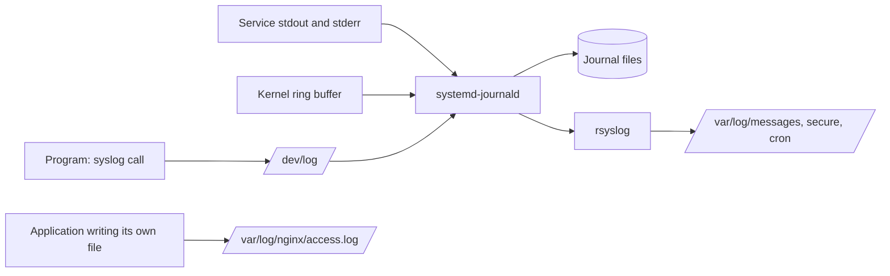

# Log Locations

A Linux host keeps logs in two places: the systemd journal and plain files under `/var/log`. Knowing which file holds authentication, cron or kernel messages on each distribution family is the first step of almost every troubleshooting answer.

**Track:** Core · **Interview weight:** High

---

## Must-Know Facts

<!-- --8<-- [start:facts] -->
| Fact | Value | Verify with |
|---|---|---|
| Two log paths | journald receives almost everything; rsyslog copies it into text files | `systemctl is-active systemd-journald rsyslog` |
| General log | RHEL `/var/log/messages`, Ubuntu `/var/log/syslog` | `ls /var/log` |
| Authentication log | RHEL `/var/log/secure`, Ubuntu `/var/log/auth.log` | `sudo tail /var/log/secure` |
| Cron log | RHEL `/var/log/cron`; Ubuntu writes cron lines to `syslog` | `journalctl -u crond` or `-u cron` |
| Kernel log | `dmesg`, `journalctl -k`; Ubuntu also `/var/log/kern.log` | `journalctl -k -n 5` |
| Package logs | RHEL `/var/log/dnf.log`, `dnf.rpm.log`; Ubuntu `/var/log/dpkg.log`, `/var/log/apt/history.log` | `ls /var/log/apt` |
| Login records (binary) | `wtmp` (`last`), `btmp` (`lastb`), `lastlog` | `last -n 3` |
| Application logs | Own directory, for example `/var/log/nginx/` | `ls /var/log/nginx` |
| Journal storage | `/var/log/journal` (persistent) or `/run/log/journal` (lost at reboot) | `journalctl --header` (the `File path` line) |
| Who can read | RHEL files are `root` only (`0600`); Ubuntu files are group `adm` (`0640`) | `ls -l /var/log/messages` |
| Journal readers | Members of `adm`, `systemd-journal` and (RHEL) `wheel` see all entries | `id` |
| Syslog socket | `/dev/log` is a symlink to journald's socket | `ls -l /dev/log` |
<!-- --8<-- [end:facts] -->

---

## The Logging Pipeline

Programs log through `syslog()`, by writing to stdout or stderr under systemd, or through the journal API. journald receives all three, and the kernel ring buffer as well. rsyslog then reads from journald and writes the classic text files according to its rules.



```bash
ls -l /dev/log; readlink -f /dev/log
```

Output:

```text
lrwxrwxrwx 1 root root 28 Sep 17 06:00 /dev/log -> /run/systemd/journal/dev-log
/run/systemd/journal/dev-log
```

The two families connect rsyslog to the journal differently. RHEL loads `imjournal`, which reads the journal files; Ubuntu configures journald with `ForwardToSyslog=yes` and rsyslog listens with `imuxsock`.

!!! note "A service's own log file bypasses both"
    nginx, PostgreSQL and Java applications often open their own files under `/var/log/<app>/`. Those lines never reach the journal, so `journalctl -u nginx` shows start and stop events but not access or error lines.

---

## The /var/log Map

=== "RHEL / Rocky"

    ```bash
    ls /var/log
    grep -E "^(authpriv|cron|\*\.info)" /etc/rsyslog.conf
    ```

    Output:

    ```text
    app
    btmp
    btmp-20260917
    crashes.log
    cron
    cron-20260917
    dnf.librepo.log
    dnf.log
    dnf.rpm.log
    hawkey.log
    hawkey.log-20260917
    httpd
    journal
    lastlog
    maillog
    maillog-20260917
    messages
    messages-20260917
    nginx
    nginx-journal.log
    payments.log
    private
    remote
    sa
    secure
    secure-20260917
    spooler
    spooler-20260917
    wtmp
    wtmp-20260917
    *.info;mail.none;authpriv.none;cron.none action(type="omfile" file="/var/log/messages")
    authpriv.* action(type="omfile" file="/var/log/secure")
    cron.* action(type="omfile" file="/var/log/cron")
    ```

    The `-20260917` files are rotated copies (`dateext` in `logrotate.conf`); `app`, `payments.log`, `crashes.log`, `nginx-journal.log` and `remote` come from the examples in this module. The playground image ships without rsyslog; the files appeared after `dnf install rsyslog`, which a standard RHEL server has by default.

=== "Ubuntu / Debian"

    ```bash
    ls /var/log
    grep -v "^#" /etc/rsyslog.d/50-default.conf | grep .
    ```

    Output:

    ```text
    README
    alternatives.log
    apt
    auth.log
    bootstrap.log
    btmp
    dmesg
    dpkg.log
    faillog
    fontconfig.log
    journal
    kern.log
    lastlog
    nginx
    private
    syslog
    sysstat
    wtmp
    auth,authpriv.*			/var/log/auth.log
    *.*;auth,authpriv.none		-/var/log/syslog
    kern.*				-/var/log/kern.log
    mail.*				-/var/log/mail.log
    mail.err			/var/log/mail.err
    *.emerg				:omusrmsg:*
    ```

    Ubuntu has no separate cron file: cron lines land in `syslog` because the `*.*` rule includes the `cron` facility. The playground image also lacked rsyslog until it was installed.

| | RHEL / Rocky | Ubuntu / Debian |
|---|---|---|
| **General** | `/var/log/messages` | `/var/log/syslog` |
| **Authentication, sudo, SSH** | `/var/log/secure` | `/var/log/auth.log` |
| **Cron** | `/var/log/cron` | `/var/log/syslog` |
| **Kernel** | `/var/log/messages`, `journalctl -k` | `/var/log/kern.log` |
| **Mail** | `/var/log/maillog` | `/var/log/mail.log` |
| **Boot messages** | `/var/log/boot.log` (`local7`) | `/var/log/dmesg`, `journalctl -b` |
| **Packages** | `/var/log/dnf.log`, `dnf.rpm.log` | `/var/log/dpkg.log`, `/var/log/apt/` |
| **SELinux / AppArmor denials** | `/var/log/audit/audit.log` | `/var/log/kern.log`, `audit.log` if `auditd` runs |
| **File mode** | `0600 root root` | `0640 syslog adm` |
| **Journal on the playground** | Volatile until `/var/log/journal` was created | Persistent (`/var/log/journal` exists) |

---

## Finding Where a Message Went

`logger` writes a test message with a chosen facility and priority, which shows exactly which file a rule sends it to.

=== "RHEL / Rocky"

    ```bash
    logger -p local0.warning -t deploy "release 42 started"; echo "backup finished in 42s" | systemd-cat -t backup -p notice; sleep 1; journalctl -t deploy -t backup -o short-iso --no-pager
    grep -h "release 42" /var/log/messages /var/log/boot.log
    ```

    Output:

    ```text
    2026-09-17T05:48:24+00:00 rocky-01 deploy[2377]: release 42 started
    2026-09-17T05:48:24+00:00 rocky-01 backup[2379]: backup finished in 42s
    Sep 17 05:48:24 rocky-01 deploy[2377]: release 42 started
    grep: /var/log/boot.log: No such file or directory
    ```

=== "Ubuntu / Debian"

    ```bash
    logger -p local0.warning -t deploy "release 42 started"; sleep 1; grep -l "release 42" /var/log/syslog /var/log/auth.log /var/log/kern.log
    ```

    Output:

    ```text
    /var/log/syslog
    ```

`local0` matches `*.info` on RHEL and `*.*` on Ubuntu, so the line lands in the general log on both. The journal keeps it regardless of rsyslog rules.

---

## Permissions on Log Files

Log files hold usernames, IP addresses and sometimes tokens, so both families restrict them. The group model differs: Ubuntu grants read access through `adm`, RHEL leaves the files to `root` and grants journal access to `wheel`.

=== "RHEL / Rocky"

    From a root shell, `su - bob` runs the read as an ordinary user:

    ```bash
    ls -l /var/log/messages /var/log/secure /var/log/cron
    su - bob -c "tail -1 /var/log/secure"
    ```

    Output:

    ```text
    -rw------- 1 root root      0 Sep 17 05:53 /var/log/cron
    -rw------- 1 root root 953490 Sep 17 05:54 /var/log/messages
    -rw------- 1 root root    194 Sep 17 05:54 /var/log/secure
    tail: cannot open '/var/log/secure' for reading: Permission denied
    ```

=== "Ubuntu / Debian"

    ```bash
    ls -l /var/log/syslog /var/log/auth.log
    tail -1 /var/log/syslog
    ```

    Output:

    ```text
    -rw-r----- 1 syslog adm  35035 Sep 17 06:04 /var/log/auth.log
    -rw-r----- 1 syslog adm 191858 Sep 17 06:04 /var/log/syslog
    tail: cannot open '/var/log/syslog' for reading: Permission denied
    ```

    The user `laborant` is in `sudo` but not in `adm`; `sudo usermod -aG adm laborant` grants read access after a new login.

!!! warning "Adding a user to adm is a real privilege"
    `adm` members can read every authentication and application log. Grant it to operators, not to service accounts.

---

## Binary Login Records

`wtmp`, `btmp` and `lastlog` are binary files read by dedicated commands. `lastb` needs root because `btmp` stores failed usernames, which are sometimes mistyped passwords.

```bash
sudo lastb | head -3
last -n 3
```

On Ubuntu 24.04, after the failed SSH logins used in [Log Parsing Recipes](log-parsing-recipes.md) and one failed `su - laborant`:

Output:

```text
laborant                               Thu Sep 17 06:04 - 06:04  (00:00)
root     ssh:notty    127.0.0.46       Thu Sep 17 05:51 - 05:51  (00:00)
root     ssh:notty    127.0.0.45       Thu Sep 17 05:51 - 05:51  (00:00)
reboot   system boot  6.1.167          Thu Sep 17 05:43   still running
reboot   system boot  6.1.167          Wed Sep 16 18:54 - 23:32  (04:37)
reboot   system boot  6.1.167          Wed Sep 16 14:20 - 18:52  (04:32)

wtmp begins Wed Sep 16 13:23:27 2026
```

The full details of these commands are in [Login Sessions](../04-users-and-access/login-sessions.md).

---

## Common Errors

### `tail: cannot open '/var/log/secure' for reading: Permission denied`

**Cause:** RHEL log files are readable by `root` only.

**Fix:** `sudo tail /var/log/secure`, or read the same entries with `journalctl` as a `wheel` member.

### `grep: /var/log/boot.log: No such file or directory`

**Cause:** The file is created only when something logs to its facility (`local7`) after rsyslog starts, or the host has no rsyslog at all.

**Fix:** Read the same information with `journalctl -b`.

---

## Interview Checkpoints

<!-- --8<-- [start:l1] -->
??? question "L1: Where are authentication failures logged on RHEL and on Ubuntu?"
    **Say first:** `/var/log/secure` on RHEL and `/var/log/auth.log` on Ubuntu; both also sit in the journal.

    **Proof:** `sudo grep "Failed password" /var/log/secure`; `journalctl -u sshd -g "Failed password"`.

    **Follow-up:** Which binary file records failed logins, and which command reads it?

??? question "L1: What is the difference between the journal and /var/log/messages?"
    **Say first:** The journal is journald's indexed binary store with structured fields; `messages` is a text copy that rsyslog writes from it using facility and priority rules.

    **Proof:** `journalctl -u crond -o verbose -n 1` shows fields such as `_SYSTEMD_UNIT` that the text file does not keep.

    **Follow-up:** Which one survives a reboot on a host with no `/var/log/journal`?
<!-- --8<-- [end:l1] -->

??? question "L2: A message was sent with logger; find which file received it."
    **Say first:** Send a tagged test message and grep the candidate files.

    **Proof:** `logger -p local0.warning -t deploy "release 42 started"; grep -l "release 42" /var/log/*`

    **Follow-up:** How do you send the `local3` facility to its own file? (An rsyslog rule, see [rsyslog](rsyslog.md).)

??? question "L2: Give a developer read access to Ubuntu system logs without sudo."
    **Say first:** Add the user to `adm`.

    **Proof:** `sudo usermod -aG adm dev1`; after a new login, `tail /var/log/syslog` works.

    **Follow-up:** What is the RHEL equivalent for the journal? (`wheel` or `systemd-journal`.)

??? question "L2: Where do dnf and apt record what was installed, and when?"
    **Say first:** `dnf history` and `/var/log/dnf.rpm.log` on RHEL; `/var/log/apt/history.log` and `/var/log/dpkg.log` on Ubuntu.

    **Proof:** `grep " install " /var/log/dpkg.log | tail -3`

    **Follow-up:** How do you undo the last transaction on RHEL? (`dnf history undo last`.)

??? question "L3: journalctl -u nginx shows the service started, but no request errors appear anywhere in the journal. Where are they?"
    **Say first:** nginx writes access and error lines to its own files, which bypass the journal.

    **Proof:** `grep -E "access_log|error_log" /etc/nginx/nginx.conf`; `tail /var/log/nginx/error.log`.

    **Follow-up:** How would you ship those files to a central server? (rsyslog `imfile`, or an agent such as Fluent Bit.)

??? question "L3: After a reboot, the logs from before the crash are gone. Why, and how do you prevent it?"
    **Say first:** The journal was volatile (`/run/log/journal`), and rsyslog was not installed or not writing files.

    **Proof:** `journalctl --list-boots` shows one boot; `ls /var/log/journal` fails.

    **Follow-up:** Enable persistence (see [journalctl](journalctl.md)) and forward logs off the host.

??? question "L2: List the logs that exist only on one family."
    **Say first:** RHEL has `secure`, `messages`, `cron`, `maillog`; Ubuntu has `auth.log`, `syslog`, `kern.log`, `dpkg.log`.

    **Proof:** `ls /var/log` on each host.

    **Follow-up:** Which rsyslog rule sends cron lines to `/var/log/cron` on RHEL?

---

## Related

- [journalctl](journalctl.md): querying the journal
- [rsyslog](rsyslog.md): rules that create these files
- [logrotate](logrotate.md): the dated and numbered copies
- [Log Parsing Recipes](log-parsing-recipes.md): extracting answers from these files
- [Login Sessions](../04-users-and-access/login-sessions.md): `last`, `lastb`, `lastlog`

Captured on Rocky Linux 10.2 and Ubuntu 24.04.4 LTS (iximiuz Labs microVMs, kernel 6.1.167), 2026-09.
