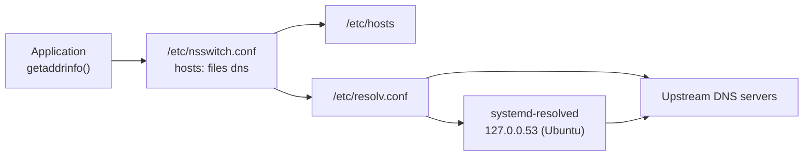

# DNS Resolution

Turning a name into an address on Linux passes through `nsswitch.conf`, `/etc/hosts`, the resolver configuration and often a local stub resolver before any DNS server is asked. Knowing that path, and which tools skip parts of it, separates a client-side problem from a server-side one.

**Track:** Core · **Interview weight:** High

---

## Must-Know Facts

<!-- --8<-- [start:facts] -->
| Fact | Value | Verify with |
|---|---|---|
| Lookup order | `hosts:` line in `/etc/nsswitch.conf`; `files` = `/etc/hosts`, `dns` = resolvers in `/etc/resolv.conf` | `grep ^hosts /etc/nsswitch.conf` |
| RHEL | `hosts: files dns myhostname`; `/etc/resolv.conf` written by NetworkManager | `head -1 /etc/resolv.conf` |
| Ubuntu | systemd-resolved stub at `127.0.0.53`; `/etc/resolv.conf` is a symlink to `stub-resolv.conf` | `ls -l /etc/resolv.conf`, `resolvectl status` |
| Application view | `getent hosts <name>` follows nsswitch like applications | `getent ahostsv4 <name>` |
| DNS view | `dig`, `host`, `nslookup` query DNS only and ignore `/etc/hosts` (the resolved stub serves hosts entries itself) | `dig @<server> <name>` |
| resolv.conf limits | Up to 3 `nameserver` lines; `search` domains; `options timeout:N attempts:N` | `cat /etc/resolv.conf` |
| Search list | Short names get each `search` domain appended | `getent hosts db` |
| Status codes | `NOERROR`, `NXDOMAIN` (name does not exist), `SERVFAIL` (server failed), `REFUSED` (policy) | `status:` line of `dig` |
| `aa` flag | Authoritative answer from the zone's own server | `dig @<server> <name>` |
| TTL | Seconds a resolver may cache the record; counts down in cached answers | `dig +noall +answer` twice |
| Record types | `A`, `AAAA`, `CNAME`, `MX`, `NS`, `TXT`, `SOA`, `PTR` (reverse, `dig -x`), `SRV` | `dig <name> <type>` |
| Transport | UDP 53, TCP 53 for large answers and zone transfers | `ss -ulpn 'sport = :53'` |
| Split DNS | resolved routing domain `Domains=~zone` sends only that zone to a server | `resolvectl domain` |
| Cache control | `resolvectl flush-caches`, `resolvectl statistics` | `sudo resolvectl statistics` |
<!-- --8<-- [end:facts] -->

---

## The Resolution Path



=== "RHEL / Rocky"

    ```bash
    grep ^hosts /etc/nsswitch.conf
    cat /etc/resolv.conf
    systemctl is-active systemd-resolved
    ```

    Output:

    ```text
    hosts:      files  dns myhostname
    # Generated by NetworkManager
    nameserver 1.1.1.1
    inactive
    ```

=== "Ubuntu / Debian"

    ```bash
    grep ^hosts /etc/nsswitch.conf
    ls -l /etc/resolv.conf
    grep -v '^#' /etc/resolv.conf | grep .
    ```

    Output:

    ```text
    hosts:          files dns
    lrwxrwxrwx 1 root root 39 Sep 17 11:55 /etc/resolv.conf -> ../run/systemd/resolve/stub-resolv.conf
    nameserver 127.0.0.53
    options edns0 trust-ad
    search lab.internal
    ```

`myhostname` on RHEL resolves the machine's own hostname even when nothing else knows it. On Ubuntu, applications talk to the stub, and `resolvectl status` shows the real upstream servers, per interface.

!!! warning "/etc/hosts wins over DNS"
    With `files` first, a stale `/etc/hosts` line silently overrides the zone. It is the first file to check when one host resolves a name differently from the others.

---

## Querying DNS with dig

The lab zone `shop.internal` is served by BIND on `web` (`172.16.1.3`), which does not recurse for other names:

```bash
dig @172.16.1.3 api.shop.internal
```

Output:

```text

; <<>> DiG 9.18.39-0ubuntu0.24.04.7-Ubuntu <<>> @172.16.1.3 api.shop.internal
; (1 server found)
;; global options: +cmd
;; Got answer:
;; ->>HEADER<<- opcode: QUERY, status: NOERROR, id: 54385
;; flags: qr aa rd; QUERY: 1, ANSWER: 1, AUTHORITY: 0, ADDITIONAL: 1
;; WARNING: recursion requested but not available

;; OPT PSEUDOSECTION:
; EDNS: version: 0, flags:; udp: 1232
; COOKIE: d6fcc48743c63d08010000006aabd642b57f7060a2385dc2 (good)
;; QUESTION SECTION:
;api.shop.internal.		IN	A

;; ANSWER SECTION:
api.shop.internal.	300	IN	A	172.16.1.3

;; Query time: 0 msec
;; SERVER: 172.16.1.3#53(172.16.1.3) (UDP)
;; WHEN: Thu Sep 17 12:00:02 UTC 2026
;; MSG SIZE  rcvd: 90
```

| Part | Meaning |
|---|---|
| `status: NOERROR` | The query succeeded (an empty answer is still `NOERROR`) |
| `flags: qr aa rd` | Response, authoritative answer, recursion desired by the client |
| `WARNING: recursion requested...` | The server has `recursion no`; `ra` is missing from the flags |
| `ANSWER SECTION` | Name, TTL in seconds, class, type, value |
| `SERVER` | Which server answered; with no `@`, the first `nameserver` in `resolv.conf` |

```bash
dig @172.16.1.3 shop.internal MX +short
dig @172.16.1.3 shop.internal NS +short
dig @172.16.1.3 shop.internal TXT +short
dig @172.16.1.3 -x 172.16.1.10 +short
dig @172.16.1.3 www.shop.internal +noall +answer
host api.shop.internal
nslookup db.shop.internal
```

Output:

```text
10 mail.shop.internal.
ns1.shop.internal.
"v=spf1 -all"
db.shop.internal.
www.shop.internal.	300	IN	CNAME	api.shop.internal.
api.shop.internal.	300	IN	A	172.16.1.3
api.shop.internal has address 172.16.1.3
Server:		127.0.0.53
Address:	127.0.0.53#53

Non-authoritative answer:
Name:	db.shop.internal
Address: 172.16.1.10
```

`-x` builds the reverse name (`10.1.16.172.in-addr.arpa`) and asks for its `PTR`. The `CNAME` answer includes the target's `A` record. `host` and `nslookup` went through the stub, which answered `Non-authoritative` because it relayed a cached or forwarded answer.

### Status Codes and Failures

```bash
dig @172.16.1.3 one.one.one.one | grep -E 'status|WARNING'
dig @172.16.1.3 nosuch.shop.internal | grep status
dig @172.16.1.99 api.shop.internal +tries=1 +time=2 | head -3
```

Output:

```text
;; ->>HEADER<<- opcode: QUERY, status: REFUSED, id: 981
;; WARNING: recursion requested but not available
;; ->>HEADER<<- opcode: QUERY, status: NXDOMAIN, id: 9502
;; communications error to 172.16.1.99#53: timed out

; <<>> DiG 9.18.39-0ubuntu0.24.04.7-Ubuntu <<>> @172.16.1.99 api.shop.internal +tries=1 +time=2
```

| Result | Likely cause |
|---|---|
| `NXDOMAIN` | The name does not exist in the zone that was asked (or the wrong zone was asked) |
| `REFUSED` | The server will not answer this client or this name (ACL, no recursion) |
| `SERVFAIL` | The server tried and failed: zone not loaded, upstream down, DNSSEC validation failure |
| `timed out` | Nothing listening, or UDP 53 blocked on the path |
| `connection refused` | Host reachable, no DNS service on port 53 |

With `named` stopped on `web`, the stub on `client` turns the failed upstream into `SERVFAIL`:

```bash
dig nothere2.shop.internal | grep -E 'status|SERVER'
```

Output:

```text
;; ->>HEADER<<- opcode: QUERY, status: SERVFAIL, id: 1749
;; SERVER: 127.0.0.53#53(127.0.0.53) (UDP)
```

---

## systemd-resolved

Ubuntu's stub caches answers. A second query five seconds later shows the TTL counting down:

```bash
sudo resolvectl flush-caches
dig +noall +answer api.shop.internal
sleep 5; dig +noall +answer api.shop.internal
sudo resolvectl statistics | grep -iE 'cache|hits|misses'
```

Output:

```text
api.shop.internal.	300	IN	A	172.16.1.3
api.shop.internal.	294	IN	A	172.16.1.3
Cache                                        
                         Current Cache Size:  1
                                 Cache Hits: 19
                               Cache Misses: 33
```

A routing domain sends only one zone to an internal server and leaves public names on the link's servers. The drop-in `/etc/systemd/resolved.conf.d/shop.conf` holds `DNS=172.16.1.3` and `Domains=~shop.internal`:

```bash
resolvectl dns
resolvectl domain
```

Output:

```text
Global: 172.16.1.3
Link 2 (eth0): 1.1.1.1 8.8.8.8
Global: ~shop.internal
Link 2 (eth0): lab.internal
```

`lab.internal` without `~` is a search domain; `~shop.internal` only routes queries. Adding `shop.internal` as a search domain at runtime makes the short name work:

```bash
getent hosts db
sudo resolvectl domain eth0 lab.internal shop.internal
getent hosts db
grep ^search /etc/resolv.conf
```

Output:

```text
172.16.1.10     db.shop.internal
search lab.internal shop.internal
```

The first `getent` printed nothing: `db.lab.internal` does not exist. `sudo resolvectl revert eth0` drops the runtime change.

!!! tip "Resolve through the same path as the application"
    `resolvectl query <name>` and `getent hosts <name>` use the stub and `/etc/hosts`; `dig @<server>` bypasses both. Compare the two before deciding where the fault is.

---

## Several Servers on RHEL

With NetworkManager, the servers and options come from the profile:

```bash
sudo nmcli connection modify dmz ipv4.dns "172.16.1.3 1.1.1.1" ipv4.dns-search lab.internal ipv4.dns-options "timeout:2 attempts:2"
sudo nmcli device reapply eth1 >/dev/null
cat /etc/resolv.conf
getent hosts api.shop.internal
getent hosts one.one.one.one
```

Output:

```text
# Generated by NetworkManager
search lab.internal
nameserver 172.16.1.3
nameserver 1.1.1.1
options timeout:2 attempts:2
172.16.1.3      api.shop.internal
2606:4700:4700::1111 one.one.one.one
2606:4700:4700::1001 one.one.one.one
```

The glibc resolver asks the servers in order and moves on after a timeout or a `REFUSED`, so the public name still resolved through `1.1.1.1`. glibc has no routing domains: every name goes to the first server first, which is why split DNS on RHEL uses systemd-resolved or dnsmasq.

---

## Common Errors

### `curl: (6) Could not resolve host: api.shop.internal`

**Cause:** no source in `nsswitch.conf` knows the name, often because the internal zone's server is not configured on the client.

**Fix:** `getent hosts <name>`, then `resolvectl status` or `/etc/resolv.conf`, then `dig @<internal server> <name>`. See [DNS Not Resolving](../interview/scenarios/dns-not-resolving.md).

### `;; communications error to 172.16.1.99#53: timed out`

**Cause:** no DNS server at that address, or a firewall drops port 53.

**Fix:** `ping` the server, `nc -vzu <server> 53`, check security groups and the server's firewall.

### `;; WARNING: recursion requested but not available`

**Cause:** the server is authoritative only and refuses names outside its zones.

**Fix:** point clients at a recursive resolver, or route only the zone to this server.

### `ping: api.shop.internal: Name or service not known`

**Cause:** the same lookup failure as above, reported by `getaddrinfo()`.

**Fix:** as for `Could not resolve host`.

---

## Interview Checkpoints

<!-- --8<-- [start:l1] -->
??? question "L1: What happens when a program looks up a hostname on Linux?"
    **Say first:** glibc reads the `hosts:` line in `nsswitch.conf`, checks `/etc/hosts`, then asks the servers in `/etc/resolv.conf`, which on Ubuntu is the local systemd-resolved stub.

    **Proof:** `grep ^hosts /etc/nsswitch.conf`; `cat /etc/resolv.conf`; `resolvectl status`.

    **Follow-up:** Which tools skip `/etc/hosts`?

??? question "L1: What is the difference between NXDOMAIN and SERVFAIL?"
    **Say first:** `NXDOMAIN` is a definite answer that the name does not exist; `SERVFAIL` means the server could not produce an answer.

    **Proof:** `dig @172.16.1.3 nosuch.shop.internal` gives `NXDOMAIN`; with `named` stopped, the resolved stub answers `SERVFAIL` for the same zone.

    **Follow-up:** Which one is cached, and for how long? (Negative answers, for the SOA minimum.)
<!-- --8<-- [end:l1] -->

??? question "L2: Query the MX and TXT records of a domain from a specific server."
    **Say first:** `dig @server domain MX` and `TXT`, with `+short` for the values.

    **Proof:** `dig @172.16.1.3 shop.internal MX +short` prints `10 mail.shop.internal.`

    **Follow-up:** How do you find the authoritative servers for a public domain? (`dig NS`, `dig +trace`.)

??? question "L2: Find the hostname for 172.16.1.10."
    **Say first:** a reverse lookup of the `PTR` record.

    **Proof:** `dig -x 172.16.1.10 +short`; `getent hosts 172.16.1.10`.

    **Follow-up:** Who controls reverse zones for public addresses?

??? question "L2: Read this: dig shows TTL 294 on a second query. What does it tell you?"
    **Say first:** the answer came from a cache, six seconds into a 300-second TTL.

    **Proof:** `dig +noall +answer` twice through `127.0.0.53`; `sudo resolvectl statistics` shows cache hits.

    **Follow-up:** Why lower TTLs before migrating a service?

??? question "L3: dig returns the right address but the application connects to an old one. Why?"
    **Say first:** the application uses nsswitch, so `/etc/hosts`, a local cache (resolved, nscd, the application's own) or a different resolver answers for it.

    **Proof:** `getent hosts <name>` versus `dig @<server> <name>`; `grep <name> /etc/hosts`; `resolvectl flush-caches`.

    **Follow-up:** How does the JVM cache DNS answers?

??? question "L3: Internal names stopped resolving after a VPN client was installed. What do you check?"
    **Say first:** which servers and routing domains are active now, and whether the VPN replaced them.

    **Proof:** `resolvectl status`; `ls -l /etc/resolv.conf`; `resolvectl query <internal name>`.

    **Follow-up:** How do routing domains avoid sending every query through the VPN?

??? question "L3: Name resolution is slow, about five seconds per lookup, but succeeds. What is the usual cause?"
    **Say first:** the first `nameserver` does not answer, so glibc waits for the timeout (5 s by default) before trying the next.

    **Proof:** `cat /etc/resolv.conf`; `dig @<first server> <name>` times out; `time getent hosts <name>`.

    **Follow-up:** Which `options` shorten the wait? (`timeout:`, `attempts:`, `rotate`.)

---

## Related

- [DNS Not Resolving](../interview/scenarios/dns-not-resolving.md): the full troubleshooting scenario
- [Network Configuration](network-configuration.md): where DNS servers are set
- [curl and DNS](../../networking/curl-dns-resolution.md): name resolution from the client side
- [Ports and Sockets](ports-and-sockets.md): checking what listens on port 53

Captured on Ubuntu 24.04.4 (systemd 255, dig 9.18.39) and Rocky Linux 10.2 (NetworkManager 1.56, BIND 9.18.33) on iximiuz Labs FlexBox microVMs, kernel 6.1.167, 2026-09.
