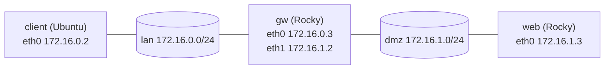

# Routing

The routing table tells the kernel which interface and next hop to use for every destination. Most "cannot reach" problems between subnets come down to a missing route, forwarding turned off on a router, or a return path that goes somewhere else.

**Track:** Core · **Interview weight:** High

---

## Must-Know Facts

<!-- --8<-- [start:facts] -->
| Fact | Value | Verify with |
|---|---|---|
| Lookup rule | Longest prefix wins; among equal prefixes, the lowest metric wins | `ip route get <ip>` |
| Default route | `default` = `0.0.0.0/0`, used when nothing more specific matches | `ip route show default` |
| Connected route | Created with each address on an up link (`proto kernel scope link`) | `ip route` |
| `via` | Next-hop router; it must be reachable on a connected subnet | `ip route get <ip>` |
| Forwarding | A Linux host routes between interfaces only with `net.ipv4.ip_forward = 1` | `sysctl net.ipv4.ip_forward` |
| Return path | Replies use the destination host's own routing table; a missing return route drops the reply | `tcpdump -e` on the destination |
| TTL | Each router decrements TTL by one; `ttl=63` from a Linux host means one hop | `ping` |
| Reverse path filter | `rp_filter=1` (strict) drops packets arriving on an interface that would not be used to reply | `sysctl net.ipv4.conf.all.rp_filter` |
| Policy routing | `ip rule` chooses a table (by source, mark, interface) before the route lookup | `ip rule show` |
| Tables | `local` (own addresses), `main` (normal), `default`; custom tables by number or `/etc/iproute2/rt_tables` | `ip route show table all` |
| Special routes | `blackhole`, `unreachable`, `prohibit` drop traffic on purpose | `ip route` |
| Persistence | NetworkManager `ipv4.routes`, netplan `routes:`, `sysctl.d` for forwarding | `nmcli -g ipv4.routes con show <name>` |
| Legacy view | `route -n` (net-tools); flags `U` up, `G` gateway, `H` host | `route -n` |
<!-- --8<-- [end:facts] -->

---

## Lab Topology



Each network also has a playground gateway at `.1` that provides internet access but does not route between `lan` and `dmz`. The goal is for `client` to reach `web` through `gw`.

---

## Reading the Table

```bash
ip route
ip route get 172.16.1.3
ping -c2 -W1 172.16.1.3 | tail -2
```

Output:

```text
default via 172.16.0.1 dev eth0 proto static 
172.16.0.0/24 dev eth0 proto kernel scope link src 172.16.0.2 
172.16.1.3 via 172.16.0.1 dev eth0 src 172.16.0.2 uid 1001 
    cache 
2 packets transmitted, 0 received, 100% packet loss, time 1020ms

```

| Part | Meaning |
|---|---|
| `default via 172.16.0.1` | Anything without a better match goes to this router |
| `proto static` / `proto kernel` | Who added the route: a configuration tool, or the kernel for a connected subnet |
| `scope link` | The destination is directly on this link; no router needed |
| `src 172.16.0.2` | Source address used for packets on this route |
| `metric` | Preference among equal prefixes; lower wins (missing = 0) |

`ip route get` answers the real question, the route a packet to one address takes: here the default route to a router that drops it.

---

## Building a Route Through a Linux Router

### 1. Add the Route on the Client

```bash
sudo ip route add 172.16.1.0/24 via 172.16.0.3
ip route get 172.16.1.3
```

Output:

```text
172.16.1.3 via 172.16.0.3 dev eth0 src 172.16.0.2 uid 1001 
    cache 
```

The `/24` route is longer than `default`, so it wins. Pings still fail.

### 2. Check Forwarding on the Router

`tcpdump` on `gw`, running while `client` pinged and stopped afterwards, shows the requests arriving and going nowhere:

```bash
sysctl net.ipv4.ip_forward
sudo tcpdump -ni any -c 6 icmp
```

Output:

```text
net.ipv4.ip_forward = 0
# ... (trimmed)
11:51:23.125206 eth0  In  IP 172.16.0.2 > 172.16.1.3: ICMP echo request, id 2824, seq 1, length 64
11:51:24.125315 eth0  In  IP 172.16.0.2 > 172.16.1.3: ICMP echo request, id 2824, seq 2, length 64
```

With forwarding off, a Linux host accepts only packets addressed to itself and silently discards the rest.

```bash
sudo sysctl -w net.ipv4.ip_forward=1
```

### 3. Check the Return Path

Pings still fail. A capture with `-e` (link-layer headers) on `web`, taken during the next ping, shows why:

```bash
sudo tcpdump -eni eth0 -c 4 icmp
```

Output:

```text
# ... (trimmed)
11:51:55.158162 02:00:ac:10:01:02 > 02:00:ac:10:01:03, ethertype IPv4 (0x0800), length 98: 172.16.0.2 > 172.16.1.3: ICMP echo request, id 2852, seq 1, length 64
11:51:55.158183 02:00:ac:10:01:03 > 02:00:ac:10:01:01, ethertype IPv4 (0x0800), length 98: 172.16.1.3 > 172.16.0.2: ICMP echo reply, id 2852, seq 1, length 64
# ... (trimmed)
```

The request came from `gw` (`...01:02`), but `web` sent the reply to its default gateway (`...01:01`), which drops it. The forward path worked; the return path did not.

!!! warning "Routing must work in both directions"
    A request that arrives proves only the forward path. Check the destination's `ip route get <source>` as well, or capture there with `tcpdump -e` to see which MAC the reply goes to.

### 4. Add the Return Route

```bash
sudo ip route add 172.16.0.0/24 via 172.16.1.2
ip route get 172.16.0.2
```

Output:

```text
172.16.0.2 via 172.16.1.2 dev eth0 src 172.16.1.3 uid 1001 
    cache 
```

From `client`:

```bash
ping -c2 172.16.1.3
tracepath -n -m 5 172.16.1.3
traceroute -n -m 5 172.16.1.3
```

Output:

```text
PING 172.16.1.3 (172.16.1.3) 56(84) bytes of data.
64 bytes from 172.16.1.3: icmp_seq=1 ttl=63 time=0.328 ms
64 bytes from 172.16.1.3: icmp_seq=2 ttl=63 time=0.318 ms
# ... (trimmed)
 1?: [LOCALHOST]                      pmtu 1500
 1:  172.16.0.3                                            0.099ms 
 1:  172.16.0.3                                            0.044ms 
 2:  172.16.1.3                                            0.111ms reached
     Resume: pmtu 1500 hops 2 back 2 
traceroute to 172.16.1.3 (172.16.1.3), 5 hops max, 60 byte packets
 1  172.16.0.3  0.056 ms  0.039 ms  0.037 ms
 2  172.16.1.3  0.149 ms  0.115 ms  0.102 ms
```

`ttl=63` (Linux starts at 64) and both traces show one router in between.

!!! note "Cloud networks add their own routing layer"
    In AWS, the VPC route table decides the next hop, and an instance that forwards traffic needs source/destination checking disabled. `ip_forward` alone is not enough there.

---

## Making Routes Permanent

=== "RHEL / Rocky"

    ```bash
    echo 'net.ipv4.ip_forward = 1' | sudo tee /etc/sysctl.d/90-router.conf
    sudo sysctl --system | grep -A1 90-router
    sudo nmcli connection modify dmz +ipv4.routes "10.20.0.0/16 172.16.1.3 50"
    sudo nmcli device reapply eth1 >/dev/null
    ip route show 10.20.0.0/16
    sudo grep route /etc/NetworkManager/system-connections/dmz.nmconnection
    ```

    Output:

    ```text
    net.ipv4.ip_forward = 1
    * Applying /etc/sysctl.d/90-router.conf ...
    * Applying /etc/sysctl.d/99-sysctl.conf ...
    10.20.0.0/16 via 172.16.1.3 dev eth1 proto static metric 50 
    route1=10.20.0.0/16,172.16.1.3,50
    ```

=== "Ubuntu / Debian"

    ```bash
    sudo netplan set --origin-hint 60-lan 'ethernets.lan.routes=[{"to":"default","via":"172.16.0.1"},{"to":"172.16.1.0/24","via":"172.16.0.3"}]'
    sudo netplan get ethernets.lan.routes
    sudo netplan apply
    sleep 2; ip route
    ```

    Output:

    ```text
    - to: "default"
      via: "172.16.0.1"
    - to: "172.16.1.0/24"
      via: "172.16.0.3"
    default via 172.16.0.1 dev eth0 proto static 
    172.16.0.0/24 dev eth0 proto kernel scope link src 172.16.0.2 
    172.16.1.0/24 via 172.16.0.3 dev eth0 proto static 
    ```

    Immediately after `netplan apply`, `ip route` printed nothing: networkd restarts and re-adds the routes a moment later.

The route format for NetworkManager is `<prefix> <next hop> <metric>`. On Ubuntu, forwarding goes into a file under `/etc/sysctl.d/` the same way.

---

## Longest Prefix, Blackholes and Policy Routing

On `gw`, a more specific route overrides the `/16` for part of the range:

```bash
sudo ip route add 10.20.5.0/24 via 172.16.0.2
ip route get 10.20.5.9
ip route get 10.20.6.9
sudo ip route del 10.20.5.0/24
sudo ip route add blackhole 10.40.0.0/16
ping -c1 10.40.0.1
sudo ip route del blackhole 10.40.0.0/16
```

Output:

```text
10.20.5.9 via 172.16.0.2 dev eth0 src 172.16.0.3 uid 1001 
    cache 
10.20.6.9 via 172.16.1.3 dev eth1 src 172.16.1.2 uid 1001 
    cache 
ping: connect: Invalid argument
```

A blackhole route drops traffic at the source, which is a quick way to cut a host off from a range.

Policy routing picks a table before the lookup. Traffic from the `dmz` address leaves through the `dmz` gateway, everything else through `eth0`:

```bash
sudo ip route add default via 172.16.1.1 table 100
sudo ip rule add from 172.16.1.2 lookup 100
ip rule show
ip route get 1.1.1.1
ip route get 1.1.1.1 from 172.16.1.2
```

Output:

```text
0:	from all lookup local
32765:	from 172.16.1.2 lookup 100
32766:	from all lookup main
32767:	from all lookup default
1.1.1.1 via 172.16.0.1 dev eth0 src 172.16.0.3 uid 1001 
    cache 
1.1.1.1 from 172.16.1.2 via 172.16.1.1 dev eth1 table 100 uid 1001 
    cache 
```

This is the fix for a host with two uplinks whose replies leave through the wrong one. The `local` table, consulted first, holds the host's own addresses (`ip route show table local`).

---

## Common Errors

### `ping: connect: Network is unreachable`

**Cause:** no route matches the destination, often a missing default route. A new network namespace (`ip netns exec iso ping -c1 1.1.1.1`) shows it: its table is empty.

**Fix:** `ip route`; add the default route or bring up the interface that provides it.

### `Error: Nexthop has invalid gateway.`

**Cause:** the `via` address (`192.168.50.1` here) is not on any connected subnet, so the kernel cannot reach it.

**Fix:** use a gateway on a local subnet, or add `onlink` when the provider requires an off-subnet gateway.

### `ping: connect: Invalid argument`

**Cause:** a `blackhole` route matches the destination; `ip route get` fails with `RTNETLINK answers: Invalid argument`.

**Fix:** `ip route | grep -E 'blackhole|unreachable|prohibit'` and remove the route.

---

## Interview Checkpoints

<!-- --8<-- [start:l1] -->
??? question "L1: How does Linux pick a route for a packet?"
    **Say first:** it checks the policy rules, then picks the most specific (longest prefix) matching route, and uses the metric to break ties.

    **Proof:** `ip rule show`; `ip route get 10.20.5.9` with a `/16` and a `/24` present.

    **Follow-up:** What happens when no route matches?

??? question "L1: What does net.ipv4.ip_forward do?"
    **Say first:** it lets the kernel pass packets between interfaces; without it the host drops traffic not addressed to itself.

    **Proof:** `sysctl net.ipv4.ip_forward`; `tcpdump` on the router shows requests arriving and nothing leaving.

    **Follow-up:** Which container and Kubernetes components need it turned on?
<!-- --8<-- [end:l1] -->

??? question "L2: Add a persistent route to 10.20.0.0/16 via 172.16.1.3 on RHEL."
    **Say first:** add it to the NetworkManager profile and reapply.

    **Proof:** `sudo nmcli con mod dmz +ipv4.routes "10.20.0.0/16 172.16.1.3"; sudo nmcli dev reapply eth1; ip route show 10.20.0.0/16`.

    **Follow-up:** How is the same route written in netplan?

??? question "L2: Show which interface and source address are used to reach 1.1.1.1."
    **Say first:** `ip route get`.

    **Proof:** `ip route get 1.1.1.1` prints `via 172.16.0.1 dev eth0 src 172.16.0.3`.

    **Follow-up:** How do you check the route for a specific source address? (`ip route get 1.1.1.1 from <ip>`.)

??? question "L2: Read this output: what does ttl=63 tell you?"
    **Say first:** the packet crossed one router, since Linux sends replies with TTL 64.

    **Proof:** `ping -c1 172.16.1.3` from the other subnet; `traceroute -n` shows one hop.

    **Follow-up:** Why is TTL 128 or 255 seen from other systems?

??? question "L3: Host A reaches host B through a Linux router, the router sees the requests, but A gets no replies. Where do you look?"
    **Say first:** forwarding on the router, the firewall's forward chain, then the return path from B.

    **Proof:** `sysctl net.ipv4.ip_forward` on the router; `tcpdump -eni eth0 icmp` on B shows replies going to another gateway's MAC; `ip route get <A>` on B.

    **Follow-up:** How would `rp_filter` cause the same symptom?

??? question "L3: A server with two network interfaces answers on one but not on the other. What do you suspect?"
    **Say first:** asymmetric routing: replies leave through the default route's interface, and the other side or `rp_filter` drops them.

    **Proof:** `ip route get <client> from <second ip>`; `sysctl net.ipv4.conf.all.rp_filter`; `tcpdump` on both interfaces.

    **Follow-up:** How does policy routing fix it?

??? question "L2: After netplan apply, routes briefly disappeared. Is that a problem?"
    **Say first:** networkd restarts and re-adds them; it is a short gap that can drop in-flight connections, so apply changes in a maintenance window.

    **Proof:** `sudo netplan apply; ip route` shows nothing, and `ip route` two seconds later shows the routes.

    **Follow-up:** Which command reverts automatically if the change breaks connectivity?

---

## Related

- [Interfaces and Addresses](interfaces-and-addresses.md): connected routes and ARP
- [Connectivity Testing](connectivity-testing.md): `traceroute` and `mtr` in detail
- [Packet Capture](packet-capture.md): `tcpdump` filters
- [sysctl](../11-kernel-and-hardware/sysctl.md): making `ip_forward` persistent
- [Packet Journey](../../networking/packet-journey-ibtisam-iq.md): the path of a packet across networks

Captured on Rocky Linux 10.2 and Ubuntu 24.04.4 (iximiuz Labs FlexBox microVMs, kernel 6.1.167), 2026-09. MAC addresses are replaced with placeholders.
