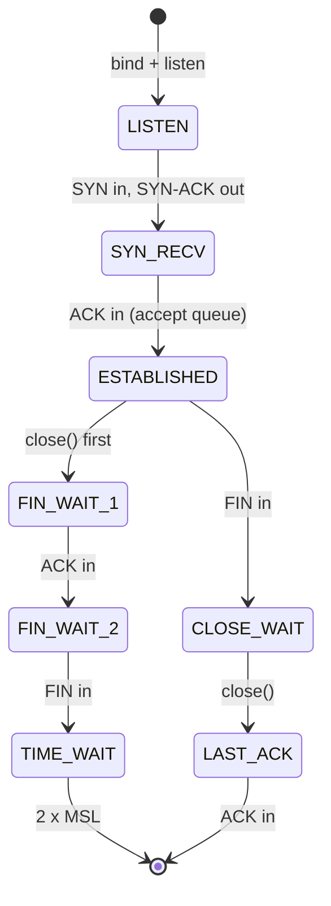

# Sockets and TCP States

A TCP server is a sequence of system calls (`socket`, `bind`, `listen`, `accept`) backed by kernel queues, and every connection moves through a fixed set of states. Reading those states in `ss` explains full accept queues, piles of `CLOSE_WAIT` and `TIME_WAIT`, and exhausted connection tables.

**Track:** Advanced · **Interview weight:** Med

---

## Must-Know Facts

<!-- --8<-- [start:facts] -->
| Fact | Value | Verify with |
|---|---|---|
| Server calls | `socket()`, `bind()`, `listen(backlog)`, `accept()` returns a new fd per client | `strace -e trace=network` |
| Client calls | `socket()`, `connect()`; the kernel picks an ephemeral source port | `ss -tn` |
| Handshake | SYN, SYN-ACK, ACK; the kernel completes it without the application | `tcpdump 'tcp[tcpflags] & tcp-syn != 0'` |
| SYN queue | Half-open connections (`SYN-RECV`); limit `tcp_max_syn_backlog`; `tcp_syncookies=1` survives floods | `sysctl net.ipv4.tcp_syncookies` |
| Accept queue | Completed connections waiting for `accept()`; limit `min(backlog, somaxconn)`, and `somaxconn` is 4096 since kernel 5.4 | `ss -ltn` (`Recv-Q`/`Send-Q`) |
| Queue overflow | New SYNs are dropped, clients sit in `SYN-SENT` and retry | `nstat -az TcpExtListenOverflows` |
| Active closer | Sends the first FIN, passes `FIN-WAIT-1`, `FIN-WAIT-2`, then `TIME-WAIT` (60 s on Linux) | `ss -tan state time-wait` |
| Passive closer | Receives the FIN and stays in `CLOSE-WAIT` until the application calls `close()` | `ss -tanp state close-wait` |
| CLOSE_WAIT pile-up | Always an application bug (sockets not closed) | `ss -tanp state close-wait` |
| TIME_WAIT pile-up | Normal on busy clients; costs little memory; `tcp_tw_reuse` lets outgoing connections reuse them | `ss -s` |
| Orphan FIN-WAIT-2 | Closed by the kernel after `tcp_fin_timeout` (60 s) | `sysctl net.ipv4.tcp_fin_timeout` |
| Connection tracking | Netfilter tracks flows for stateful rules and NAT; full table drops new flows | `conntrack -C`, `sysctl net.netfilter.nf_conntrack_max` |
| Per-socket detail | RTT, congestion window, retransmits | `ss -tin` |
<!-- --8<-- [end:facts] -->

---

## A Server in System Calls

A small Python server on `web` accepts one client on port 9100, sends a line and exits. Traced with `strace`:

```bash
strace -f -e trace=socket,bind,listen,accept4,sendto,close -o /tmp/strace-accept.txt python3 /opt/lab/tcpdemo.py accept 9100
grep -v -E 'close\([0-9]+\) += 0$' /tmp/strace-accept.txt
```

Output:

```text
2554  socket(AF_INET, SOCK_STREAM|SOCK_CLOEXEC, IPPROTO_IP) = 3
2554  bind(3, {sa_family=AF_INET, sin_port=htons(9100), sin_addr=inet_addr("0.0.0.0")}, 16) = 0
2554  listen(3, 16)                     = 0
2554  accept4(3, {sa_family=AF_INET, sin_port=htons(50238), sin_addr=inet_addr("172.16.0.2")}, [16], SOCK_CLOEXEC) = 4
2554  sendto(4, "hello\n", 6, 0, NULL, 0) = 6
2554  +++ exited with 0 +++
```

The `grep` hides the many successful `close()` calls Python makes at startup. `accept4()` blocked until `client` connected (`nc -w2 172.16.1.3 9100`), then returned fd 4 for that client while fd 3 kept listening.



---

## A Full Accept Queue

The `slow` server on port 9101 calls `listen(2)` and never calls `accept()`. Six clients connect:

```bash
for i in 1 2 3 4 5 6; do nohup timeout 120 nc 172.16.1.3 9101 >/dev/null 2>&1 </dev/null & done
sleep 3; ss -tn dst 172.16.1.3:9101
```

Output:

```text
State    Recv-Q Send-Q Local Address:Port  Peer Address:PortProcess
SYN-SENT 0      1         172.16.0.2:57720   172.16.1.3:9101       
SYN-SENT 0      1         172.16.0.2:57728   172.16.1.3:9101       
ESTAB    0      0         172.16.0.2:57692   172.16.1.3:9101       
ESTAB    0      0         172.16.0.2:57688   172.16.1.3:9101       
ESTAB    0      0         172.16.0.2:57694   172.16.1.3:9101       
SYN-SENT 0      1         172.16.0.2:57708   172.16.1.3:9101       
```

On the server:

```bash
ss -tln sport = :9101
ss -tn '( sport = :9101 )'
nstat -az TcpExtListenOverflows TcpExtListenDrops
sysctl net.core.somaxconn net.ipv4.tcp_max_syn_backlog net.ipv4.tcp_syncookies
```

Output:

```text
State  Recv-Q Send-Q Local Address:Port Peer Address:Port
LISTEN 3      2            0.0.0.0:9101      0.0.0.0:*   
State Recv-Q Send-Q Local Address:Port Peer Address:Port 
ESTAB 0      0         172.16.1.3:9101   172.16.0.2:57692
ESTAB 0      0         172.16.1.3:9101   172.16.0.2:57688
ESTAB 0      0         172.16.1.3:9101   172.16.0.2:57694
#kernel
TcpExtListenOverflows           12                 0.0
TcpExtListenDrops               12                 0.0
net.core.somaxconn = 4096
net.ipv4.tcp_max_syn_backlog = 128
net.ipv4.tcp_syncookies = 1
```

The queue holds `backlog + 1` connections (`Recv-Q 3`, `Send-Q 2`). Further SYNs, including the clients' retransmissions, were dropped and counted, so those clients show `SYN-SENT` and their connections look like a slow or dead server. The three established clients are connected at the TCP level although the application never saw them.

!!! warning "A full accept queue looks like a network problem"
    Clients time out while the port is open and ping works. Check `ss -ltn` (`Recv-Q` near `Send-Q`) and `ListenOverflows`; the fix is a faster application or more workers, and a larger backlog only helps with bursts.

---

## CLOSE_WAIT and TIME_WAIT

The `leak` server on port 9102 accepts clients and never closes them. A client connects, reads the greeting and closes:

```bash
nc -w1 172.16.1.3 9102 </dev/null
sleep 1; ss -tn dst 172.16.1.3:9102
```

Output:

```text
hello
State      Recv-Q Send-Q Local Address:Port  Peer Address:PortProcess
FIN-WAIT-2 0      0         172.16.0.2:55444   172.16.1.3:9102       
```

On `web`:

```bash
ss -tnp '( sport = :9102 )'
```

Output:

```text
State      Recv-Q Send-Q Local Address:Port Peer Address:Port Process                           
CLOSE-WAIT 1      0         172.16.1.3:9102   172.16.0.2:55444 users:(("python3",pid=2550,fd=4))
```

The client sent its FIN and waits in `FIN-WAIT-2` for the server's. The server acknowledged it but its application never called `close()`, so the socket stays in `CLOSE-WAIT` with fd 4 open (`Recv-Q 1` is the unread FIN). The kernel drops the orphaned client side after `tcp_fin_timeout`; the server side stays until the process closes it or exits.

!!! danger "CLOSE_WAIT never times out"
    Thousands of `CLOSE-WAIT` sockets mean an application leaks connections, and each holds a file descriptor until it hits `Too many open files`. Restarting hides it; the fix is in the code or the connection pool.

`TIME_WAIT` belongs to whoever closed first. `curl` closes its connection after each request:

```bash
for i in 1 2 3; do curl -s -o /dev/null http://172.16.1.3:8080/; done
ss -tan state time-wait dst 172.16.1.3
```

Output:

```text
Recv-Q Send-Q Local Address:Port  Peer Address:PortProcess
0      0         172.16.0.2:44932   172.16.1.3:8080       
0      0         172.16.0.2:44940   172.16.1.3:8080       
0      0         172.16.0.2:44952   172.16.1.3:8080       
```

Each entry reserves the 4-tuple for 60 seconds so late packets cannot corrupt a new connection. A client making thousands of short connections to one server can exhaust its ephemeral ports this way; keep-alive and connection pooling fix that, and `net.ipv4.tcp_tw_reuse` allows reuse for outgoing connections (the default `2` means loopback only, `1` everywhere).

---

## Socket Internals with ss -i

```bash
ss -tin dst 172.16.1.3:9001 | head -3
```

Output:

```text
State Recv-Q Send-Q Local Address:Port  Peer Address:PortProcess
ESTAB 0      0         172.16.0.2:46910   172.16.1.3:9001
	 cubic wscale:7,7 rto:204 rtt:0.314/0.157 mss:1448 pmtu:1500 rcvmss:536 advmss:1448 cwnd:10 bytes_acked:1 segs_out:2 segs_in:1 send 368917197bps lastsnd:141868 lastrcv:141868 lastack:141868 pacing_rate 737834392bps delivered:1 app_limited rcv_space:14480 rcv_ssthresh:64088 minrtt:0.314 snd_wnd:65160
```

| Field | Meaning |
|---|---|
| `cubic` | Congestion control algorithm |
| `rtt:0.314/0.157` | Smoothed round-trip time and its variance, in ms |
| `rto:204` | Retransmission timeout, in ms |
| `mss:1448` | Largest segment payload (1500 MTU minus IP, TCP and timestamp headers) |
| `cwnd:10` | Congestion window in segments |
| `retrans:` | Appears when segments were retransmitted, the first sign of loss |

---

## Connection Tracking

Stateful firewalls and NAT keep a table of flows. With a stateful forward rule loaded on `gw` and traffic from `client` to `web`:

```bash
sudo conntrack -L 2>&1 | grep 172.16.0.2
sudo conntrack -C
sysctl net.netfilter.nf_conntrack_max net.netfilter.nf_conntrack_tcp_timeout_established
```

Output:

```text
icmp     1 20 src=172.16.0.2 dst=172.16.1.3 type=8 code=0 id=3738 src=172.16.1.3 dst=172.16.0.2 type=0 code=0 id=3738 mark=0 use=1
tcp      6 110 TIME_WAIT src=172.16.0.2 dst=172.16.1.3 sport=40662 dport=8080 src=172.16.1.3 dst=172.16.0.2 sport=8080 dport=40662 [ASSURED] mark=0 use=1
tcp      6 431990 ESTABLISHED src=172.16.0.2 dst=172.16.1.3 sport=46542 dport=9102 src=172.16.1.3 dst=172.16.0.2 sport=9102 dport=46542 [ASSURED] mark=0 use=1
udp      17 20 src=172.16.0.2 dst=172.16.1.3 sport=51913 dport=53 src=172.16.1.3 dst=172.16.0.2 sport=53 dport=51913 mark=0 use=1
4
net.netfilter.nf_conntrack_max = 8192
net.netfilter.nf_conntrack_tcp_timeout_established = 432000
```

Each entry stores both directions and a timeout in seconds; an established TCP flow is kept for five days (432000 s) unless it closes. When the table reaches `nf_conntrack_max`, the kernel logs `nf_conntrack: table full, dropping packet` and new connections fail on a host that otherwise looks healthy.

---

## Common Errors

### `nf_conntrack: table full, dropping packet`

**Cause:** more tracked flows than `nf_conntrack_max`, common on NAT gateways and Kubernetes nodes.

**Fix:** raise `net.netfilter.nf_conntrack_max`, shorten timeouts, or exempt high-volume traffic with `notrack`.

### `Cannot assign requested address`

**Cause:** a client ran out of ephemeral ports to one destination, usually with many sockets in `TIME-WAIT`.

**Fix:** reuse connections (keep-alive, pooling); widen `ip_local_port_range`; `tcp_tw_reuse=1` for outgoing connections.

---

## Interview Checkpoints

<!-- --8<-- [start:l1] -->
??? question "L1: What is the difference between CLOSE_WAIT and TIME_WAIT?"
    **Say first:** `CLOSE_WAIT` is on the side that received a FIN and has not closed yet (an application issue); `TIME_WAIT` is on the side that closed first and lasts 60 seconds (normal).

    **Proof:** `ss -tan state close-wait`; `ss -tan state time-wait`.

    **Follow-up:** Which one should never pile up?
<!-- --8<-- [end:l1] -->

??? question "L2: Show whether a listening service is dropping connections because its accept queue is full."
    **Say first:** compare `Recv-Q` with `Send-Q` on the listener, and check the overflow counters.

    **Proof:** `ss -ltn sport = :9101` shows `3 2`; `nstat -az TcpExtListenOverflows`.

    **Follow-up:** What does the client see meanwhile?

??? question "L2: Find the process that holds hundreds of CLOSE_WAIT sockets."
    **Say first:** list the state with process information and count by process.

    **Proof:** `sudo ss -tanp state close-wait | grep -o 'users:(("[^"]*",pid=[0-9]*' | sort | uniq -c`.

    **Follow-up:** Why does the count grow until `Too many open files`?

??? question "L3: A client fleet sees intermittent connection timeouts to an API that looks healthy. How do you investigate on the server?"
    **Say first:** check the listener's accept queue, the overflow and SYN counters, the conntrack table, and whether workers are saturated.

    **Proof:** `ss -ltn`; `nstat -az | grep -i listen`; `sudo conntrack -C` against `nf_conntrack_max`; `dmesg | grep conntrack`.

    **Follow-up:** How do SYN cookies change the picture during a SYN flood?

??? question "L4: Walk through what the kernel does between a client's connect() and the server's accept()."
    **Say first:** the SYN creates a request socket in the SYN queue, the SYN-ACK goes out, and the client's ACK turns it into a full socket in the accept queue; `accept()` only dequeues it and allocates an fd.

    **Proof:** `strace` shows `accept4()` returning after the client connected; the `slow` server has `ESTAB` connections without any `accept()`.

    **Follow-up:** Why is the three-way handshake complete before the application knows about the client?

??? question "L4: Why does TIME_WAIT exist, and why does it last twice the maximum segment lifetime?"
    **Say first:** it ensures the final ACK can be retransmitted and that delayed segments from the old connection expire before the same 4-tuple is reused.

    **Proof:** `ss -tan state time-wait` after `curl`; the entries vanish after about 60 seconds.

    **Follow-up:** What does `SO_REUSEADDR` change for a server restarting while old connections are in `TIME_WAIT`?

---

## Related

- [Ports and Sockets](ports-and-sockets.md): finding listeners and their processes
- [System Calls and Tracing](../07-processes/system-calls-and-tracing.md): `strace` in depth
- [File Descriptors](../02-files-and-filesystem/file-descriptors.md): what `accept()` returns
- [Packet Capture](packet-capture.md): the handshake on the wire

Captured on Rocky Linux 10.2 and Ubuntu 24.04.4 (iximiuz Labs FlexBox microVMs, kernel 6.1.167, strace 6.12), 2026-09. The `conntrack` capture ran on `gw`, the router.
