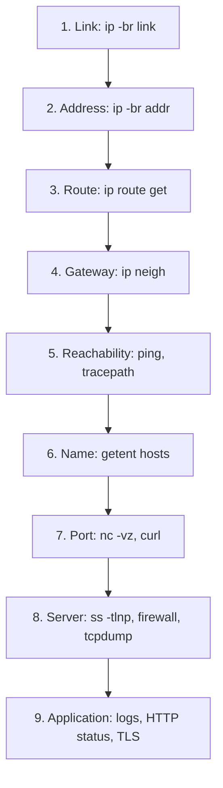

# Troubleshooting Ladder

A network problem is solved fastest by testing one layer at a time from the bottom up (link, address, route, neighbor, reachability, name, port, firewall, application) and stopping at the first layer that fails. The ladder is also the expected shape of an answer to any "service is unreachable" interview question.

**Track:** Core · **Interview weight:** High

---

## Must-Know Facts

<!-- --8<-- [start:facts] -->
| Fact | Value | Verify with |
|---|---|---|
| Order | Link, IP, route, gateway ARP, ping, DNS, port, firewall, application | this page |
| Link | `UP` and `LOWER_UP`; `NO-CARRIER` means cable or virtual NIC | `ip -br link` |
| Address | Right IP and prefix on the right interface | `ip -br addr` |
| Route | The path the kernel will use for this destination | `ip route get <ip>` |
| Gateway | Neighbor entry `REACHABLE` or `STALE`, never `FAILED` | `ip neigh show <gw>` |
| Reachability | ICMP may be blocked; a failure here is a hint, not proof | `ping -c3 <ip>` |
| Name | Resolve the way the application does | `getent hosts <name>` |
| Port | `refused` = nothing listens or `reject`; `timed out` = dropped | `nc -vz -w3 <ip> <port>` |
| Listener | Service bound to the right address on the server | `sudo ss -tlnp 'sport = :<port>'` |
| Firewall | Host rules, then security groups and network ACLs | `sudo nft list ruleset`, `firewall-cmd --list-all` |
| Proof on the wire | SYNs arriving without SYN-ACK = dropped on the server | `sudo tcpdump -nn -i any port <port>` |
| Application | HTTP status, TLS errors, application logs | `curl -sv <url>`, `journalctl -u <unit>` |
| Compare | A working client or path narrows the fault faster than any single tool | same tests from two hosts |
<!-- --8<-- [end:facts] -->

---

## The Ladder



| Step | Failure looks like | Usual causes | Topic |
|---|---|---|---|
| 1 Link | `NO-CARRIER`, `DOWN` | Cable, switch port, VM NIC detached, `ip link set down` | [Interfaces and Addresses](interfaces-and-addresses.md) |
| 2 Address | No `inet`, wrong prefix, duplicate IP | DHCP failure, typo, clone | [Network Configuration](network-configuration.md) |
| 3 Route | `Network is unreachable`, wrong `via` | Missing default or static route | [Routing](routing.md) |
| 4 Gateway | `FAILED`, `Destination Host Unreachable` from self | Wrong VLAN, gateway down | [Interfaces and Addresses](interfaces-and-addresses.md) |
| 5 Reach | 100% loss, `!H`, TTL exceeded | Routing loop, firewall on path, return route | [Connectivity Testing](connectivity-testing.md) |
| 6 Name | `Could not resolve host` | Resolver config, zone, `/etc/hosts` | [DNS Resolution](dns-resolution.md) |
| 7 Port | `refused` or `timed out` | Service down, bound to loopback, firewall | [Ports and Sockets](ports-and-sockets.md) |
| 8 Server | SYN arrives, no SYN-ACK | Host firewall, SELinux port label, full accept queue | [Sockets and TCP States](sockets-and-tcp-states.md) |
| 9 App | `502`, `503`, TLS errors, slow responses | Backend, certificates, timeouts | [Reverse Proxy and Load Balancing](reverse-proxy-and-load-balancing.md) |

!!! tip "Ask before you test"
    Which client, which destination (name, IP, port), since when, and does it work from anywhere else. A working path from a second host often skips half the ladder.

---

## Walking the Ladder

The report: `curl` from `client` to the API on `web` times out, while the same API works through the load balancer on `gw`. Every step below ran on `client` unless noted.

### Symptom

```bash
curl -sS -m5 http://api.shop.internal:8080/
curl -s -m3 http://172.16.0.3:8081/
```

Output:

```text
curl: (28) Connection timed out after 5002 milliseconds
shop-api on web (172.16.1.3:8080) client=172.16.1.2 xff=172.16.0.2
```

The backend is alive and answers the proxy, so the problem is specific to this path.

### Steps 1 to 4: Link, Address, Route, Gateway

```bash
ip -br link show eth0
ip -br addr show eth0
ip route get 172.16.1.3
ping -c1 -W1 172.16.0.3 >/dev/null; ip neigh show 172.16.0.3
```

Output:

```text
eth0             UP             02:00:ac:10:00:02 <BROADCAST,MULTICAST,UP,LOWER_UP> 
eth0             UP             172.16.0.2/24 172.16.0.20/24 fe80::acff:fe10:2/64 
172.16.1.3 via 172.16.0.3 dev eth0 src 172.16.0.2 uid 1001 
    cache 
172.16.0.3 dev eth0 lladdr 02:00:ac:10:00:03 REACHABLE 
```

The link is up, the address is right, the route points at `gw`, and `gw` answers ARP.

### Steps 5 and 6: Reachability and Name

```bash
ping -c2 -W1 172.16.1.3 | tail -2
getent hosts api.shop.internal
```

Output:

```text
2 packets transmitted, 2 received, 0% packet loss, time 1009ms
rtt min/avg/max/mdev = 0.406/0.424/0.442/0.018 ms
172.16.1.3      api.shop.internal
```

`web` answers ping and the name resolves to the right address, so layers 1 to 3 and DNS are fine.

### Step 7: Port

```bash
nc -vz -w3 172.16.1.3 8080
nc -vz -w3 172.16.1.3 80
```

Output:

```text
nc: connect to 172.16.1.3 port 8080 (tcp) timed out: Operation now in progress
Connection to 172.16.1.3 80 port [tcp/http] succeeded!
```

Port 80 on the same host works and port 8080 times out: something drops traffic to one port, from this client.

### Step 8: Server Side

On `web`:

```bash
sudo ss -tlnp 'sport = :8080'
sudo tcpdump -ni eth0 -c 3 'tcp port 8080 and host 172.16.0.2'
sudo nft -a list chain inet labdrop input
```

Output:

```text
State  Recv-Q Send-Q Local Address:Port Peer Address:PortProcess                                                                         
LISTEN 0      511          0.0.0.0:8080      0.0.0.0:*    users:(("nginx",pid=3201,fd=6),("nginx",pid=3200,fd=6),("nginx",pid=3199,fd=6))
# ... (trimmed)
12:29:30.772177 IP 172.16.0.2.56928 > 172.16.1.3.webcache: Flags [S], seq 933936045, win 64240, options [mss 1460,sackOK,TS val 1883355674 ecr 0,nop,wscale 7], length 0
12:29:31.778479 IP 172.16.0.2.56928 > 172.16.1.3.webcache: Flags [S], seq 933936045, win 64240, options [mss 1460,sackOK,TS val 1883356681 ecr 0,nop,wscale 7], length 0
# ... (trimmed)
table inet labdrop {
	chain input { # handle 1
		type filter hook input priority filter; policy accept;
		tcp dport 9200 drop # handle 2
		tcp dport 9201 reject with tcp reset # handle 4
		ip saddr 172.16.0.0/24 tcp dport 8080 drop # handle 5
	}
}
```

nginx listens on all addresses, and the client's SYNs arrive (retransmitted after one second) without any answer. The firewall drops TCP 8080 from the `lan` subnet, which is why the proxy on `gw` (source `172.16.1.2`) still works. `tcpdump -n` still printed the port as `webcache`; `-nn` also disables port names.

!!! warning "tcpdump sees packets the firewall then drops"
    A capture shows packets as they arrive on the interface, before the host firewall's input rules. A SYN in the capture with no SYN-ACK is the signature of a local drop, a full accept queue, or a service that is not listening.

### Fix and Verify

```bash
sudo nft delete rule inet labdrop input handle 5
curl -sS -m5 http://api.shop.internal:8080/
```

Output:

```text
shop-api on web (172.16.1.3:8080) client=172.16.0.2 xff=
```

The rule was deleted on `web` and the request repeated on `client`. The response now shows the client's own address, because the request went direct instead of through the proxy.

---

## Without the Usual Tools

Minimal images and containers often lack `ip`, `ss`, `nc` and `dig`. The same ladder works with files and shell builtins:

| Step | Fallback |
|---|---|
| Address | `cat /proc/net/fib_trie`, `cat /sys/class/net/eth0/operstate` |
| Route | `cat /proc/net/route` (hex, little-endian) |
| Neighbor | `cat /proc/net/arp` |
| Name | `getent hosts <name>`, `cat /etc/resolv.conf` |
| Port | `timeout 2 bash -c '< /dev/tcp/<ip>/<port>'` |
| Listeners | `cat /proc/net/tcp /proc/net/tcp6` (state `0A` is LISTEN) |
| HTTP | `exec 3<>/dev/tcp/<ip>/80; printf 'GET / HTTP/1.0\r\n\r\n' >&3; cat <&3` |

!!! note "Debug containers from the host"
    `nsenter -t <pid> -n` runs the host's tools inside a container's network namespace, which avoids installing anything in the image.

---

## Common Errors

### `curl: (28) Connection timed out after 5002 milliseconds`

**Cause:** packets are dropped somewhere between client and service (firewall, security group, routing).

**Fix:** walk the ladder; capture on the server to see whether SYNs arrive.

### `ping: connect: Network is unreachable`

**Cause:** no route to the destination (step 3).

**Fix:** `ip route`; restore the default or static route.

### `From 172.16.0.2 icmp_seq=1 Destination Host Unreachable`

**Cause:** the local host cannot resolve the next hop's MAC (step 4).

**Fix:** `ip neigh`; check the gateway, VLAN and prefix length.

---

## Interview Checkpoints

<!-- --8<-- [start:l1] -->
??? question "L1: A user says the website is down. How do you structure the investigation?"
    **Say first:** clarify the scope, then test from the bottom up: link, address, route, gateway, reachability, DNS, port, firewall, application, stopping at the first failure.

    **Proof:** `ip -br link`; `ip route get`; `ping`; `getent hosts`; `nc -vz`; `curl -sv`.

    **Follow-up:** Which one question would you ask first, and why?
<!-- --8<-- [end:l1] -->

??? question "L2: Show that a service is reachable on its port without curl, nc or telnet."
    **Say first:** use Bash's `/dev/tcp` with a timeout.

    **Proof:** `timeout 2 bash -c '< /dev/tcp/172.16.1.3/8080' && echo open`.

    **Follow-up:** How do you read the answer to an HTTP request the same way?

??? question "L2: Prove on the server that client packets arrive but are not answered."
    **Say first:** capture SYNs from the client's address on the service port.

    **Proof:** `sudo tcpdump -nn -i eth0 'tcp port 8080 and host 172.16.0.2'` shows repeated `[S]` without `[S.]`.

    **Follow-up:** Which three causes produce that pattern?

??? question "L3: A service works through the load balancer but not directly from one subnet. Where is the fault likely to be?"
    **Say first:** a filter that depends on the source: a host firewall rule, a security group or network ACL, or a missing return route for that subnet.

    **Proof:** `nc -vz` to a second port on the same host works; `tcpdump` on the server shows SYNs; `nft list ruleset` shows a source-based drop.

    **Follow-up:** How would a missing return route look different in the capture?

??? question "L3: Users in one office cannot reach an internal app; other offices can. Walk through your checks."
    **Say first:** compare a failing and a working client at each step: DNS answers, routes, the path (`tracepath`), then filters keyed on the office's source range.

    **Proof:** `getent hosts` and `ip route get` on both; `mtr -r`; firewall rules and VPN routes for the office subnet.

    **Follow-up:** What role can MTU play in a site-to-site VPN?

??? question "L3: After a server migration, clients get Connection refused. What do you check on the new server?"
    **Say first:** whether the service runs and listens on the right address and port.

    **Proof:** `systemctl status <unit>`; `sudo ss -tlnp 'sport = :<port>'`; the service's bind setting.

    **Follow-up:** Why is the error `refused` and not `timed out`?

??? question "L3: Only some requests to a service fail, at random. How do you narrow it down?"
    **Say first:** find what differs between failing and working requests: backend, source port, DNS answer, time, request size.

    **Proof:** proxy logs with `$upstream_addr`; repeated `curl -w` with `--resolve` to each backend; `ss -s` and `nstat` for overflows; `conntrack -C`.

    **Follow-up:** How does one bad backend in a pool of four show up in the error rate?

---

## Related

- [DNS Not Resolving](../interview/scenarios/dns-not-resolving.md): the ladder applied to name resolution
- [Connectivity Testing](connectivity-testing.md): each test tool in detail
- [Packet Capture](packet-capture.md): proving where packets stop
- [Packet Journey](../../networking/packet-journey-ibtisam-iq.md): what happens on the network between the steps

Captured on Ubuntu 24.04.4 and Rocky Linux 10.2 (nftables, nginx 1.26.3) on iximiuz Labs FlexBox microVMs, kernel 6.1.167, 2026-09. MAC addresses are replaced with placeholders.
