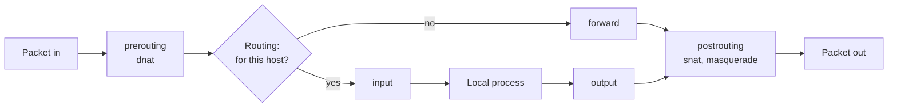

# nftables and iptables

netfilter is the packet filter inside the kernel, and `nft` (nftables) and `iptables` are the tools that load its rules. firewalld, ufw, Docker and Kubernetes all write netfilter rules, so reading them directly explains blocked traffic, NAT and port forwarding that the front ends hide.

**Track:** Core · **Interview weight:** Med

---

## Must-Know Facts

<!-- --8<-- [start:facts] -->
| Fact | Value | Verify with |
|---|---|---|
| Hooks | `prerouting`, `input`, `forward`, `output`, `postrouting`; local traffic uses `input`, routed traffic uses `forward` | `sudo nft list ruleset` |
| Objects | Table (family `ip`, `ip6`, `inet`, ...) holds chains; a base chain has a hook, priority and policy; rules have handles | `sudo nft -a list tables` |
| iptables today | RHEL 9/10 and Ubuntu 24.04 ship `iptables-nft`, which writes nftables tables `ip filter`, `ip nat`; `iptables-translate` prints the nft form | `iptables -V` shows `(nf_tables)` |
| Stateful | `ct state established,related accept` lets replies through; conntrack tracks each flow | `sudo conntrack -L` |
| Evaluation | Every base chain on a hook runs; a packet must be accepted by all of them (firewalld, Docker and custom tables together) | `sudo nft list chains` |
| NAT | `masquerade` or `snat` in `postrouting` (source), `dnat` in `prerouting` (destination, port forwarding); routing also needs `ip_forward=1` | `sudo nft list table ip nat` |
| Sets | Named address or port sets, optionally with `timeout`, replace long rule lists and `ipset` | `sudo nft list sets` |
| Persistence | RHEL: `/etc/sysconfig/nftables.conf` + `nftables.service`; Ubuntu: `/etc/nftables.conf`; iptables: `iptables-save` with `iptables-persistent` | `systemctl cat nftables` |
<!-- --8<-- [end:facts] -->

---

## Where Rules Apply



DNAT happens before the routing decision, so a forwarded packet reaches the `forward` chain with its new destination. Source NAT happens last, after filtering.

---

## A Forwarding Filter on a Router

`gw` (Rocky Linux 10.2) routes between `lan` (`eth0`) and `dmz` (`eth1`) and had no rules. The table below lets replies back, allows SSH, DNS and the API from `lan` to `dmz`, and logs and drops everything else.

```bash
sudo nft list ruleset
sudo nft add table inet lab
sudo nft add chain inet lab forward '{ type filter hook forward priority filter; policy drop; }'
sudo nft add rule inet lab forward ct state established,related counter accept
sudo nft add rule inet lab forward iifname eth0 oifname eth1 tcp dport '{ 22, 53, 8080 }' counter accept
sudo nft add rule inet lab forward iifname eth0 oifname eth1 udp dport 53 counter accept
sudo nft add rule inet lab forward counter log prefix '"lab-fwd-drop "' drop
sudo nft list table inet lab
```

Output:

```text
table inet lab {
	chain forward {
		type filter hook forward priority filter; policy drop;
		ct state established,related counter packets 0 bytes 0 accept
		iifname "eth0" oifname "eth1" tcp dport { 22, 53, 8080 } counter packets 0 bytes 0 accept
		iifname "eth0" oifname "eth1" udp dport 53 counter packets 0 bytes 0 accept
		counter packets 0 bytes 0 log prefix "lab-fwd-drop " drop
	}
}
```

The first command printed nothing: the ruleset was empty. From `client`, allowed traffic passed and the rest timed out:

```bash
curl -s -m3 http://172.16.1.3:8080/    # on client
dig +short @172.16.1.3 api.shop.internal
ping -c2 -W1 172.16.1.3 | tail -2
nc -vz -w3 172.16.1.3 9100
```

Output:

```text
shop-api on web (172.16.1.3:8080) client=172.16.0.2 xff=
172.16.1.3
2 packets transmitted, 0 received, 100% packet loss, time 1011ms

nc: connect to 172.16.1.3 port 9100 (tcp) timed out: Operation now in progress
```

Counters and the log show what the policy did:

```bash
sudo nft list chain inet lab forward
sudo journalctl -k --since -2min | grep lab-fwd-drop | tail -2
```

Output:

```text
# ... (trimmed)
		ct state established,related counter packets 10 bytes 877 accept
		iifname "eth0" oifname "eth1" tcp dport { 22, 53, 8080 } counter packets 1 bytes 60 accept
		iifname "eth0" oifname "eth1" udp dport 53 counter packets 1 bytes 86 accept
		counter packets 5 bytes 364 log prefix "lab-fwd-drop " drop
# ... (trimmed)
Sep 17 16:20:47 gw kernel: lab-fwd-drop IN=eth0 OUT=eth1 MAC=02:00:ac:10:00:03:02:00:ac:10:00:02:08:00 SRC=172.16.0.2 DST=172.16.1.3 LEN=60 TOS=0x00 PREC=0x00 TTL=63 ID=14117 DF PROTO=TCP SPT=43666 DPT=9100 WINDOW=64240 RES=0x00 SYN URGP=0 
Sep 17 16:20:48 gw kernel: lab-fwd-drop IN=eth0 OUT=eth1 MAC=02:00:ac:10:00:03:02:00:ac:10:00:02:08:00 SRC=172.16.0.2 DST=172.16.1.3 LEN=60 TOS=0x00 PREC=0x00 TTL=63 ID=14118 DF PROTO=TCP SPT=43666 DPT=9100 WINDOW=64240 RES=0x00 SYN URGP=0 
```

Only one packet per allowed connection matched its port rule; every later packet, in both directions, matched the `established` rule. New rules go to the end of a chain; `nft insert rule ... position <handle>` places one earlier, with handles from `nft -a list`.

!!! warning "Test a drop policy on the forward path or with a timer"
    A `policy drop` on `input` without an SSH rule ends the remote session. On real servers, load new rules with a scheduled rollback (for example `sleep 120; nft flush ruleset` in another session) and cancel it once a new login works.

---

## NAT and Port Forwarding

Masquerading makes `dmz` hosts see `gw` as the source, and DNAT publishes the API on `gw` port 8088.

```bash
sudo nft add table ip labnat
sudo nft add chain ip labnat postrouting '{ type nat hook postrouting priority srcnat; }'
sudo nft add chain ip labnat prerouting '{ type nat hook prerouting priority dstnat; }'
sudo nft add rule ip labnat postrouting oifname eth1 ip saddr 172.16.0.0/24 masquerade
sudo nft add rule ip labnat prerouting iifname eth0 tcp dport 8088 dnat to 172.16.1.3:8080
curl -s -m3 http://172.16.1.3:8080/    # on client
curl -s -m3 http://172.16.0.3:8088/
sudo conntrack -L -p tcp --orig-port-dst 8088    # on gw
```

Output:

```text
shop-api on web (172.16.1.3:8080) client=172.16.1.2 xff=
shop-api on web (172.16.1.3:8080) client=172.16.1.2 xff=
conntrack v1.4.8 (conntrack-tools): 1 flow entries have been shown.
tcp      6 109 TIME_WAIT src=172.16.0.2 dst=172.16.0.3 sport=49184 dport=8088 src=172.16.1.3 dst=172.16.1.2 sport=8080 dport=49184 [ASSURED] mark=0 secctx=system_u:object_r:unlabeled_t:s0 use=1
```

The conntrack entry holds both directions: the original tuple (client to `gw:8088`) and the reply tuple (`web:8080` back to `gw`'s `dmz` address). The forward filter allowed the DNAT connection because it saw the translated port 8080.

---

## Sets

A set with timeouts blocks addresses for a limited time without editing rules. The client's second address, `172.16.0.20`, is blocked for ten minutes.

```bash
sudo nft add set inet lab blocked '{ type ipv4_addr; flags timeout; }'
sudo nft insert rule inet lab forward ip saddr @blocked counter drop
sudo nft add element inet lab blocked '{ 172.16.0.20 timeout 10m }'
curl -s -m3 --interface 172.16.0.20 http://172.16.1.3:8080/; echo "exit=$?"    # on client
curl -s -m3 --interface 172.16.0.2 http://172.16.1.3:8080/
```

Output:

```text
exit=28
shop-api on web (172.16.1.3:8080) client=172.16.1.2 xff=
```

The first request timed out (`curl` exit status 28). `sudo nft list set inet lab blocked` showed the element as `172.16.0.20 timeout 10m expires 9m59s988ms`.

---

## iptables Commands and the nftables View

`iptables-translate` shows the nft equivalent of familiar rules. `iptables -S` on the same router shows empty chains, because it reads only the tables iptables created.

```bash
iptables-translate -A FORWARD -i eth0 -o eth1 -p tcp --dport 8080 -j ACCEPT
iptables-translate -t nat -A POSTROUTING -s 172.16.0.0/24 -o eth1 -j MASQUERADE
iptables-translate -t nat -A PREROUTING -i eth0 -p tcp --dport 8088 -j DNAT --to-destination 172.16.1.3:8080
sudo iptables -S
```

Output:

```text
nft 'add rule ip filter FORWARD iifname "eth0" oifname "eth1" tcp dport 8080 counter accept'
nft 'add rule ip nat POSTROUTING oifname "eth1" ip saddr 172.16.0.0/24 counter masquerade'
nft 'add rule ip nat PREROUTING iifname "eth0" tcp dport 8088 counter dnat to 172.16.1.3:8080'
-P INPUT ACCEPT
-P FORWARD ACCEPT
-P OUTPUT ACCEPT
```

!!! danger "iptables -L can show ACCEPT while nftables drops"
    `-P FORWARD ACCEPT` appeared while the `inet lab` table dropped forwarded traffic. On any host with firewalld, ufw, Docker or custom tables, read `sudo nft list ruleset` before concluding that nothing filters.

---

## Saving Rules

=== "RHEL / Rocky"

    `nftables.service` loads `/etc/sysconfig/nftables.conf`, which includes files from `/etc/nftables/`.

    ```bash
    sudo nft list table inet lab > /tmp/lab.nft
    sudo nft list table ip labnat >> /tmp/lab.nft
    sudo install -m 600 /tmp/lab.nft /etc/nftables/lab.nft
    echo 'include "/etc/nftables/lab.nft"' | sudo tee -a /etc/sysconfig/nftables.conf
    sudo nft -c -f /etc/sysconfig/nftables.conf && echo "syntax ok"
    sudo systemctl enable nftables
    ```

    Output:

    ```text
    include "/etc/nftables/lab.nft"
    syntax ok
    Created symlink '/etc/systemd/system/multi-user.target.wants/nftables.service' → '/usr/lib/systemd/system/nftables.service'.
    ```

    Use either firewalld or `nftables.service` for the host's own rules, not both.

=== "Ubuntu / Debian"

    The packaged `/etc/nftables.conf` starts with `flush ruleset`, and the service is disabled.

    ```bash
    cat /etc/nftables.conf
    systemctl is-enabled nftables
    ```

    Output:

    ```text
    #!/usr/sbin/nft -f

    flush ruleset

    table inet filter {
    # ... (trimmed)
    disabled
    ```

    Enabling `nftables.service` next to ufw would flush ufw's rules at boot. Hosts managed with iptables commands save them with the `iptables-persistent` package (not installed by default).

---

## Interview Checkpoints

<!-- --8<-- [start:l1] -->
??? question "L1: What is the difference between the input and forward chains?"
    **Say first:** `input` sees packets addressed to the host itself, `forward` sees packets the host routes to another host.

    **Proof:** a drop policy in `inet lab forward` on `gw` blocked `client` to `web` traffic while `gw`'s own services stayed reachable.

    **Follow-up:** Which chain filters traffic to a Docker container published with `-p`?

??? question "L1: Why does a stateful firewall need the established,related rule?"
    **Say first:** replies and follow-up packets match it, so allow rules only need to describe new connections.

    **Proof:** the port rule matched one packet per connection, the `established` rule matched the rest.

    **Follow-up:** What does `related` add for ICMP errors and FTP?
<!-- --8<-- [end:l1] -->

??? question "L2: Forward port 8088 on a gateway to an internal web server on 8080."
    **Say first:** DNAT in `prerouting`, a forward allow rule for the translated port, and masquerade or a return route.

    **Proof:** `nft add rule ip labnat prerouting iifname eth0 tcp dport 8088 dnat to 172.16.1.3:8080`; `sudo conntrack -L -p tcp --orig-port-dst 8088`.

    **Follow-up:** What breaks if the internal server's default route does not point back through the gateway?

??? question "L2: Block an abusive address for ten minutes without editing rules later."
    **Say first:** a set with the `timeout` flag referenced by one drop rule.

    **Proof:** `sudo nft add element inet lab blocked '{ 172.16.0.20 timeout 10m }'`; `sudo nft list set inet lab blocked` shows `expires`.

    **Follow-up:** How would fail2ban use the same mechanism?

??? question "L3: iptables -L shows ACCEPT everywhere, yet traffic through the host is dropped. What do you check?"
    **Say first:** the full nftables ruleset, because other tables and base chains filter too.

    **Proof:** `sudo nft list ruleset`; counters on `drop` rules; kernel log prefixes; `sysctl net.ipv4.ip_forward`.

    **Follow-up:** How do firewalld and a custom table interact on the same hook?

??? question "L3: After adding masquerade, the backend's logs lost the real client addresses. What are the options?"
    **Say first:** source NAT hides the client by design; keep it only where the return path needs it.

    **Proof:** the API logged `client=172.16.1.2`; alternatives are a return route on the backend instead of masquerade, or a proxy that adds `X-Forwarded-For`.

    **Follow-up:** Why do cloud load balancers offer the PROXY protocol?

---

## Related

- [firewalld and ufw](firewalld-and-ufw.md): the front ends that write these rules
- [Routing](../13-networking/routing.md) and [Sockets and TCP States](../13-networking/sockets-and-tcp-states.md): forwarding, return paths and conntrack
- [Cannot Reach Host](../interview/scenarios/cannot-reach-host.md): a scenario with a forwarding-firewall branch

Captured on Rocky Linux 10.2 (nftables 1.1.5, iptables-nft 1.8.11, conntrack-tools 1.4.8) and Ubuntu 24.04.4 (nftables 1.0.9) on iximiuz Labs FlexBox microVMs, kernel 6.1.167, 2026-09. The lab tables were removed from `gw` after the capture.
